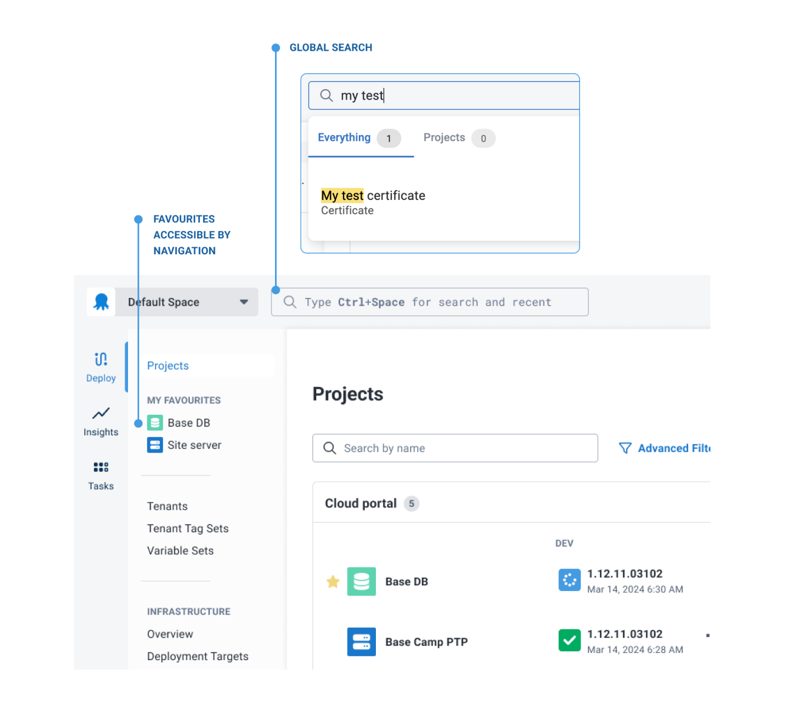
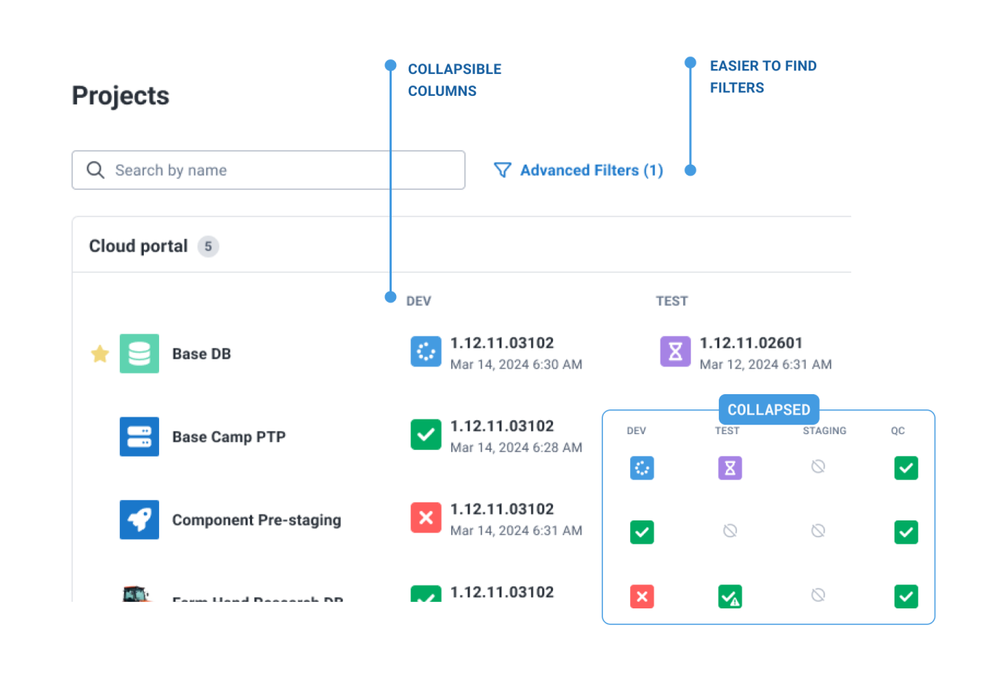
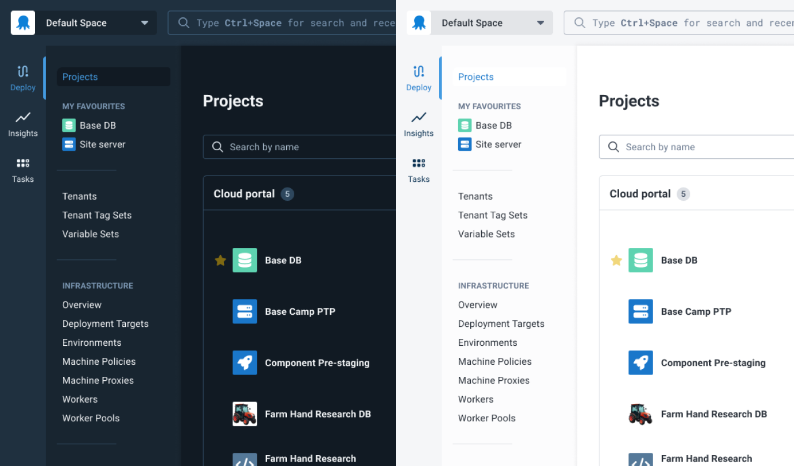

Our New Navigation UI has a handful of different ways of making it easier to find what you are looking for. A faster experience for our scale customers. And for everyone, modern dark / light themes that are more considered of accessibility.

## Getting around

→ Vertical Navigation exposes features used to manage deploy projects

→ Favourited projects appears in the navigation, simply clicking the star ⭐️ 

→ Global Search is positioned more centrally

## Projects Dashboard
→ Faster Loading ⚡️

→ Collapsible columns for better status visibility across complex projects

→ Filters for easier configuration

## Modern theme

→ We heard you! Dark mode and light mode stay true to their intended theme. 

→ No more SHOUTY capitalised buttons or tabs 😌



* Light vs Dark Theme*

### The thinking behind the change

Interested in the thinking behind this change. Read Re-envisioning our Navigation 





