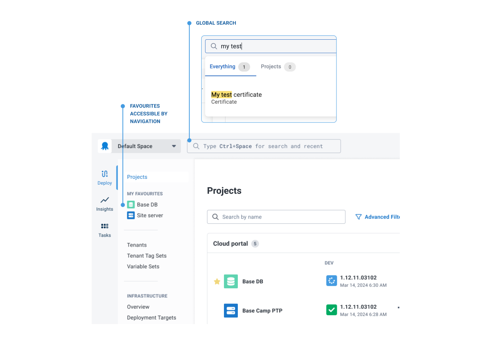

Our new navigation UI, rolling out to Cloud customers in July, makes it easier to find what you're looking for in Octopus in a handful of different ways. It's also a faster experience for our scale customers. And for everyone, we've ensured modern dark and light themes that are more considerate of accessibility.

In this post, I give you a quick rundown of the navigation UI changes.  

## Getting around

- Vertical navigation exposes the features you use to manage deployment projects

- Favorited projects appear in the navigation, simply by clicking the star ⭐️ 

- We've positioned global search more centrally

## Projects dashboard

- Faster loading ⚡️

- Collapsible columns for better status visibility across complex projects

- Filters for easier configuration

## Modern theme

- We heard you – dark mode and light mode stay true to their intended theme. 

- No more SHOUTY capitalized buttons or tabs 😌

*Dark vs light theme*

### The thinking behind the changes

If you're interested in the thinking behind these changes, please read our post about [redesigning the navigation in Octopus](https://octopus.com/blog/redesigning-octopus-navigation).

## Conclusion

Changes to the navigation are rolling out to Cloud instances in July. For our self-hosted customers, you can expect the update later in the year.

We're always keen to hear your feedback. Feel free to jump into the blog comments to share your thoughts about the new navigation.

Happy deployments!
