I recently worked with a customer to configure the [Octopus Kubernetes agent](https://octopus.com/docs/kubernetes/targets/kubernetes-agent) on an AWS Elastic Kubernetes Service (EKS) cluster.  The Kubernetes agent requires a [storage class](https://kubernetes.io/docs/concepts/storage/storage-classes/) to provide volumes so it has a file system to work with. The customer wanted to use the Elastic File System (EFS) for the storage class. 

I couldn't find a walkthrough that describes the steps to configure EFS to work with EKS. Instead had to rely on a combination of AWS documentation and blog posts. This led to a frustrating amount of incremental successes as I went from brick wall to brick wall trying to get the 2 technologies to work together. 

So in this post, I cover the steps to connect the 2 technologies in a single location, so you don't have to struggle like I did.

## Before you start

This post assumes you have an EKS cluster and its associated roles, node groups, and security groups already configured.  If you're starting from scratch, using the [eksctl](https://eksctl.io/) command-line tool is easiest.  The eksctl tool provisions all the  items for a functional EKS cluster with a single, easy-to-use [command](https://eksctl.io/getting-started/#basic-cluster-creation).  

The cluster created for this post uses eksctl and several other eksctl commands to complete the configuration.

## Resources you need to follow along

Along with the EKS cluster, we'll create a few items that demonstrate how to connect EFS to EKS:

- An EFS file system
- An IAM OIDC provider for your cluster
- An IAM Service Account and Role for the CSI driver

### Create an EFS file system

Creating an EFS file system is relatively straightforward. For simplicity, this post uses the UI to create the EFS file system. I'll walk through the steps to create the EFS file system and configure it.

#### Creating the EFS file system using the UI

You can create an EFS file system in just a few clicks:

1. Log into the AWS console.
1. Click the search bar and enter `efs`.  This filters the services list. EFS should be the first result.  

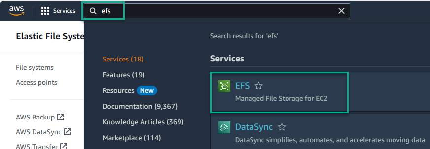

3. Click EFS, which takes you to the EFS service.
3. Click the Create file system button

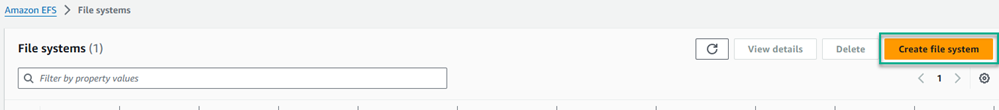

5. Give the EFS file system a name and select the VPC to use.  Note: Make sure you select the correct VPC so the 2 technologies can communicate.

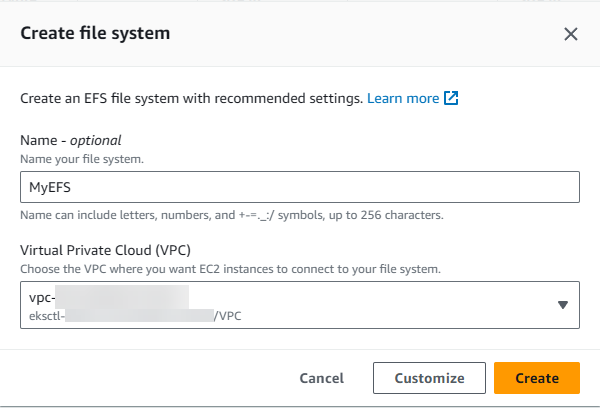

The above image selects the VPC created by the eksctl tool.

6. After it's created, click the entry to configure settings.

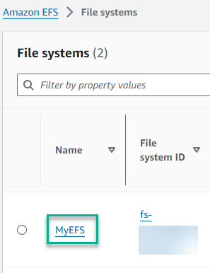

7. Copy the EFS ID number and save it somewhere like Notepad. You'll  need it later.

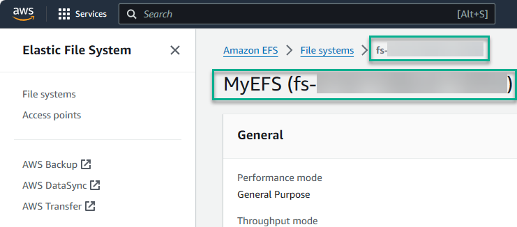

8. Click the `Network` tab to view the assigned `Security groups`.  EFS selects the default security groups for the VPC when it gets created.

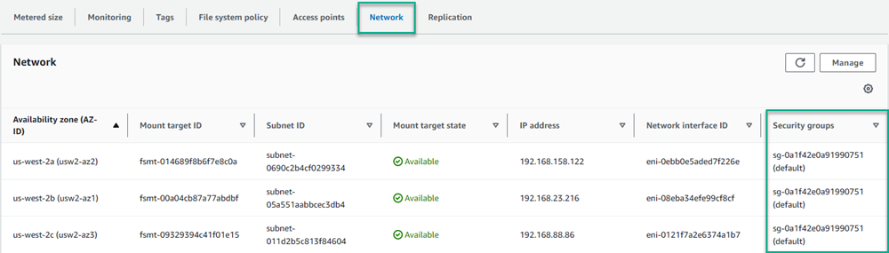

In my case, the eskctl tool created its own security groups, so I needed to update them to the appropriate groups.  To update the groups, click Manage, then update the groups assigned to the EKS nodes.

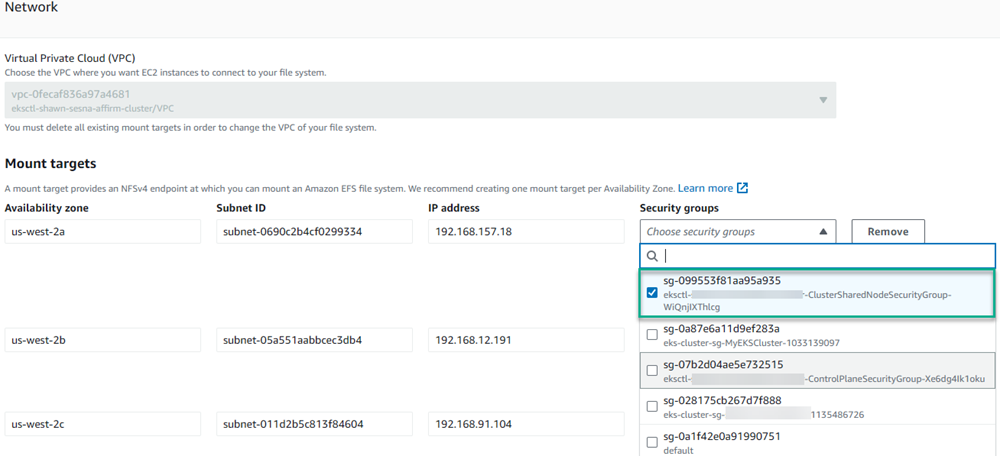

This was a stumbling point for me. One of the blog posts I read briefly pointed this out as a potential issue.

### Create an IAM OIDC provider for your cluster

EKS clusters come with an OpenID Connect provider URL as part of the EKS offering.  This lets you create an OIDC provider for your cluster to provide secure authentication between EFS and your cluster.  You can read the [documentation on this process](https://docs.aws.amazon.com/eks/latest/userguide/enable-iam-roles-for-service-accounts.html).

The documentation describes 2 ways to configure the provider:

- Using eksctl
- Using the UI

For this post, we'll use the eksctl method.  The documentation provides a Bash example to programatically create the OIDC provider.  I use a Windows machine, so converted it to PowerShell (the step comments are the step numbers from the documentation).

```powershell
# Step 1
$clusterName = "MyEKSCluster"
$regionCode = "us-west-2"
$cluster = (aws eks describe-cluster --name $clusterName --region $regionCode)

$cluster = ($cluster | ConvertFrom-JSON)

# Step 2
$oidc_id = ($cluster.cluster.identity.oidc.issuer.split("/"))[4]

# Step 3
./eksctl utils associate-iam-oidc-provider --cluster $clusterName --region $regionCode --approve
```

### Create an IAM Service Account and Role for the CSI driver

To connect EFS to your EKS cluster, you need to create an IAM Service Account and Role for the CSI driver. This was another AWS documentation page I needed to reference to configure the solution ([see AWS documentation page](https://docs.aws.amazon.com/eks/latest/userguide/efs-csi.html)).  Similar to the other AWS documentation pages, the example was only available in Bash. Here's the PowerShell equivalent:

```powershell
$clusterName="MyEKSCluster"
$roleName="AmazonEKS_EFS_CSI_DriverRole_Blog"
$regionCode="us-west-2"
./eksctl create iamserviceaccount `
    --name efs-csi-controller-sa `
    --namespace kube-system `
    --cluster $clusterName `
    --role-name $roleName `
    --role-only `
    --attach-policy-arn arn:aws:iam::aws:policy/service-role/AmazonEFSCSIDriverPolicy `
    --approve `
    --region $regionCode

# Update trust policy
$trust_policy = (aws iam get-role --role-name $roleName)
$trust_policy = $trust_policy.Replace(":efs-csi-controller-sa", ":efs-csi-*")
$trust_policy = $trust_policy.Replace("StringEquals", "StringLike")
$trust_policy = ($trust_policy | ConvertFrom-JSON)

# Write policy to file
Set-Content -Path "policy.json" -Value "$($trust_policy.Role.AssumeRolePolicyDocument | ConvertTo-JSON -Depth 10)"

# Update the Trust Policy on the role
aws iam update-assume-role-policy --role-name $roleName --policy-document file://policy.json
```

## Configuring the EKS cluster to use EFS

Now we've created the IAM Service Account, Role, and the EFS file system, we can configure the EKS cluster to use them.  To connect EFS to EKS, you need to do the following:

- Add the Amazon EFS CSI Driver to the cluster
- Set the IAM Service Account role for the EFS CSI Driver
- Create the Kubernetes 'StorageClass' resource for the EFS CSI Driver

### Add the Amazon EFS CSI Driver

The Amazon EFS CSI Driver is an add-on to an EKS cluster. To add the add-on, navigate to your cluster and perform the following steps:

1. Click **Add-ons**.

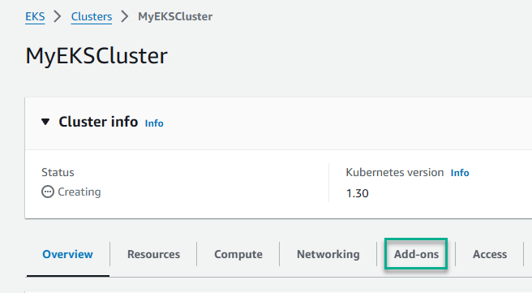

2. Click the **Get more add-ons** button.

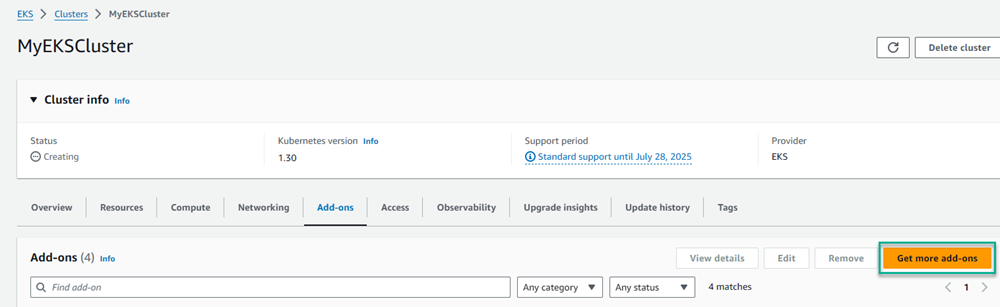

3. Select **Amazon EFS CSI Driver** from the list and click **Next**.

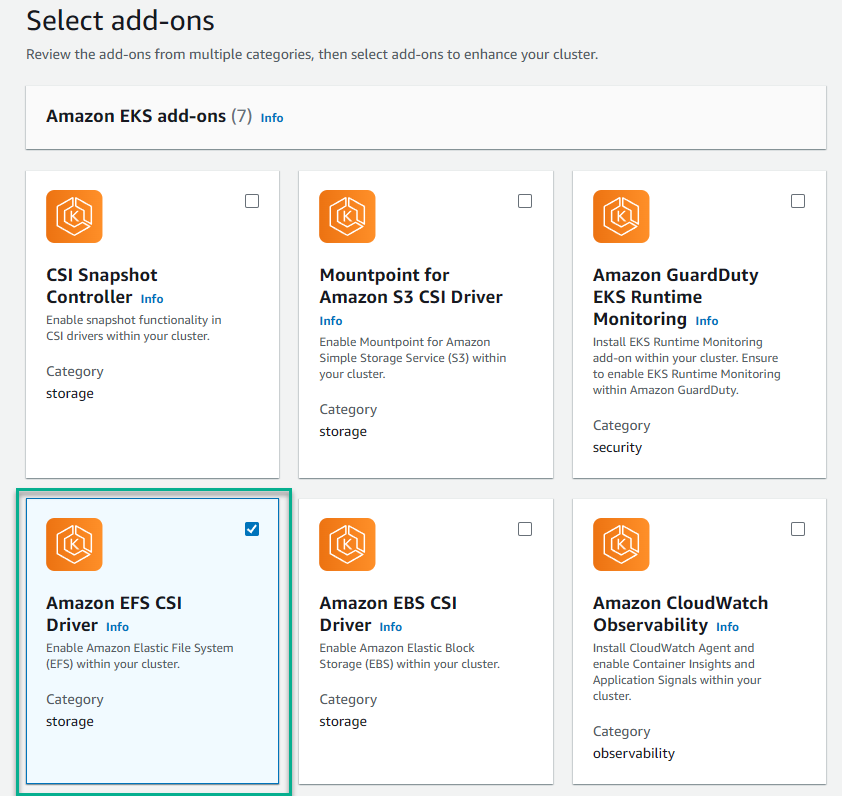

4. Select the IAM Role you created earlier and click **Next**.

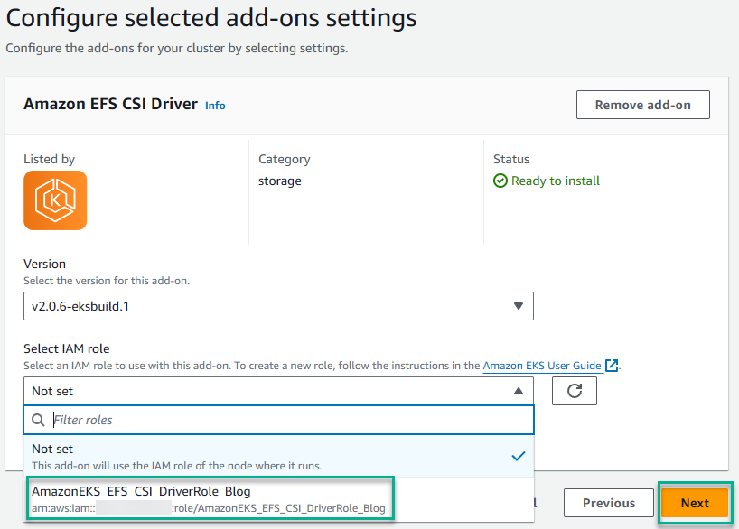

5. Review the configuration and click **Create**.

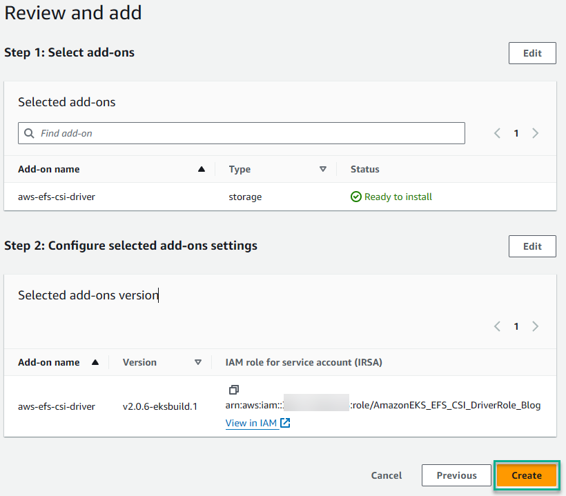

## Create a StorageClass resource on your cluster

The final step is to create a StorageClass resource in your EKS cluster to use the EFS file system you created.  

Create a YAML file with the following (you need the file system ID value we copied earlier):

```yaml
kind: StorageClass
apiVersion: storage.k8s.io/v1
metadata:
  name: efs-sc
provisioner: efs.csi.aws.com
parameters:
  provisioningMode: efs-ap
  fileSystemId: fs-XXXXXXXXXXXXX # The file system ID we copied from earlier
  directoryPerms: "700"
  gidRangeStart: "1000" # optional
  gidRangeEnd: "2000" # optional
  basePath: "/dynamic_provisioning" # optional
  subPathPattern: "${.PVC.namespace}/${.PVC.name}" # optional
  ensureUniqueDirectory: "true" # optional
  reuseAccessPoint: "false" # optional
```

Apply this to your cluster and you're done. Whew!

## Conclusion

The information to connect EFS to EKS *is* readily available, but it's spread across multiple AWS documentation pages that don't seem to reference each other. I hope that consolidating the steps in one spot saves you from the frustration of piecing together the steps.

Happy deployments!