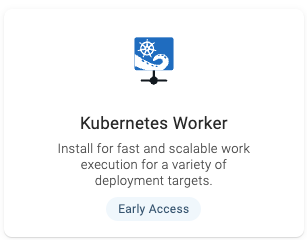
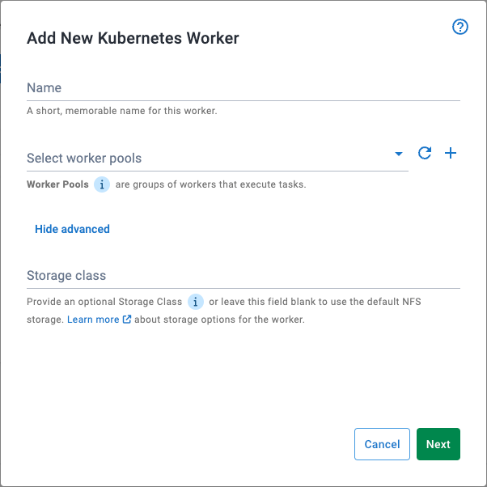
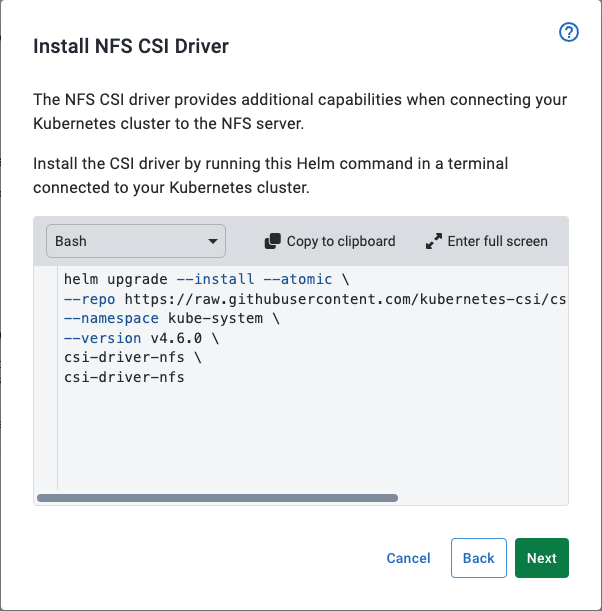
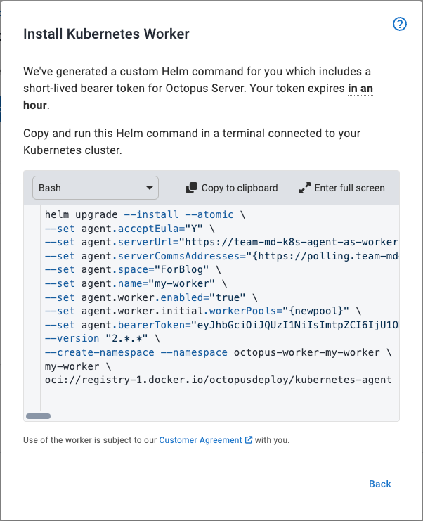
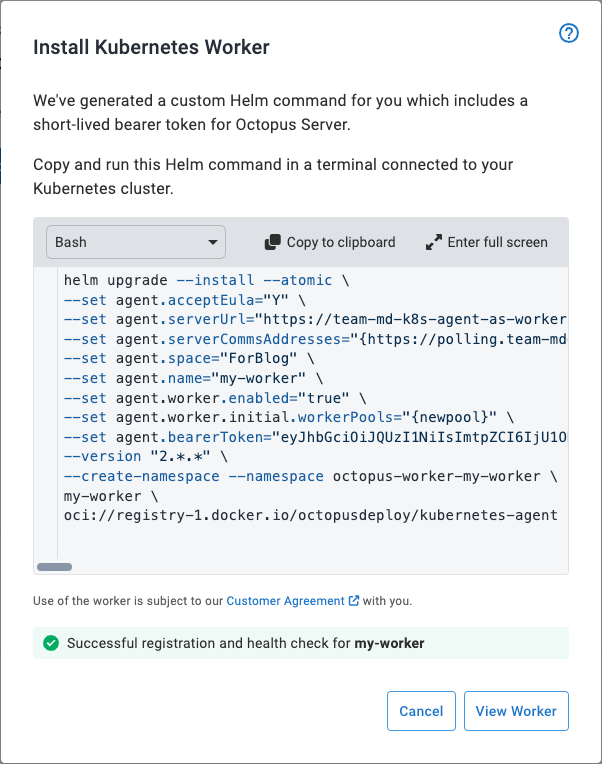

The words belong to go together; it took some work, but we've made it happen.

The story starts with the recently completed [Octopus Deploy Kubernetes Agent](https://octopus.com/blog/kubernetes-agent).

The Kubernetes Agent was our "contact on the inside", simplifying deployments into a Kubernetes cluster. 
It allowed Deployments to execute Kubernetes commands, from _within_ the cluster.

We've now built a Kubernetes Worker - an extension to the Agent, which is able to execute any workload in the cluster 
(not just Kubernetes commands!).

## Background
To appreciate how this new capability helps you, it's worth explaining the types of machines involved in an deployment:

1. Deployment Targets - machines which host runtime software packages
2. Workers - compute resources required to execute the deployment process.

We’re only going to deal with Workers here - i.e. computers required during a deployment, but are otherwise idle.

When using a physical or virtual machine as a worker, it must be adequately provisioned to handle peak-deployment loads.
Unfortunately, the worker machine holds onto those resources between deployments, when no operations are executing.
Which is a little disappointing.

With a Kubernetes worker, once a deployment is complete the hardware resources used are given back to the cluster.
Allowing the cluster to repurpose them, or release them.

The Kubernetes worker executes each deployment task in a new Kubernetes Pod (horizontal scaling).
When sufficient pressure is applied to the cluster, additional resources are automatically provisioned. Then as work completes and the 
pods terminate, the additional resources are returned to the cluster.

This reduces the running and maintenance costs associated a fleet of physical (or virtual) worker machines.

## Is this for you?
Octopus Deploy provides a number of ways for you to provide Worker compute resources:

1. Taking it directly from your Octopus Server instance
    i. Great place to start, and fine for smaller installations, but can be limiting in large systems
2. If cloud-hosted, you may be using the Dynamic Workers supplied in cloud
3. Self-managed VMs or physical machines.

The Kubernetes worker is may not reduce complexity for the first groups. 
Whereas group-3 is likely to see significant benefits through reduced worker-management.

So if you're in group-3, you may find the Kubernetes Worker allows you to replace a fleet of worker-machines, with a single Kubernetes Worker. One that will scale with your workloads.

## How To install the Kubernetes worker
The Kubernetes Worker can be installed via the Kubernetes Agent [helm chart](https://hub.docker.com/r/octopusdeploy/kubernetes-agent) - you can do this manually via the command-line, but a far simpler method is to use the “installation wizard” provided by the Octopus Deploy Web portal.

This wizard will guide you through a series of steps to capture values defining your worker, and provide the Helm command required to install the defined worker.

1. In the sidebar menu, navigate to Deploy → Infrastructure → Workers → Add Worker → Add Worker → Kubernetes

2. This launches the Kubernetes Worker installation wizard. Here you can name the worker, specify (and create) the worker pool(s) to which it should belong. To create a new Worker Pool, select the “+” symbol to dropdown required pool creation fields.

3. The Kubernetes worker needs a shared filesystem. You have the option of providing an existing storage class (under “Show Advanced”) or using a default Network File System (NFS) storage pod. The NFS storage pod is an easy, low-configuration storage option that doesn’t need extra volumes or storage classes to be configured in the cluster first. To use NFS storage, you must install an extra Helm chart.

4. At the end of the wizard, Octopus generates a Helm command that you copy and paste into a terminal connected to the target cluster. After it’s executed, Helm intsalls all the required resources and starts the agent.

5. If left open, the installation dialog waits for the worker to establish a connection and run a health check. Once successful, the Kubernetes worker is ready for use!

## How does it communicate?
The Kubernetes Worker uses the same polling communications protocol as Octopus Tentacle. It lets the worker connect from the cluster to Octopus Server (via proxy as required), solving potential network access issues.

## Inbuilt tooling 
When work-packages are sent to the Kubernetes Worker, the actual operation is executed within an Octopus Deploy [Worker-tools](https://hub.docker.com/r/octopusdeploy/worker-tools) container.

If the worker-tools is not appropriate for your workloads, two options exist:
1. Override the default container on the specific deployment step (as per standard workers),
2. Change the image used by all Worker operations via the chart's `Values`.

## How to customize the Kubernetes worker
The installation wizard creates a Kubernetes worker which is appropriate for a majority of expected workloads.

For the rest, manual customization is available.

Many aspects of the worker can be configured via its `Values`. For now, these customisations must be performed via the command
line using a Helm upgrade command (or setting them manually during initial install).

The full list of customizations are documented in the `Readme.md` of the [helm chart](https://hub.docker.com/r/octopusdeploy/kubernetes-agent).

## Easy ways to try it out!
The Kubernetes Worker has been proven to work in a variety of clusters - if it's something you'd like to try, we recommend using
a lightweight Kubernetes cluster such as:
* [Minikube](https://minikube.sigs.k8s.io/docs/start/?arch=%2Fmacos%2Farm64%2Fstable%2Fbinary+download)
* [Kind](https://kind.sigs.k8s.io/docs/user/quick-start/)

As part of install, each of these will configure a kubernetes context in your terminal, allowing helm to connect to the installed
cluster.

## When do I get to use it?
It’s on Cloud instances already, and will be available to self-hosted customers in 2024.3, which is coming out in a few weeks.

## More information & support
The Octopus Deploy documentation suite covers the use of the Kubernetes Worker, otherwise reach out to our [community slack](https://octopususergroup.slack.com/archives/CBQ3FPQAH), or direct to our support in case of trouble.

