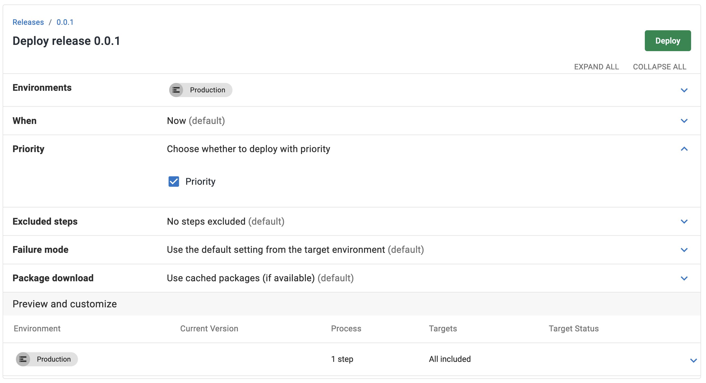
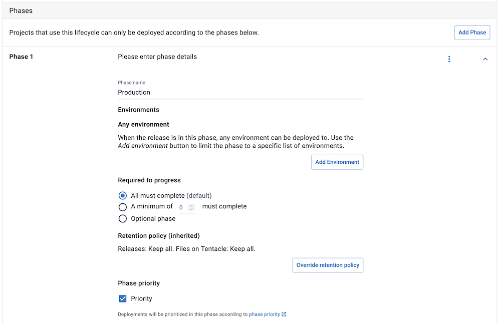
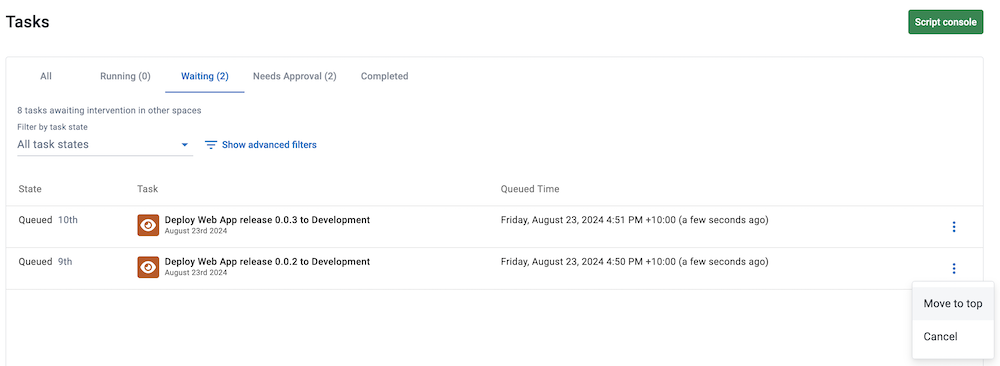

As our customers grow, Octopus endeavors to ensure our tools allow teams to deploy what they need, when they need it. We're excited to introduce two methods to prioritize essential deployments. This feature expands on the 2023.4 feature which provides the ability to manually prioritize a deployment. Now, we've automated the prioritization process, ensuring essential deployments are expedited.

In this post, I explain how to configure priority deployments.

## Prioritize deployments

We've introduced two ways to automate deployment priority.

1. Prioritize the deployment when creating a new deployment

2. Prioritize an environment in a lifecycle phase. All deployments to that particular environment(s) in the lifecycle will be prioritized.

### Prioritize when creating a new deployment

When creating a new deployment, configure its priority before deploying. By checking the **Priority** checkbox and deploying, your deployment will be fast-tracked to the top of the task queue.

### Prioritize an environment in a lifecycle phase

This option is beneficial if you want to prioritize all deployments to a specific environment. When configuring your lifecycle, check the Priority checkbox under Phase Priority. This will ensure all deployments deployed to that lifecycle phase will be prioritized in the task queue.

### Manually Prioritize a deployment task

This was introduced in Octopus 2023.4 and serves as an excellent option to fast-track your deployments when they are already waiting in the task queue. On the tasks page, select the overflow menu for the task you want to prioritize, then select move to top. Your task will move to the top of the queue.

## Conclusion

Priority deployments are available for Cloud customers as an early access feature.

## Learn more

Read about [Prioritizing Tasks in our docs](https://octopus.com/docs/tasks/prioritize-tasks).

Happy deployments!

