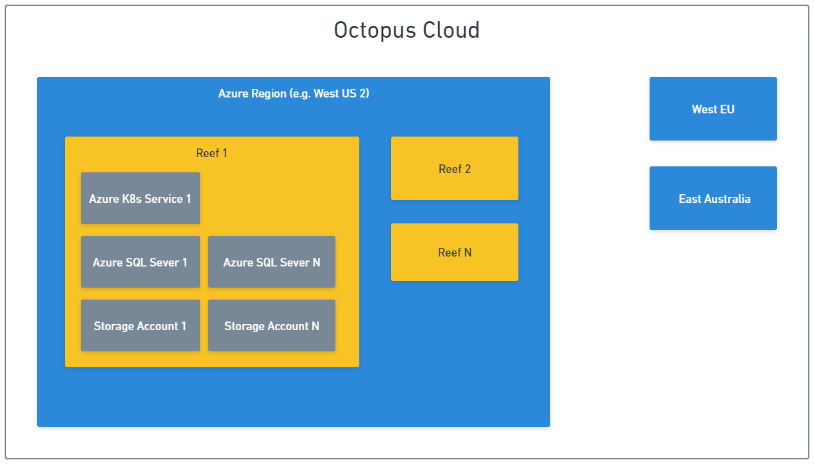
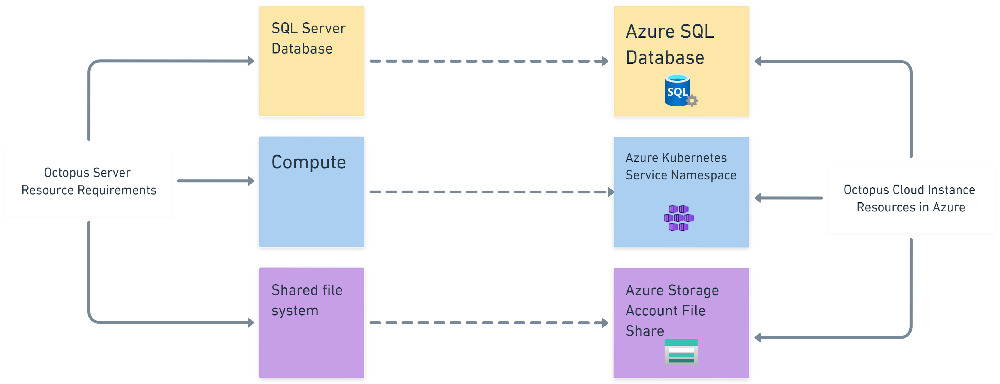

Octopus Cloud reliably runs thousands of Octopus Server instances. In this post, I explain the architecture that underpins this complex distributed system.

## What is Octopus Cloud

Octopus Cloud is the easiest way to run Octopus Deploy. It has the same software and functionality as Octopus Server, except we host it for you and we call it a Cloud instance. You don’t need to download, install, and manage it yourself. You can create [a free instance](https://octopus.com/start) if you want to give a try.

## Foundations of Octopus Cloud

We designed Octopus Cloud as a distributed system that can withstand partial infrastructure outages. To achieve this high-level goal, we created a set of guiding principles. The engineering team at Octopus has been following these principles since the product's inception.

### Avoiding a single point of failure

Octopus Cloud has what's sometimes called a cell-based architecture. A cell represents an independent and isolated part of a larger system. You can replicate the cells to increase the system's scalability and reliability. Individual cells get created, destroyed, upgraded, scaled, or simply stay broken without affecting the rest of the system.

#### Azure region as a cell

Octopus Cloud is currently deployed in [3 different Azure regions](https://octopus.com/docs/octopus-cloud#octopus-cloud-hosting-locations) and we can deploy to more regions if we see enough demand there. Resources used by Octopus Cloud in each Azure region are fully isolated from each other. This means that an outage in **West US 2** region only affects customers hosted in that region. It won't affect customers hosted in **West Europe** and **Australia East** regions.

#### Reef as a cell

Resources deployed into each Azure region also follow the cell-based architecture and are split into multiple reefs. A reef is a collection of Azure resources shared by several Cloud instances. Reefs don't share any resources, so an outage of one reef in a region doesn't affect other reefs in that region.  

Fun fact: We picked **reef** as the name because this is where octopuses usually live in tropical waters. The other popular contender was Octopus Cloud region, but we decided it might get easily confused with Azure region.

#### Cloud instance as a cell

Octopus Server is a monolithic .NET application that requires 3 basic resources to run:

- SQL Server database for structured data (for example, project data)
- Shared file system for unstructured data (for example, task logs and packages)
- VM or container for computing

Octopus Cloud provides Cloud instances with an Azure version of each of the required resources:

Driven by the cell-based approach used at the region and reef levels, this is where the strict isolation changes from a binary proposition to a spectrum of options. 

At one end of the spectrum, we can host a single instance on a dedicated reef. This is a powerful option, but we avoid using it because it’s not cost-effective.

At the other end of the spectrum, hundreds of instances can run on a single reef and share a single Azure SQL elastic pool, AKS cluster, and Azure storage account. This option works well for Cloud instances that are active at different times of the day and don’t generate much load.

Finally, we have a few options between these 2 extremes. For example, a busy Cloud instance might have dedicated resources assigned to its database, but likely shares its Kubernetes cluster and storage account with other Cloud instances.

:::hint
Because each Cloud instance has its own database and a file share, we can use built-in Azure tools to manage [backup and restore processes](https://octopus.com/docs/octopus-cloud/disaster-recovery).
:::

### Designing for gradual rollouts

The cell-based architecture lends itself to gradual rollouts because we can upgrade the infrastructure in each reef and region independently. This reduces the risk of a change causing an outage that affects the whole of Octopus Cloud. Nobody likes outages, but an outage affecting hundreds of instances is better than one affecting thousands. 

Provisioning a dedicated file share and a database for each Cloud instance also helps with the gradual rollout of the Octopus Server changes. This is because each instance can get upgraded and downgraded independently. That wouldn't be an easy goal to achieve if, for example, more than one Cloud instance shared the same database via database schemas or a similar mechanism that implements multi-tenancy.

### Scalable by default

Scalability is again where cell-based architecture shines. We can scale the infrastructure of Octopus Cloud easily by adding new reefs. We can also assign individual resource limits to each Cloud instance.

Fun fact: We had an event a few years ago when Octopus Cloud doubled the number of active Cloud instances in 48–72 hours, and nothing broke. No existing customers were affected and Octopus simply paid a higher hosting bill that month. 

### Avoiding temporal coupling

Octopus Cloud must be able to perform its primary function, which is keeping Cloud instances up and running, even when some non-essential services aren’t available. For example, Cloud instances should continue to operate when any of the following are not available:

- Octopus Cloud monitoring platform 
- Octopus Cloud management platform 
- Octopus Cloud observability platform 

In the context of [CAP theorem](https://en.wikipedia.org/wiki/CAP_theorem), Octopus Cloud opts for availability over consistency at the infrastructure level, and consistency over availability at the individual Cloud instance level.

### Using officially supported APIs only

Octopus Cloud glues together several third party services using their APIs. This might sound like an obvious choice. That said, we also extended this approach to interactions with internal services and Octopus Server itself. For example, if Octopus Cloud needs to provide a configuration value to a Cloud instance for a configuration setting that isn't exposed via a public API, then we add a new API. We won't modify this setting directly in the database even though we could.

Fun fact: After years of using APIs from major service and Cloud providers, we've learned that very few of them follow [SemVer](https://semver.org/). Also, changes to runtime characteristics (for example, a synchronous operation becomes asynchronous and vice versa) happen all the time and without any notice.

## Developer productivity

Cell-based architecture can also increase engineering productivity, which is often overlooked. You can test each change on its own isolated reef, either locally or using an automated build. There's no need for shared test or dev environments, which are commonly used for testing infrastructure-related changes in our industry.

## Trade-offs 

### Effort

Cell-based architecture requires a considerable effort to implement properly. It's not something that an existing system can easily evolve into. In software engineering, we often distinguish between exactly 1 and 1+ problems. This is because the effort to implement a solution that handles multiples of X can be an order of magnitude bigger than a solution that handles just one of X. Call-based architecture falls squarely into the 1+ bucket. 

### Hidden shared parts

If you think there must be something connecting all these independent parts, then you're right. In the real world, nothing can be 100% isolated. In Octopus Cloud's case, it's the DNS that plays the role of the connective tissue.

## Conclusion

Cell-based architecture is the cornerstone of Octopus Cloud's reliability and scalability. I hope this post has given you a high-level but insightful overview. If you have any questions about the Octopus Cloud architecture, please ask them in the comments section below.

Happy deployments!