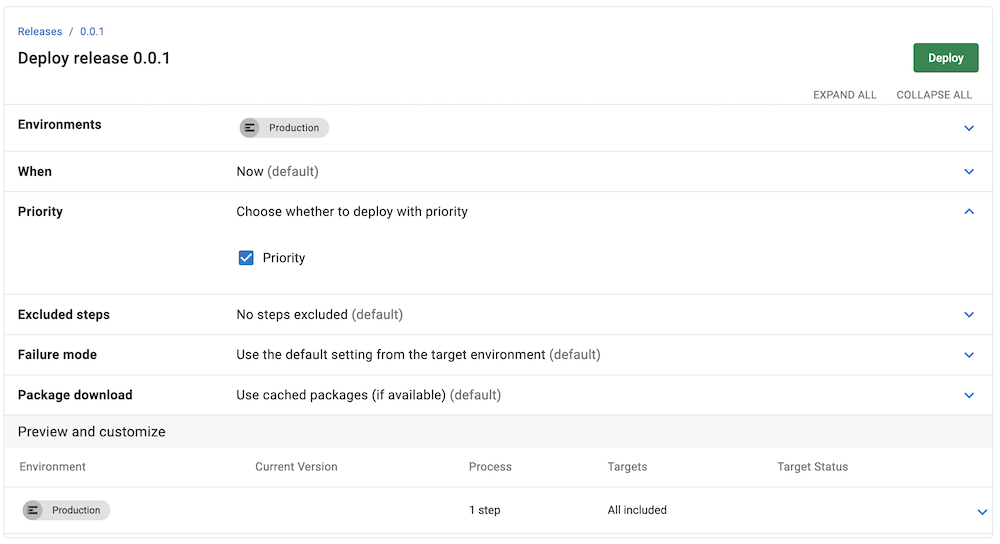
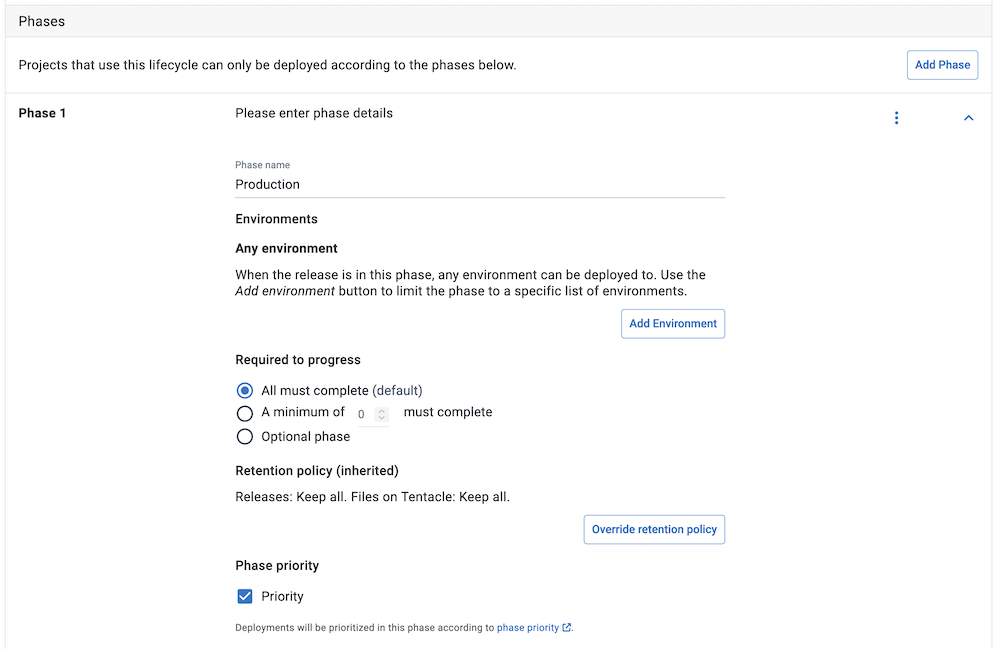
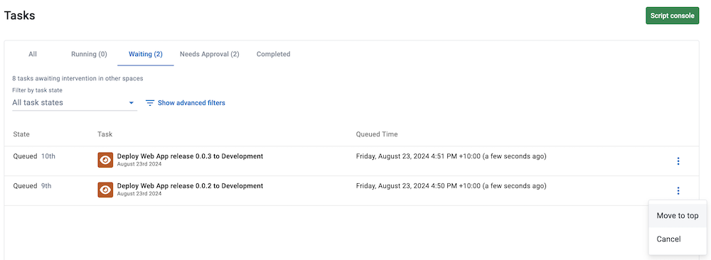

As our customers grow, we want to ensure they can deploy what they need, when they need to. We're excited to introduce 2 ways to prioritize essential deployments. This expands on the 2023.4 feature that lets you [manually prioritize a deployment](https://octopus.com/blog/reprioritize-task-queue). Now, we've automated the prioritization process, so you can expedite essential deployments.

In this post, I explain how to configure priority deployments.

## Prioritize deployments

We've introduced 2 ways to automate deployment priority:

1. Prioritize the deployment when creating a new deployment

2. Prioritize an environment in a lifecycle phase. This prioritizes all deployments to that environment(s) in the lifecycle.

### Prioritize when creating a new deployment

When creating a new deployment, configure its priority before deploying. By checking the **Priority** checkbox and deploying, your deployment gets fast-tracked to the top of the task queue.

### Prioritize an environment in a lifecycle phase

This option is beneficial if you want to prioritize all deployments to a specific environment. When configuring your lifecycle, check the **Priority** checkbox under **Phase Priority**. This ensures all deployments deployed to that lifecycle phase get prioritized in the task queue.

### Manually prioritize a deployment task

We introduced [manual task prioritization](https://octopus.com/blog/reprioritize-task-queue) in Octopus 2023.4. This is an excellent option to fast-track your deployments when they're already in the task queue. On the **Tasks** page, select the overflow menu for the task you want to prioritize, then select **Move to top**. Your task will move to the top of the queue.

## Conclusion

Priority deployments are available now for Cloud customers as an early access preview.

You can read more about [prioritizing tasks in our docs](https://octopus.com/docs/tasks/prioritize-tasks).

Happy deployments!