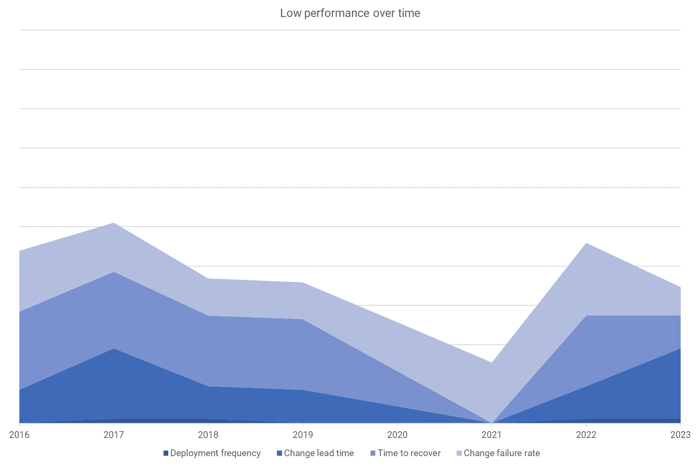
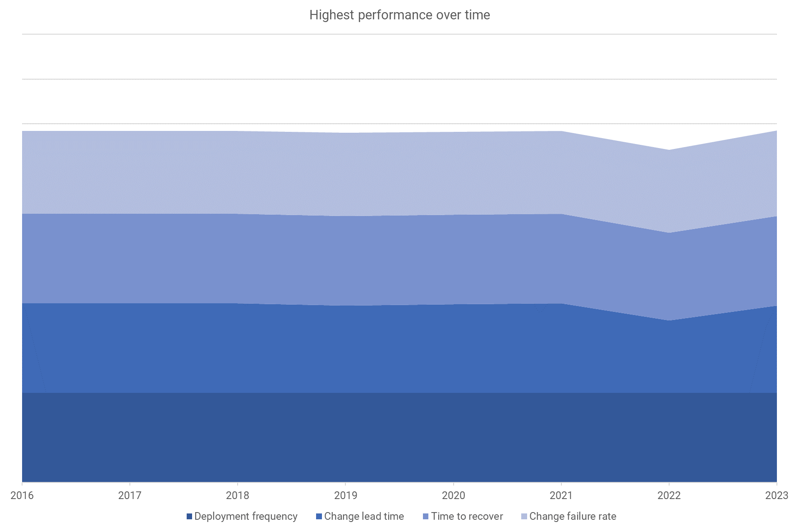
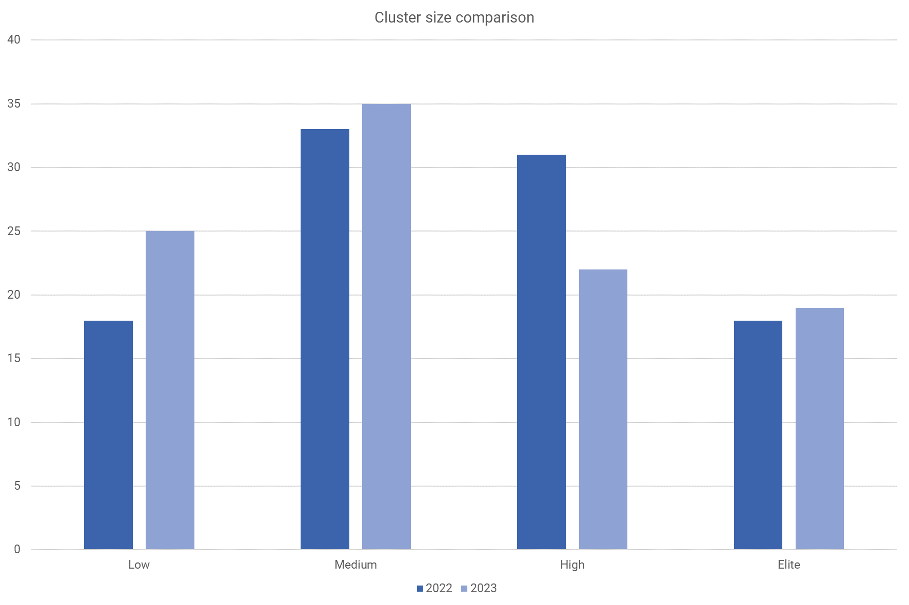

With the publication of [DORA's State of DevOps Report](https://dora.dev/dora-report) each year, our understanding of software delivery increases. For over a decade, the research has joined the dots on what makes software teams and their organizations successful.

One of the report's highlights is the software delivery performance clusters. These are groups of different performance levels that emerge from statistical data analysis. There's always a spread of varying performance levels, usually falling into low, medium, high, and elite groups.

You get higher performance by improving the 4 key [DORA metrics](https://octopus.com/devops/metrics/dora-metrics/):

- Deployment frequency
- Lead time for changes
- Change failure rate
- Failed deployment recovery time

By increasing your performance against these metrics, you can improve your organization's performance against its goals. Improving the throughput and stability of your deployment pipeline means working in smaller batches, which forces you to remove manual toil from the system with automation.

## Performance is always changing

Although the names used to describe performance levels have remained the same over the years, the performance they represent changes yearly.

The data includes new teams and organizations each year, depending on who responds to the annual survey. If more responses come from developers early in their careers, the clusters can reflect this.

If a team participates every year, they may move between clusters or end up in the same cluster but with a different definition.

We can compare the groups over time by converting the metrics into scores, making it easier to compare.

*The lowest performance levels are highly variable*

The lowest-performing cluster has been a bumpy ride over the years. In contrast, the highest-performing cluster (high or elite) has been relatively stable. You can see a small trough in 2022. You can read the [2022 performance cluster analysis](https://octopus.com/blog/new-devops-performance-clusters) to understand some of the reasons for these changes.

You'll notice from this comparison that the most significant difference between the lowest performance level and the highest is deployment frequency. Top performers deploy on demand, keeping their batch sizes small and using automation to remove risk and stress from the deployment process.

*The highest performance levels are relatively stable*

Even more important than performance is continuous improvement. When you measure your performance against the [DORA metrics](https://octopus.com/devops/metrics/dora-metrics/), you should aim to improve over time. The metrics help you understand your performance, whether it's improving, and what areas you can focus improvement ideas on. Octopus customers can use the [Octopus Insights feature](https://octopus.com/docs/insights) to see these metrics.

## The 2024 performance clusters

This year brings another plot twist. The medium and high-performance groups have inverted change failure rates. Usually, as deployment frequency increases, so does stability.

This remains true in general. Low performers deploy the least with the highest failure rates, while elite performers deploy the most with the lowest failure rates. For the middle groups, they're unexpectedly the other way around.

| Level  | Lead time         | Deployment frequency  | Change failure rate | Time to recover   |
|--------|-------------------|-----------------------|---------------------|-------------------|
| Low    | 1 to 6 months     | Monthly to biannually | 40%                 | 1 week to 1 month |
| Medium | 1 week to 1 month | Weekly to monthly     | **10%**             | Less than a day   |
| High   | 1 day to 1 week   | Daily to weekly       | **20%**             | Less than a day   |
| Elite  | Less than a day   | On demand             | 5%                  | Less than an hour |

The difference between low performance and elite performance remains spectacular. Elite performers deploy **182x** more, with **8x** lower change failure rates. Their change lead times are **127x** faster, and they can recover from a failed deployment **2,293x** faster - and that's not a typo.

Comparison with 2023 performance clusters:

- **Elite**: No difference.
- **High**: Change failure rates are higher.
- **Medium**: Change failure rates and time to recover have improved.
- **Low**: Throughput is worse, but stability has improved.

## Elite performance may be higher

Because elite performers deploy on demand, with changes taking less than a day to move through the deployment pipeline, they may continue to improve in undetectable ways. Their change lead times may have improved from 7 hours to 1 hour, but that's still classed as "less than a day". If they've continued to deploy on demand, they could be deploying 7x more, but that's still "on demand".

While it's tempting to increase the fidelity by collecting more precise responses, the reality is that the precision matters less as your performance increases. Thinking about how you'd go from monthly to weekly deployments will generate many improvement ideas. When you deploy each change on demand, the difference between deploying every 35 minutes or every 30 minutes is likely not the best area to focus improvement efforts on.

Instead, when you achieve elite performance levels, you should try to become more user-centric so more of the changes you deliver are valuable to the people using the software.

For most organizations, though, elite performance has yet to be achieved.

*Elite performance represents less than 20% of organizations*

## How to apply the research

Use the DORA metrics to track your improvement efforts over time. Using them to compare teams can be tempting, but this will lead to unintended and often undesirable behaviors.

The clusters demonstrate that organizations across all industries can achieve elite performance—even regulated and safety-critical sectors. Industry is no barrier to high performance, and the elite cluster shows that, given appropriate culture and practices, you can achieve high throughput and stability.

The DORA research extends well beyond the 4 key metrics. Use the [capability catalog](https://dora.dev/capabilities/) to find ways to improve how you work, and [download the latest report](https://dora.dev/dora-report) to get all the insights.

Instead of aiming for a specific performance level, seek to improve performance continually over time. Many of the changes you introduce to increase throughput will also benefit stability, like removing toil, automation, and smaller batches of work.

As Nathen Harvey says, "Elite improvement is more important than elite performance."

Happy deployments!