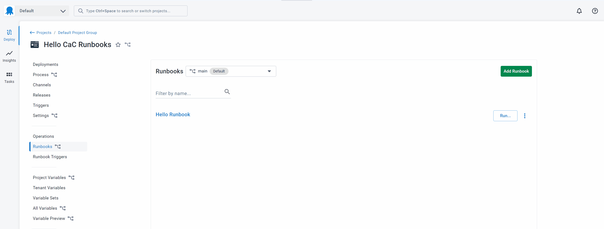
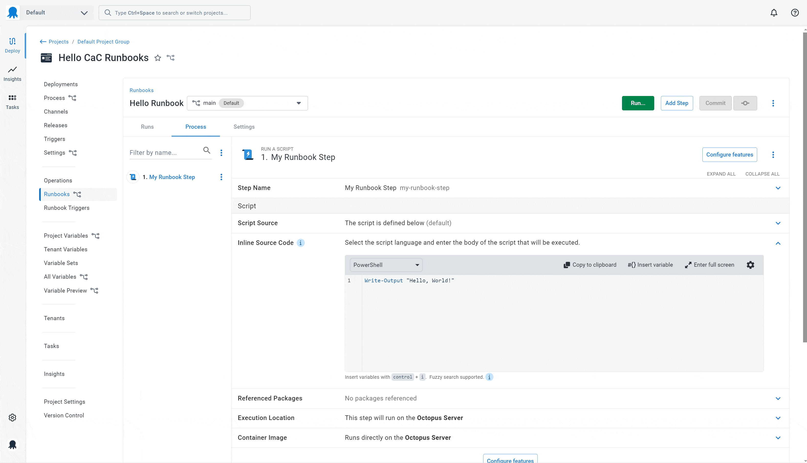

We're excited to announce that Configuration as Code for Runbooks has started rolling out to our Cloud customers. It will be available for our self-hosted customers in the 2024.4 release later this year.

Config as Code for Runbooks has been one of our most requested features. You told us that you wanted your runbooks to gain the benefits of version control. Until now, you had to update your runbooks and application code in 2 different places, making it hard to keep your runbooks in sync with your application and deployment changes. It was also inconvenient not being able to view the history of changes in Git like you can for your deployment processes.

Config as Code support for runbook processes complements our existing support for version-controlled deployment processes. When you enable Config as Code, you can track your runbook process in your Git repo next to your related application code or other operation files. You can continue using the Octopus UI as you always have, or edit the config files in your favorite editor. 

Config as Code for Runbooks brings some changes to the existing runbooks experience. In this post, I explain Config as Code for Runbooks and highlight some of the changes you'll see. 

## Why Config as Code for Runbooks?

The [Octopus Runbooks](https://octopus.com/docs/runbooks) feature lets you automate routine and emergency operations tasks, giving you one platform for DevOps automation. 

Storing your runbooks in your Git repository alongside your application code, deployment process, and variables unlocks the full power of version control. This means:

- You can make and test changes to your runbooks alongside your application code changes so they're never out of sync. 
- On top of existing Octopus permissions and audit logs, you can review all changes through pull requests and have a full history of all changes made to your runbooks. 
- With your runbooks in Git, it’s easy to run an old version by running the runbook at a commit or tag. If you make a mistake and need to roll back, you have a full history of all changes and can roll back to any point in time.

## Snapshots changing to branches

Without Config as Code for Runbooks, when running a runbook, you pick from 2 different versions: the published snapshot or the latest draft.

When running the published snapshot, we run a version of the runbook that was snapshotted sometime in the past and marked as the published version. When running the latest draft, we create a new snapshot of the latest process and variables at the time of running, every time you run. This lets you make and test changes to your runbooks without impacting day-to-day operations.

With Config as Code for Runbooks, you can make and test changes to a runbook on a branch without impacting the rest of the team, so there's no need for published and draft versions.

After your changes have been tested and reviewed, simply merge them into your default branch to make them available for the rest of the team.

You can also run an old version of a runbook from a commit or tag at any time – there's no need to go searching through old snapshots trying to find one that works.

### How will runbook permissions work?

If you're using the built-in Runbook Producer and Runbook Consumer roles, these will still apply to Config as Code for Runbooks.

- Runbook Producers can run runbooks on any branch, commit, or tag.

- Runbook Consumers can view a runbook on any branch but can only run the latest version of the runbook from the default branch.

## Using Config as Code for Runbooks

Config as Code for Runbooks is rolling out to our Cloud customers now. It  will be available to our self-hosted customers as part of the 2024.4 release. 

If you want to use Config as Code for Runbooks, you need to migrate your existing runbooks using our simple migration tool. A prompt will appear when it's available in your instance. 

## Conclusion

Config as Code for Runbooks has been one of our most requested features, and we're excited that it's started rolling out. We'll be providing more information soon, so stay tuned more for more updates on our blog, in our newsletter, on social media, and in our docs. 

Happy deployments!