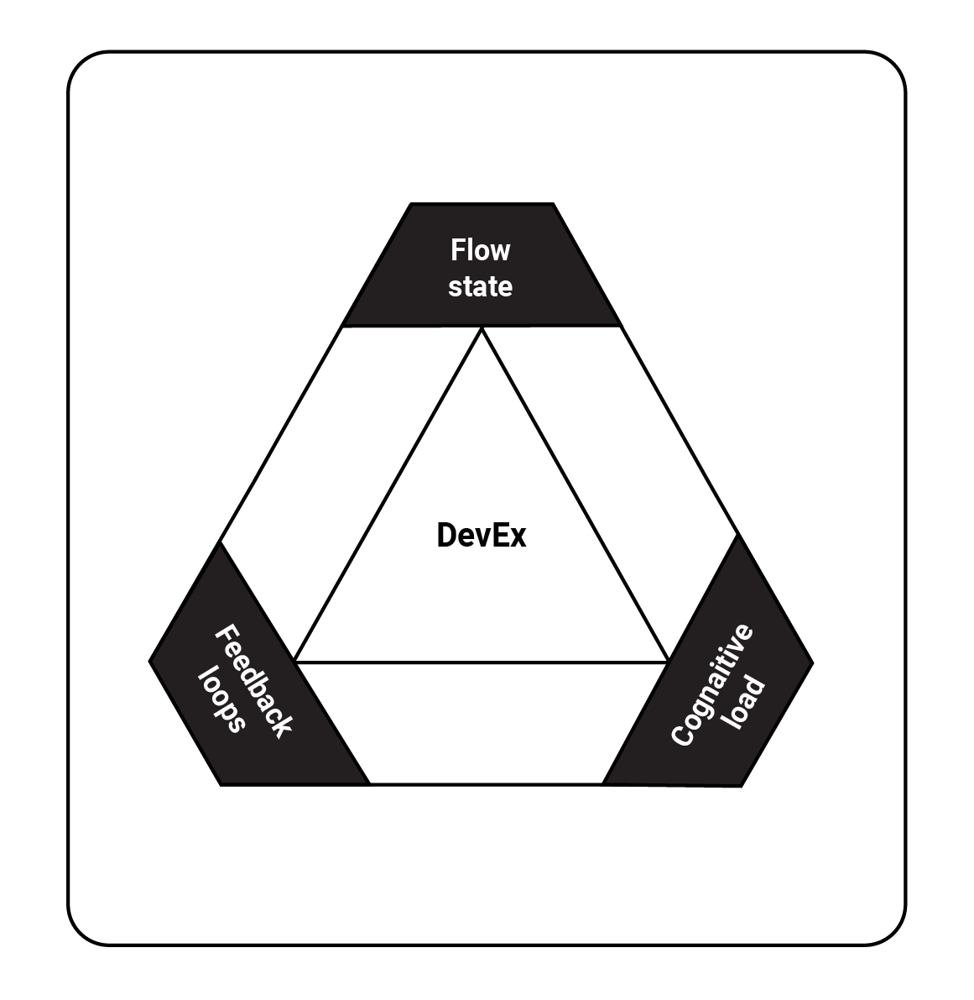
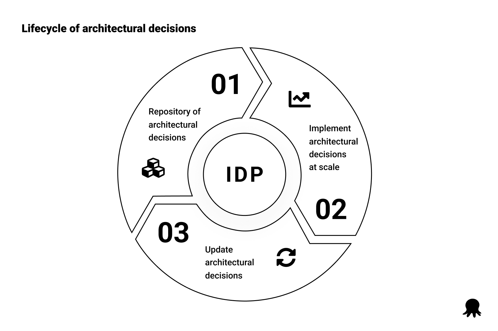
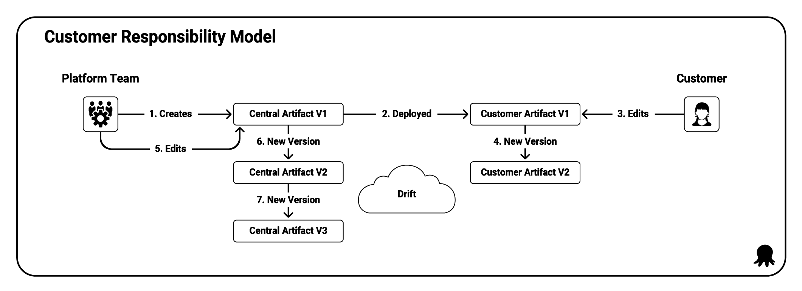
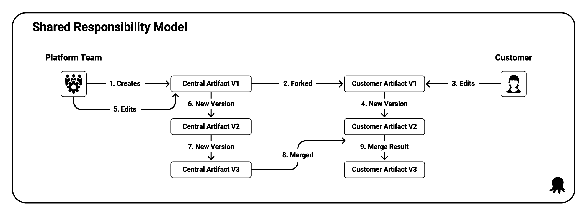
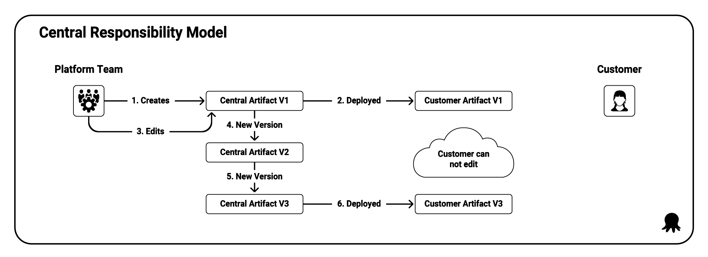
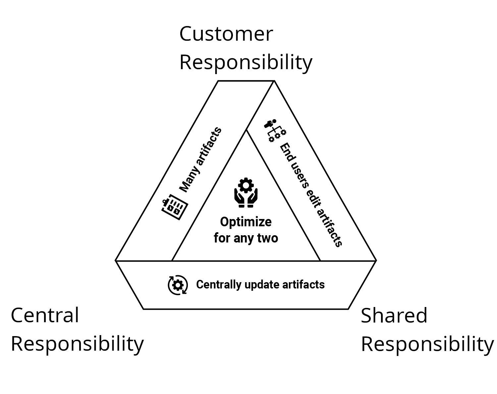

AI has generated a lot of excitement and criticism ever since ChatGPT highlighted the potential and limitations of generative AI. DevOps teams have a unique challenge developing and deploying AI platforms because they are tasked with realizing the value of AI and delivering it to customers safely, reliably, and predictably.

Fortunately, most of the best practices we have adopted for deploying and maintaining software still apply to those responsible for AI platforms. Much like database deployments, which have always been tightly coupled to application deployments, deploying AI models and other AI artifacts benefit from a tight integration with the DevOps lifecycle. The atomic elements of AI deployments are just files to be moved around, API calls to hosting platforms, IaC to manage infrastructure, and human-based workflows to coordinate, test, and authorize changes. 

While AI presents novel social and ethical challenges, the largest technical challenges when deploying AI platforms are applying existing processes, like transferring packages, to AI-specific services, like [HuggingFace](https://huggingface.co/), or replicating security practices, such as CVE scanning, to AI models.

AI teams may also have the luxury of working on greenfield projects, which allows them to design their DevOps processes from the ground up, taking advantage of trends like platform engineering and focusing on DevEx.

In this post, we’ll explore the practices, ideals, and compromises that DevOps teams spinning up new AI projects must consider as they lay the foundation of their DevOps lifecycle.

## It starts and ends with DevEx

DevOps started with an insight as obvious as it was brilliant: what if instead of separate development and operations teams with distinct management hierarchies, measured on (often competing) outcomes, and communicating through tickets, we had one team reporting to a shared management hierarchy measured on shared outcomes focused on delivering value to customers?

Over the years, though, DevOps has come to encompass so much that it has almost no meaning. To say you have a DevOps job has about as much meaning as saying you have a sales, finance, or management job. DevOps's nature is to consume as much responsibility as it can (demonstrated by all the Dev-Insert-Something-Here-Ops paradigms that have evolved), often without any consideration for who has to deliver this growing sphere of responsibility. The frustration of DevOps team members with the inability to answer the question “What am I not responsible for?” has led to the rise of DevEx.

As noted in the paper [DevEx: What Actually Drives Productivity](https://queue.acm.org/detail.cfm?id=3595878), DevEx has three dimensions: flow state, cognitive load, and feedback loops:

DevOps teams can support all three of these dimensions by ensuring every member of the team can confidently answer the question, “What am I not responsible for?” Keeping this question in mind as you develop your DevOps processes is a powerful strategy for maximizing the best that DevOps has to offer without inadvertently building a system that only functions because everyone is responsible for everything all the time.

## DevEx as a Service

Platform Engineering is one of the most effective ways to answer the question, “What am I not responsible for?” At its core, Platform Engineering, and specifically, the Internal Developer Platform (IDP) that is the interface between the platform and DevOps teams, must satisfy three requirements:

1. Provide a repository of architectural decisions.
2. Enable architectural decisions to be implemented at scale.
3. Define feedback processes that ensure architectural decisions are updated over time.

In this context, we refer to the book [Objects, Components, and Frameworks With UML: The Catalysis Approach](https://www.amazon.com/Objects-Components-Frameworks-UML-Catalysis/dp/0201310120) by Desmond D'Souza and Alan Wills for this definition of “architecture”:

> The set of design decisions about any system (or smaller component) that keeps its implementors and maintainers from exercising needless creativity.

In other words, architectural decisions answer the question, “What am I not responsible for?” by providing DevOps teams with golden pipelines, common tools, processes, and best practices, which serve as the foundation for building valuable solutions to meaningful problems.

When the goal of platform engineering is to deliver improved DevEx, the end result is [DevEx as a Service (DEaaS)](https://octopus.com/publications/devex-as-a-service).

The architectural decisions maintained by your DEaaS implementation will adopt one of three responsibility models.

**Customer responsibility** (or eventual inconsistency) occurs when a customer takes a copy of an artifact capturing architectural decisions and then owns it. 

**Shared responsibility** (or eventual consistency), where the DEaaS team and customers collaborate on shared artifacts. 

**Central responsibility** (or enforced consistency), where the DEaaS team owns the artifacts and exposes controlled interfaces to customers.

Bringing this back to the question, “What am I not responsible for?”:

* The customer responsibility model makes the DEaaS team responsible for creating artifacts, while customers are responsible for editing and maintaining artifacts after they take ownership.
* The shared responsibility model makes the DEaaS team responsible for creating artifacts and providing a process for customers to contribute updates, while customers have the responsibility (and sometimes the obligation) to improve the artifacts.
* The central responsibility model makes the DEaaS team responsible for creating and maintaining artifacts. Customers can use the artifacts but are not responsible for maintaining them.

The responsibility models are each subject to constraints around who can edit artifacts, how artifacts are maintained over time, and how many artifacts can be managed by the DEaaS team. These constraints are captured by the responsibility triad, where artifacts maintained by the DEaaS team can optimize for any two of the three concerns:

When implemented correctly, every DevOps team member can clearly identify what they are and are not responsible for when consuming artifacts provided by the DEaaS team. This allows them to focus on building valuable solutions to meaningful problems.

This is reinforced by Meryem Arik, co-founder of TitanML, who noted in her talk [Navigating LLM Deployment: Tips, Tricks, and Techniques](https://www.infoq.com/presentations/llm-deployment/) that:

> Deployment is really hard, so it's better if you deploy once, you have one team managing deployment, and then you maintain that, rather than having teams individually doing that deployment, because then each team individually has to discover that this is a good tradeoff to make. What this allows is it allows the rest of the org to focus on that application development while the infrastructure is taken care of.

## The 10 pillars of pragmatic deployments

There are several common non-functional requirements associated with the DevOps lifecycle that DEaaS teams must consider as they decide which architectural decisions to share with the DevOps teams. These have been grouped into the 10 pillars of pragmatic deployments.

AI developers are held to a high standard, with AWS noting that governance, defined as “Incorporating best practices into the AI supply chain, including providers and deployers,” is a [core dimension of responsible AI](https://aws.amazon.com/ai/responsible-ai/).

**Repeatable deployments** ensure that DevOps teams can deploy new features and fixes in an automated and consistent manner. While it may be necessary to involve some human decision-making before software is deployed to production, the low-level work involved in deployments must be automated. [Google's AI and ML perspective: Operational excellence](https://cloud.google.com/architecture/framework/perspectives/ai-ml/operational-excellence) documentation notes that "Automation enables seamless, repeatable, and error-free model development and deployment."

**Verifiable deployments** bake testing into the deployment process. Testing has added significance when deploying AI applications because GenAI models are non-deterministic by design, which means every deployment is effectively slightly broken all the time. Tests are crucial for ensuring that AI applications meet minimum requirements while catching the subtle and hard to diagnose bugs that can arise from seemingly simple changes to underlying models. Google calls this out with “Test, Test, Test” as part of their [responsible AI practices](https://ai.google/responsibility/responsible-ai-practices/), saying developers should “Conduct integration tests to understand how individual ML components interact with other parts of the overall system.”

**Seamless deployments** implement strategies like blue/green and canary deployments to enable progressive delivery and facilitate quick recoveries. Like verifiable deployments, seamless deployments are important for AI applications because it can often be difficult to fully understand the outcome of every model change. Rolling changes out slowly or having the ability to quickly revert a deployment can reduce the risk of unintended changes negatively affecting your customers. [Google's AI and ML perspective: Operational excellence](https://cloud.google.com/architecture/framework/perspectives/ai-ml/operational-excellence) documentation advises teams to "Implement phased release approaches such as canary deployments or A/B testing, for safe and controlled model releases."

**Recoverable deployments** are related to seamless deployments and focus on how quickly a team can roll forward or backward to restore a production service. Fortunately, AI platforms don’t tend to rely heavily on persistent state, meaning deployments can be easily rolled back. The post [Achieve operational excellence with well-architected generative AI solutions using Amazon Bedrock](https://aws.amazon.com/blogs/machine-learning/achieve-operational-excellence-with-well-architected-generative-ai-solutions-using-amazon-bedrock/) notes that "Automated deployment techniques together with smaller, incremental changes reduces the blast radius and allows for faster reversal when failures occur."

**Visible deployments** allow DevOps teams to answer questions like “What is the state of production?” and “What has changed since the last deployment?” [Microsoft’s Human AI Experience (HAX) workbook](https://www.microsoft.com/en-us/haxtoolkit/workbook/) lists “Notify users about major changes” as one of the guidelines, which requires a good understanding of how the production environment has changed between deployments.

**Measurable deployments** are essential to measuring the performance of a DevOps team against common metrics like those [popularized by DORA](https://dora.dev/guides/dora-metrics-four-keys/). Capturing these metrics in the deployment process ensures they are consistent and reliable. AI deployments, in particular, must be able to quickly adapt to new models, as noted by Meryem Arik in her talk [Navigating LLM Deployment: Tips, Tricks, and Techniques](https://www.infoq.com/presentations/llm-deployment/) saying "Build as if you're going to replace the models within 12 months, because you will," and "In fact, if you check out the Hugging Face, which is where all of these models are stored, if you check out their leaderboard of open-source models, the top model changes almost every week."

**Auditable deployments** allow DevOps teams to track what changes were made, by whom, and when the change was made. CSIRO calls out “supply chain accountability” as a core part of [their responsible AI research](https://www.csiro.au/en/research/technology-space/ai/responsible-ai).

**Standardized deployments**, or golden pipelines, are a common architectural decision the DEaaS team shares. Golden pipelines define common deployment steps and encapsulate business requirements like security scanning, manual approvals, deployment windows, and notifications. Modeling deployments and resources using Infrastructure as Code (IaC) allows them to be recreated at scale. [Google's AI and ML perspective: Operational excellence](https://cloud.google.com/architecture/framework/perspectives/ai-ml/operational-excellence) documentation advises teams to "Manage your infrastructure as code (IaC). This approach enables efficient version control, quick rollbacks when necessary, and repeatable deployments."

**Maintainable deployments** automate day 2 maintenance and ad-hoc tasks like downloading log files, restarting services, performing backups, or applying updates. Teams responsible for managed AI services will also benefit from automating processes like adjusting token limits.

**Coordinated deployments** allow DevOps teams to synchronize the deployment of two or more applications that are coupled to each other. They also expose business processes, such as approvals with ITSM platforms, to ensure deployments are performed in conjunction with other business units and all appropriate stakeholders have given their approval. [Microsoft’s Responsible AI principles and approach](https://www.microsoft.com/en-us/ai/principles-and-approach) calls out accountability as a key requirement, asking, “How can we create oversight so that humans can be accountable and in control?”

The 10 pillars of pragmatic deployments represent architectural decisions to bake into the DevOps lifecycle. Understanding which are important to your team and how they support AI best practices removes a manual decision your DevOps team needs to make as they deliver new features to your customers.

## Summary

It is not surprising that AI and DevOps best practices overlap. All the major cloud providers emphasize automation, testing, supply chain accountability, human oversight, and transparency, all supported by a robust DevOps lifecycle.

Consistently delivering a high-quality product means best practices can not be opt-in. Define best practices as architectural decisions that are implemented at scale throughout your DevOps teams and refined over time. This allows DevOps teams to focus on creating valuable solutions to meaningful problems rather than being burdened with menial tasks.

DEaaS provides a framework for thinking about how these architectural decisions allow DevOps team members to answer the question “What am I not responsible for?”, which in turn supports good DevEx, with the 10 pillars of pragmatic deployments listing the non-functional requirements found in a robust DevOps lifecycle.

