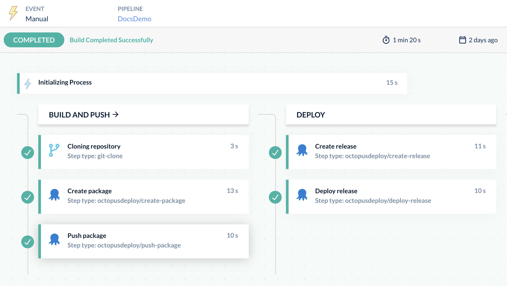

We're excited to announce the first set of official [Codefresh steps](https://codefresh.io/steps/) for Octopus Deploy. Codefresh is a modern CI/CD platform built on top of Docker. Their CI product, Codefresh Pipelines, are customizable workflows made from a series of steps, each performing their own action. 

In this post, I walk you through the process of creating a release and deploying it to an Octopus environment through Codefresh Pipelines.

## What are Codefresh steps?

Codefresh steps are the building blocks for creating Codefresh pipelines. You can chain them together in any sequence. You execute each step in the context of its own Docker container, with a default workspace that's [shared between all steps in the pipeline](https://codefresh.io/docs/docs/pipelines/introduction-to-codefresh-pipelines/#sharing-the-workspace-between-build-steps). The shared volume contains data that's accessible to all steps in the pipeline, so files you use and access in one step can be used in all subsequent steps. 

All our Octopus Deploy steps use and execute inside the [octopus-cli Docker container](https://hub.docker.com/r/octopuslabs/octopus-cli). Within each step, we use the Octopus CLI to interact with your Octopus instance to create, push, and deploy. 

We're thrilled to introduce the addition of the following steps to the [Codefresh steps marketplace](https://codefresh.io/steps/):

- Login to Octopus Deploy
- [Push packages to Octopus Deploy](https://codefresh.io/steps/step/octopusdeploy-push-package)
- [Create releases in Octopus Deploy](https://codefresh.io/steps/step/octopusdeploy-create-release)
- [Deploy a release in Octopus Deploy](https://codefresh.io/steps/step/octopusdeploy-deploy-release)
- [Deploy a tenanted release in Octopus Deploy](https://codefresh.io/steps/step/octopusdeploy-deploy-release-tenanted)
- [Run a runbook in Octopus Deploy](https://codefresh.io/steps/step/octopusdeploy-run-runbook)
- [Push build information to Octopus Deploy](https://codefresh.io/steps/step/octopusdeploy-push-build-information)


## Step configuration

Each step needs the following details to run: 

- An Octopus instance URL
- A space name

We recommend using [Codefresh variables](https://codefresh.io/docs/docs/pipelines/variables/) to set these values, so that each step can use the same variable value. For sensitive values like API keys, remember to [encrypt your variable](https://codefresh.io/docs/docs/pipelines/variables/) to avoid security vulnerabilities. 

## Example workflow

The following example Codefresh workflow is a common scenario that customers of Octopus Deploy may be familiar with. For this example, we'll configure the following steps:

- Clone a Git repository
- Create a zip of the repository
- Push the package to the [Octopus Deploy built-in feed](https://octopus.com/docs/packaging-applications/package-repositories/built-in-repository)
- Create a new release in project `Example Project` with the pushed package
- Deploy the created release to environment `Development`

Since each Codefresh step calls the Octopus CLI, each step's required and optional arguments should follow the CLI's required and optional parameters quite closely. You can find documentation on each individual step by searching for the step in [Codefresh's step marketplace](https://codefresh.io/steps/). 

In the following example, we split the steps into 2 [stages](https://codefresh.io/docs/docs/pipelines/stages/): 

- Build and push
- Deploy 

These stages help with the pipeline's visualization, but have no effect on the order of execution of the steps. By default, the steps should flow sequentially from the first defined in the YAML file to the last. 

```yaml
version: "1.0"

stages:
  - "build and push"
  - "deploy"

steps:
  clone:
	title: "Cloning repository"
	type: "git-clone"
	stage: "build and push"
	repo: "https://github.com/repoName/exampleRepository"
	revision: "main"
	working_directory: "/codefresh/volume"
	credentials:
  	username: ${{GITHUB_USERNAME}}
  	password: ${{GITHUB_PASSWORD}}
  
create-package:
	title: "Create package"
	type: octopusdeploy-create-package
	stage: "build and push"
	arguments:
  	ID: "Hello"
  	VERSION: "1.0.0-${{CF_BUILD_ID}}"
  	BASE_PATH: "/codefresh/volume"
  	OUT_FOLDER: "/codefresh/volume"
  
push-package:
	title: "Push package"
	type: octopusdeploy-push-package
	stage: "build and push"
	arguments:
  	OCTOPUS_API_KEY: ${{OCTOPUS_API_KEY}}
  	OCTOPUS_URL: ${{OCTOPUS_URL}}
  	OCTOPUS_SPACE: "Spaces-42"
  	PACKAGES:
    	- "/codefresh/volume/Hello.1.0.0-${{CF_BUILD_ID}}.zip"
  	OVERWRITE_MODE: 'overwrite'

  create-release:
	type: octopusdeploy-create-release
	title: "Create release"
	stage: "deploy"
	arguments:
  	OCTOPUS_API_KEY: ${{OCTOPUS_API_KEY}}
  	OCTOPUS_URL: ${{OCTOPUS_URL}}
  	OCTOPUS_SPACE: "Spaces-42"
  	PROJECT: "Demo Project"
  	RELEASE_NUMBER: "1.0.0-${{CF_BUILD_ID}}"
  	PACKAGES:
   	- "Hello:1.0.0-${{CF_BUILD_ID}}"
  	RELEASE_NOTES: This is a release note

  deploy:
	type: octopusdeploy-deploy-release
	title: "Deploy release"
	stage: "deploy"
	arguments:
  	OCTOPUS_API_KEY: ${{OCTOPUS_API_KEY}}
  	OCTOPUS_URL: ${{OCTOPUS_URL}}
  	OCTOPUS_SPACE: "Spaces-42"
  	PROJECT: "Demo Project"
  	RELEASE_NUMBER: "1.0.0-${{CF_BUILD_ID}}"
  	ENVIRONMENTS:
    	- "Development"
```
For the last step in the workflow, we defined a step with the name `deploy`. This step uses one of our Codefresh Octopus Deploy steps - the `octopusdeploy-deploy-release` step. 

We defined an Octopus instance URL and API key using Codefresh variables, and are passing them in as arguments using the Codefresh variable substitution syntax. 

The output of the pipeline build running in Codefresh looks something like this:

*Example pipeline workflow with Octopus Deploy steps*

## Step output values

Along with sharing files between steps using the shared volume, each step also produces outputs. Any subsequent step in the pipeline can then access these output values.

| Step | Output | Description |
| -------- | ------- | -------- |
| octopusdeploy-login |  |  | 
| octopusdeploy-create-package | `FILE` | JSON object with property ‘path' for the path to the created zip file |
| octopusdeploy-push-package | - | This step has no output. | 
| octopusdeploy-create-release | `RELEASE` | JSON object with `channel` and `version` for the created release | 
| octopusdeploy-deploy-release | DEPLOYMENTS | JSON array of objects with `deploymentId` and `serverTaskId` for created deployments | 
| octopusdeploy-deploy-release-tenanted | `DEPLOYMENTS`  | JSON array of objects with `deploymentId` and `serverTaskId` for created deployments | 
| octopusdeploy-run-runbook | `DEPLOYMENTS` | JSON array of objects with `runbookId` and `serverTaskId` for created runbooks | 
| octopusdeploy-push-build-information | - | This step has no output. | 

# Conclusion

Codefresh steps for Octopus Deploy are yet another way to streamline your processes. Customize your build pipeline through Codefresh and watch your Octopus deployments fly through the door.

Happy deployments!