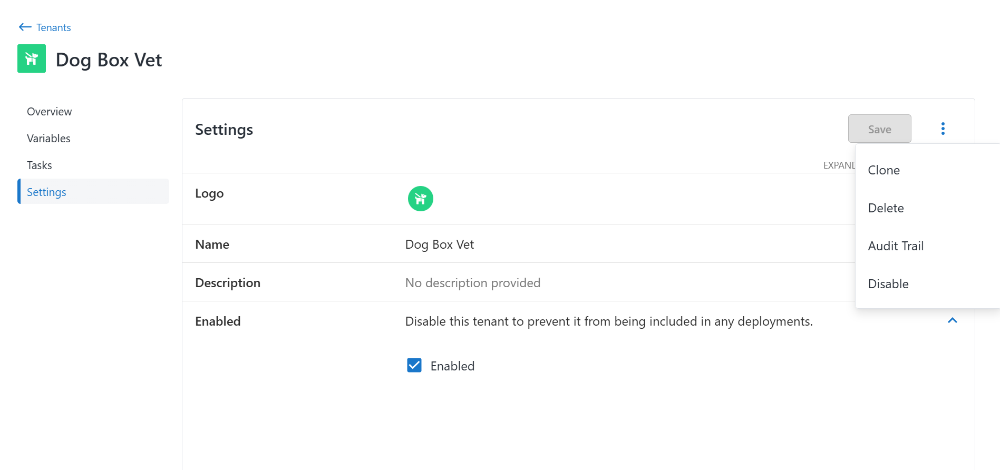
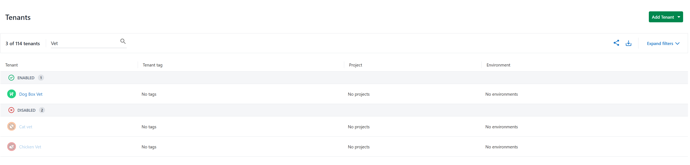
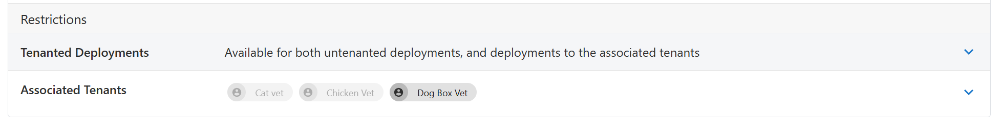
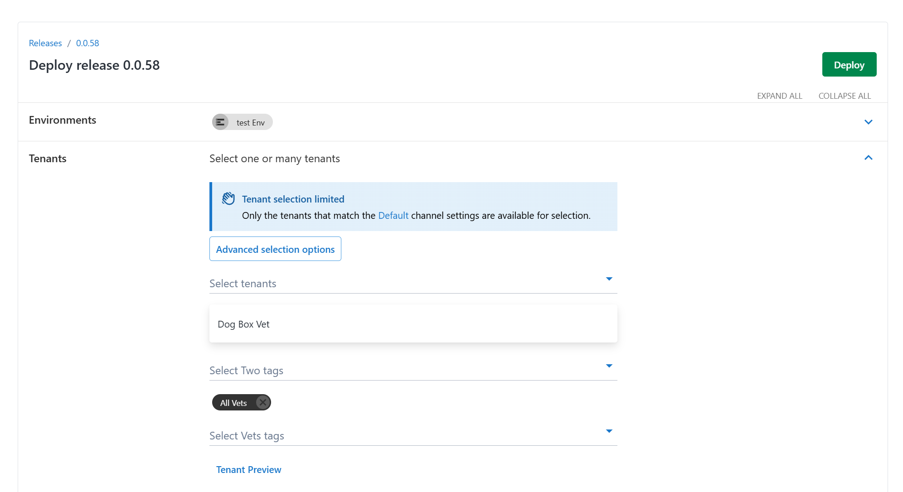
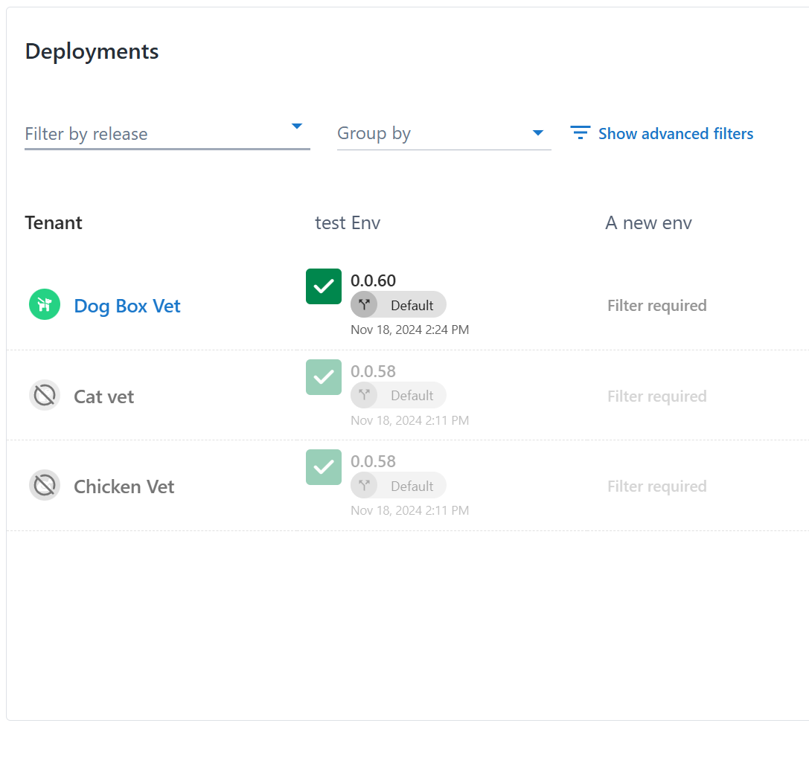

In response to [customer feedback](https://roadmap.octopus.com/c/158-ability-to-disable-tenants) in 2025.1 Octopus has added support for disabling tenants. This also removes disabled tenants from license calculations. Disabled tenants prevent deployments and runbook runs but remain editable.

## Enabling and Disabling

Tenants can be enabled and disabled in the tenant settings page. Support is included for the [Terraform provider](https://registry.terraform.io/providers/OctopusDeployLabs/octopusdeploy/latest/docs/resources/tenant) and [CLI](https://octopus.com/docs/octopus-rest-api/cli).

Tenants are now grouped by their enabled or disabled status on the tenants and project tenants pages.

Disabled tenants can still be edited, added or removed from any related entities. In these scenarios disabled tenants can be identified by their disabled chip state.

## Deployments and Runbooks
When creating a deployment or runbook run manually or through triggers only enabled tenants will be able to be selected. If you are selecting tenant tags, only enabled tenants with that tag will be deployed to, disabled tenants will automatically be filtered out. Deployments to disabled tenants through the CLI or API will fail, throwing an error.

When creating a deployment against a tenant tag, all disabled tenants will be ignored. This allows for tenants to effectively be removed from all deployments at the tenant level, and later re-enabled if required.

## Conclusion

The ability to disable tenants in Octopus 2025.1 provides greater flexibility and control over your deployments. This feature simplifies preventing deployments to specific tenants, managing licensing requirements, and keeping your environment organized without losing access to historical configurations.

With support across the UI, CLI, and Terraform provider, managing tenant states is accessible anywhere. We’re excited to hear how this feature helps you simplify your processes so, as always, we’d love to hear your feedback. Let us know how you’re using this feature and what future improvements you’d like to see.

Happy deployments! 
