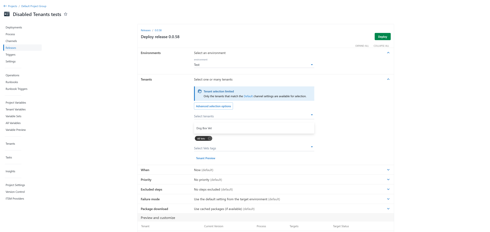

In 2025.1 Octopus has added support for disabling tenants in respose to [customer requests](https://roadmap.octopus.com/c/158-ability-to-disable-tenants). This capability allows you to manage tenants easily, preventing deployments to a specific tenant. This also removes tenants from license calculations allowing you to effectively archive unused tenants and re-enable them in the future. Disabled tenants do not allow deployments or runbook runs but are able to be edited.

## Enabling and Disabling

Tenants can be enabled and disable in the tenant settings page. Support has also been added for the [terraform provider](https://registry.terraform.io/providers/OctopusDeployLabs/octopusdeploy/latest/docs/resources/tenant) and [CLI](https://octopus.com/docs/octopus-rest-api/cli).

Tenants are now grouped by their enabled or disabled state.

Disabled tenants can still edited, added or removed from any related entities. In these scenarios disabled tenants can be identified by their disabled chip state.

## Deploying
When creating a deployment or runbook run only enabled tenants will be able to be selected. When selecting tenant tags, only enabled tenants with that tag will be deployed to. Deploying to a single disabled tenant will cause an error preventing deployment creation.

When creating a deployment against a tenant tag, all disabled tenants will not be deployed to. This allows for tenants to effectively be removed from all deployments in one place, and later re-enabled if required.

## Conclusion

The ability to disable tenants in Octopus 2025.1 provides greater flexibility and control over your deployments. This feature helps ease the process of preventing deployments to specific tenants, manage licesning requirements and keep your environment organized without losing access to historical configurations.

With support across the UI, CLI, and Terraform provider, managing tenant states is accessible anywhere. We’re excited to hear how this feature helps you simplify your processes so as always, we’d love to hear your feedback. Let us know how you’re using this feature and what future improvements you’d like to see.

Happy deployments! 
