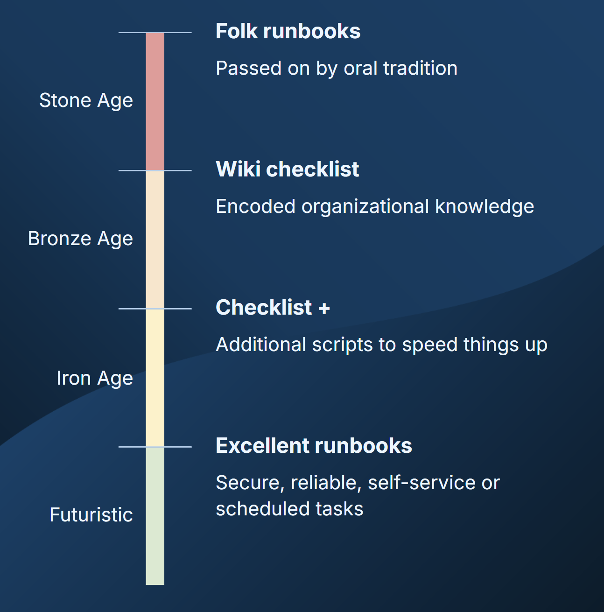
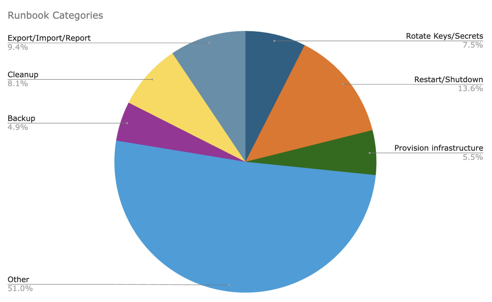

Octopus added a feature to help you automate your operations runbooks in 2019. In our recent webinar, Michael Richardson and I discussed when runbooks became available, why automating them with Octopus is beneficial, and how people use them in the real world.

You can [watch the webinar](https://www.youtube.com/live/UEysbmos2T0?t=267s) or read on to find a summary of all the key points.

## What's a runbook?

A runbook is a set of steps you need to follow to complete a task. This includes a number of routine and emergency operations tasks, like taking regular database backups or changing firewall configuration when an application is under attack.

If you go back in time, you'd find runbooks were just in the minds of the senior team members. They knew how to do something and they'd show others how to do it. This is the era of folk runbooks, where the stories were passed from generation to generation around a campfire.

The success of these early runbooks depended greatly on the accuracy of the knowledge transfer and the memory of the people learning how things worked. Each team member would know a subset of the runbooks that had been shared as the need presented itself.

Eventually, people realized it would be a good idea to capture this knowledge in written form. They were often stored in a big lever-arch file in the ops team space so anyone could grab it when they needed to perform a task. When wikis replaced paper files, runbooks migrated into wiki pages.

To make runbooks easier, people created script snippets to perform parts of the process. You'd have a wiki page describing all the steps, but some steps would have an associated script that would take care of a standard part of the process.

In all these cases, runbooks were high risk. It was easy to perform steps in the wrong order or to miss a step entirely. It was also common to introduce an unintended side effect by missing an essential flag on a command through a copy/paste error, or by executing a step against the wrong infrastructure or environment.

To remove the risk from runbooks, there was a need for a more futuristic form of automation that would ensure runbooks were secure and reliable. You needed to trigger a runbook with the push of a button or automatically based on a schedule.

Your confidence never increases if you need manual steps as part of a runbook. There's always a chance you'll miss a step or make a mistake. When a runbook is fully automated, like they are in Octopus, your confidence increases each time you run it.

## The origins of Octopus Runbooks

We created [Octopus Runbooks](https://octopus.com/docs/runbooks) because we could see customers using our deployment features to run tasks like database backups. Customers would have a project group containing software deployments and associated utility tasks.

There were opportunities to improve the experience around runbooks by making them part of a deployment project. This reduced clutter on the dashboard and let you re-use project variables. Instead of creating a release to trigger a new run, you could push a button to start a runbook.

Built-in support for runbooks arrived in 2019, and within 5 years, it had become one of our most popular features.

## The benefits of runbooks

With traditional runbooks that rely on manual steps, someone needs to access the infrastructure. Whether that means logging into a virtual machine or a cloud portal, or using a command-line tool like `kubectl`, this isn't access you provide to everyone.

Access is only usually given to your most senior people, so these routine toil tasks fall to them. These low-value repetitive tasks take your most experienced team members away from more valuable and interesting work.

The impacts are also felt by those without access, as they must raise tickets and wait for them to be done. This delays their work.

With fully automated runbooks, you provide them as permission-based self-service actions so people can progress their tasks without raising tickets. Senior technical team members don't need to process the ticket queue and the people who depend on these actions can work without delays caused by the queue of requests.

For example, if a tester needs to clear a cache as part of their tests, you can grant them permission to perform this runbook specifically on the test environment. They can instantly unblock their testing, and the software version can progress more rapidly through the deployment pipeline. They can also work more freely, without trying to batch their requests to clear the cache.

With the runbook automated in Octopus, nobody needs elevated access rights to perform these routine tasks, and there's no chance of forgetting a command line flag or making an unintentional change while you're signed in. It also means you can quickly perform emergency actions without introducing further errors through mistakes.

## How people are using runbooks

We looked at 200,000 runbooks across 3,200 organizations to find inspiration for your runbook journey. We've listed the most common runbook categories below:

1. Restart/shutdown
2. Export/import/report
3. Cleanup
4. Rotate keys/secrets
5. Provision infrastructure
6. Backup

These 6 categories account for around half of all runbooks. The remaining half is a mixture of expected and surprising ideas.

These less common uses may provide ideas you can use runbooks for:

- Clearing caches
- Updating log settings
- Resetting data for a test environment
- DNS
- Scale up/down or resize an instance

These runbooks are highly unusual:

- Apply printer settings
- Office automation, such as turning lights on and off or starting a coffee machine

There was also a runbook called "Happy Crisis Handler", which reminds us that runbooks can bring calm to stressful incident management situations.

## Reduce toil, increase joy

Runbooks can remove toil work for technical team members and reduce wait times for everyone else. Octopus makes runbooks as joyful as deployments with familiar tools optimized for utility tasks. We recently announced [Config as Code for Runbooks](https://octopus.com/blog/introducing-config-as-code-runbooks), which lets you store your runbook process in version control and use branches and pull requests to manage them.

If you want to know more about runbooks, you can [watch the webinar](https://www.youtube.com/live/UEysbmos2T0?t=267s) that accompanies this article and check our [webinars page](https://octopus.com/webinars) to sign up for the "Introducing Config as Code for Runbooks" webinar.

Happy deployments (and runbooks)!