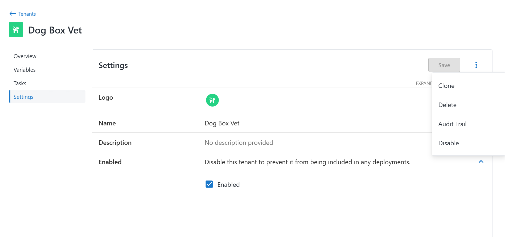
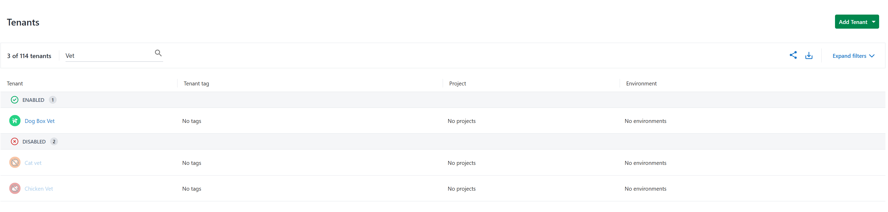
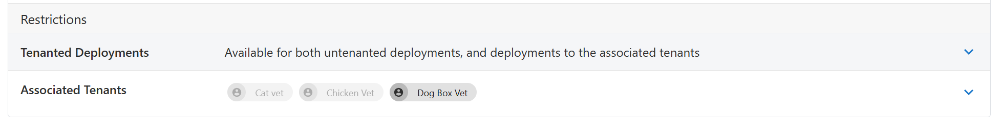
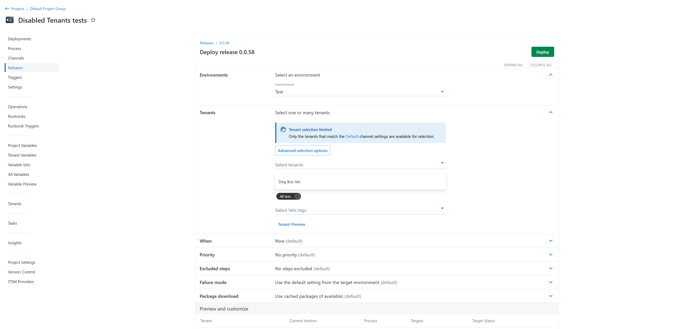
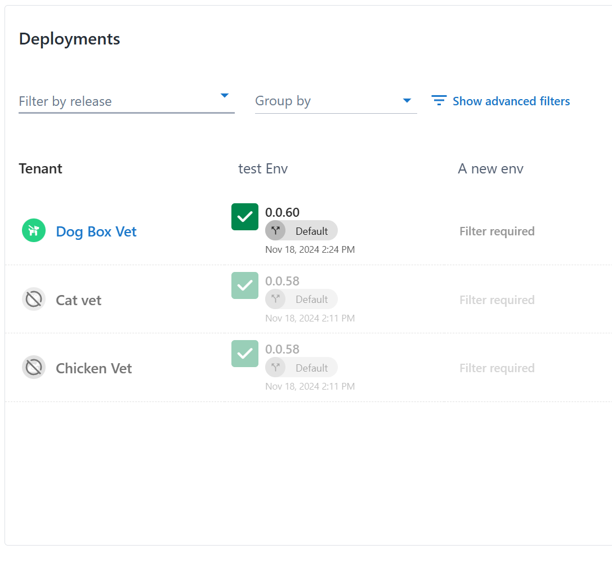

In response to [customer feedback](https://roadmap.octopus.com/c/158-ability-to-disable-tenants), Octopus is adding support for deactivating tenants. This also removes deactivated tenants from license calculations. Deactivated tenants prevent deployments and runbook runs but remain editable.

We expect this feature to roll out to Cloud customers soon, and to our self-hosted customers in the 2025.1 release. 

In this post, I walk you through how to enable and deactivate tenants.

## Enabling and deactivating tenants

You can choose to enable or deactivate tenants on the Tenant Settings page. We've included support for the [Terraform provider](https://registry.terraform.io/providers/OctopusDeployLabs/octopusdeploy/latest/docs/resources/tenant) and [CLI](https://octopus.com/docs/octopus-rest-api/cli).

Tenants are now grouped by their ENABLED or DISABLED status on the Tenants and Project Tenants pages.

You can still edit, add, or remove deactivated tenants from any related entities. In these scenarios, you can identify deactivated tenants by their deactivated chip state.

## Deployments and runbooks

When creating a deployment or runbook run manually or through triggers, you can only select enabled tenants. If you're selecting tenant tags, you can deploy to enabled tenants with that tag, and deactivated tenants will get automatically filtered out. Deployments to deactivated tenants through the CLI or API will fail, throwing an error.

When creating a deployment against a tenant tag, Octopus will ignore all deactivated tenants. This allows tenants to be effectively removed from all deployments at the tenant level, and later re-enabled if needed.

## Conclusion

The ability to deactivate tenants gives you greater flexibility and control over your deployments. This feature makes it simple to prevent deployments to specific tenants, manage licensing requirements, and keep your environments organized without losing access to historical configurations.

With support across the UI, CLI, and Terraform provider, managing tenant states is accessible anywhere. We’re keen to hear how this feature helps you simplify your processes so, as always, we’d love to hear your feedback. Let us know in the comments how you’re using this feature and what future improvements you’d like to see.

Happy deployments! 