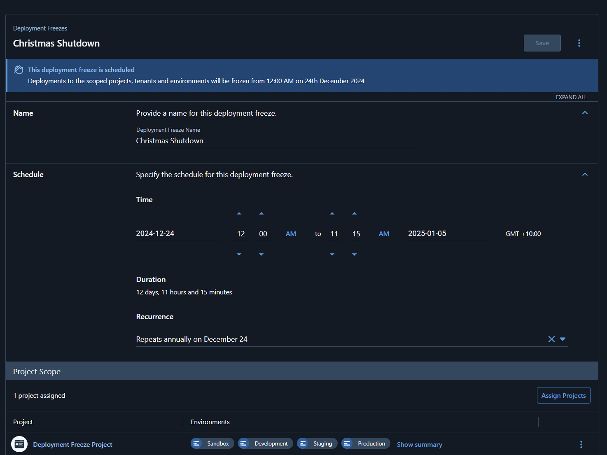
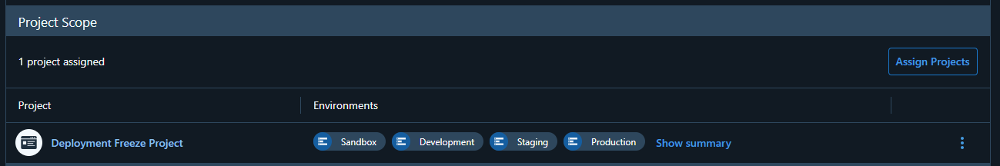
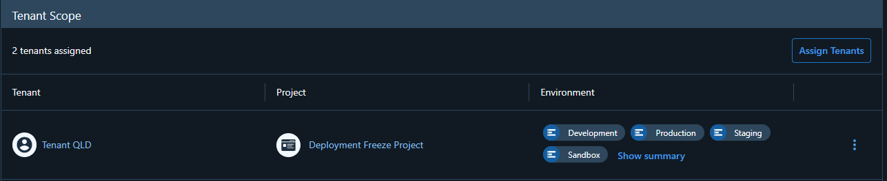
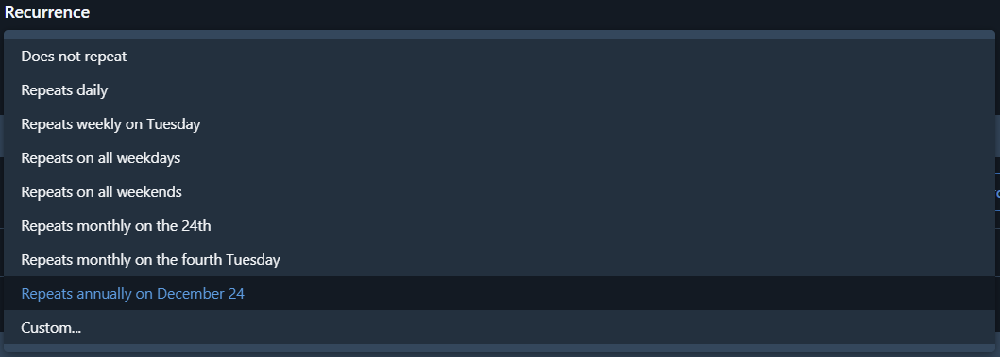
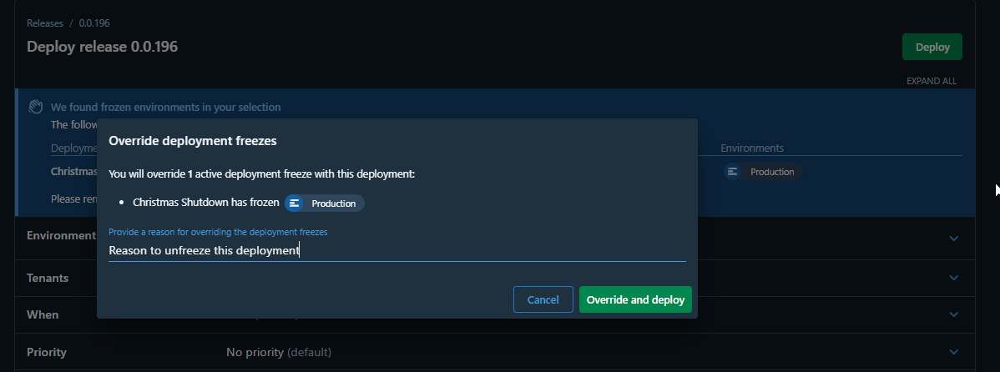

Change control during critical periods is essential for maintaining system stability and meeting business requirements. Today, we're introducing deployment freezes in Octopus Deploy, a feature designed to help you manage deployment schedules and enforce deployment policies across your organization.

## Why Deployment Freezes?

Organizations often need to restrict deployments during specific periods. The holiday season might bring reduced staffing levels, making it risky to deploy new changes. During tax season or elections, organizations may want to limit deployments to critical bug fixes only. Teams sharing test or demo environments might need to prevent deployments during important demonstrations or testing cycles.

Our new deployment freeze feature addresses these scenarios by providing precise control over when and where deployments can occur, helping you maintain stability during critical periods while ensuring necessary changes can still be made when required.

## Creating and Managing Freezes

The deployment freeze interface allows you to create both immediate and scheduled freezes. You can specify exactly which projects, environments, and tenants should be affected, providing the flexibility to protect critical systems while allowing deployments to continue in other areas.

Each freeze can be configured with:
- A descriptive name for easy identification
- Specific start and end times
- Duration of the freeze period
- Scope settings for projects, tenants, and environments

For regular maintenance windows or recurring business cycles, you can set up automated recurring freezes that align with your organization's needs.

## Understanding Scope of Deployment Freezes

Deployment freezes in Octopus Deploy offer flexible scoping options for precise control over deployment restrictions. The scoping system provides two powerful options to give you granular control over your deployment activities.

Project scope allows you to freeze deployments for specific projects in particular environments. For instance, you might freeze deployments to production for your e-commerce application during peak shopping seasons while allowing deployments to continue for internal tools. This targeted approach ensures critical systems remain stable during important business periods.

Tenant scope provides even more refined control by allowing you to freeze deployments for specific tenants on selected projects and environments. This is particularly valuable for organizations managing multi-tenant deployments across different time zones or business requirements. For example, you could freeze deployments to production for your Asia-Pacific tenants during their business hours while continuing deployments for other regions.

By combining these scoping options, you can create highly targeted freeze policies that align with your organization's specific needs. The system's flexibility ensures you can maintain stability where needed while allowing development and deployment activities to continue in other areas.

## Understanding Freeze Behavior

When a deployment freeze is active, it affects deployments in specific ways:

- Existing deployments that started before the freeze will continue to completion
- New deployments attempted during the freeze will need to provide an override reason to be able to deploy
- Scheduled deployments that would start during a freeze period will not execute
- Automatic deployments based on deployment target triggers are allowed to ensure your deployment targets stay updated when scaling up
- Other automatic deployments, such as scheduled deployments or automatic lifecycle promotions, are blocked during the freeze

## Recurring Schedules

The recurring schedule feature helps you manage regular deployment restrictions across different scenarios. For organizations serving customers globally, you can create separate recurring freezes aligned with each region's business hours. If you have agreements specifying deployment windows, such as monthly maintenance periods, you can configure recurring freezes to automatically enforce these schedules.

The system supports various recurrence patterns:
- Daily windows for protecting business hours
- Weekly schedules for regular maintenance periods
- Monthly patterns for coordinated release cycles
- Annual schedules for recurring business events

## Override Capabilities and Audit Trail

While deployment freezes help enforce deployment policies, we understand that exceptions are sometimes necessary. Authorized users can override active freezes by providing a documented reason, which is captured in the audit trail. This ensures that when critical deployments are needed, they can proceed while maintaining transparency and accountability.

The audit system maintains detailed records of:
- Freeze creation and modification
- Deployment Freeze Override and their justifications
- Deployment attempts during freeze periods

## Automation and Integration

Deployment freezes can be automated and integrated into existing workflows using the Octopus REST API and Terraform provider. For example, you can use the Go client to automate the creation and management of deployment freezes as part of your CI/CD pipeline. The Terraform provider also includes a `octopusdeploy_deployment_freeze` resource that can be used to automate freeze configuration. For more information, see the following resources:
- [Octopus REST API - Go Client](https://github.com/OctopusDeploy/go-octopusdeploy)
- [Terraform provider: Deployment Freeze example](https://github.com/OctopusDeployLabs/terraform-provider-octopusdeploy/tree/main/examples/resources/octopusdeploy_deployment_freeze)

## Conclusion

Deployment freezes in Octopus Deploy provide the control and flexibility organizations need to manage their deployment schedules effectively. Whether you're protecting critical systems during peak business periods, managing reduced staffing windows, or coordinating deployments across multiple teams, this feature helps you maintain stability while staying agile.

Ready to get started with deployment freezes? Check out our [deployment freeze documentation](https://octopus.com/docs/deployments/deployment-freezes) for detailed setup instructions and best practices.

Happy deployments!