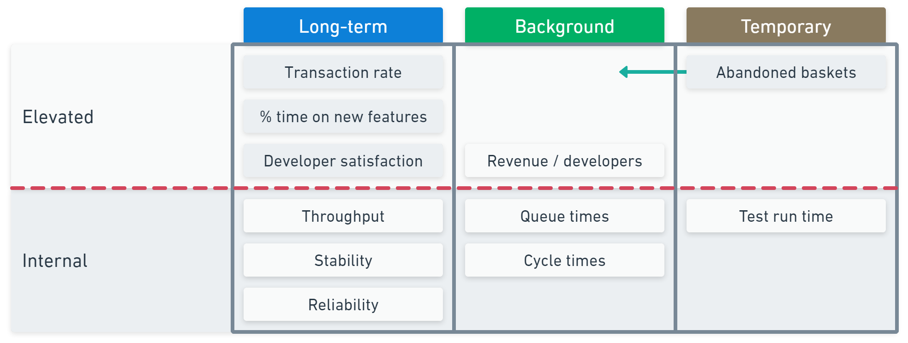

At SHIPPED24 I presented a version of my "Effective DevOps metrics" talk, which included a simple framework to help you keep your measurement system healthy.

When you look at how our idea of value has evolved, you can see why we need to change how we measure software delivery. Let's explore that and see how the time/elevation model keeps things positive.

You can [watch the webinar](https://www.youtube.com/watch?v=_gZCUwecZ9E) or read on to explore the healthy metrics model.

## Value in software delivery

The primary value of software is whether it helps people achieve their objectives, but within technical teams, we tend to consider more localized versions of value. We need short-hop goals that help us see our progress, as the end-to-end system provides feedback too late to be helpful.

We can use a simplified version of the [history of software delivery](https://octopus.com/devops/history/) to understand how our idea of value has changed.

- **Heavyweight era**: Large projects were plan-based, and the goal was to be on time and within budget. The localized measures for this tended to focus on activity.
- **Lightweight era**: Iterative and incremental methods were more adaptable to change. The most famous tagline of the era was "twice the work in half the time" because the localized measures focused on speed.
- **Modern era**: Continuous Delivery arrived just as we began to look at software delivery through the lens of rigorous academic research. We discovered links between technical and cultural practices that helped us understand what moves the needle. Localized measures now focus on outcomes.

Measuring outcomes has several key benefits.

You can determine whether all the hard work throughout the value stream results in a real change at the whole system level. That means you can assess whether the organization is achieving its goals.

Just as important, you can establish a chain of outcomes. Your localized outcome-based measures provide early feedback on your process improvement efforts. Having this signal helps you connect the result back to the improvement. These lagging indicators of local success should also be early indicators of organizational outcomes.

For example, improving your ability to deliver software will increase your chances of success at the organizational level.

- Software delivery performance is easier to observe
- Movements are more likely to be related to your changes
- It will change earlier than the organizational metrics

That makes it better to inform your continuous improvement process.

## How do you measure software delivery?

The great news is that there are plenty of ideas for measuring software delivery. In fact, you'll have too many options to choose from. There's the [DORA 4 keys](https://octopus.com/devops/metrics/dora-metrics/), the [SPACE framework](https://octopus.com/devops/metrics/space-framework/), DX Core, and many more.

You'll need a razor to reduce all the possible options, and the simplest is to ask why you are measuring software delivery.

You can apply this by reflecting on your actions if the metric you measure goes up, down, or remains unchanged. If you don't have a clear idea of this, the metric won't provide a strong signal. No metric should end up in your model if you can't answer these questions.

Collecting useless metrics isn't the only danger. A more pressing problem is how you make the metrics available.

## Elevation and distraction

The purpose of your metrics is improvement. A common mistake is to show off your improvement by elevating the metric in management reports. When you share the measurements too broadly, it fundamentally changes how people respond to them.

Equally, if you put a chart on a dashboard or information radiator, you are sending a signal about the importance of that number. When you make a number prominent, you distract people from anything you omit.

When metrics become too prominent, either through elevation or visible distraction, tasks not reflected in that number get de-prioritized. When someone talks about a development team "gaming the metrics," they are likely admitting that they have created unbalanced signals about what's important.

To maintain health, it makes sense to be careful about what numbers we actively track, how long the metric is helpful, and how broadly we share it.

## The model for healthy metrics

The overlay has three dimensions:

- **Elevation**: Whether or not you make a metric visible outside your team.
- **Lifespan**: Whether a metric is long-term or temporary.
- **Visibility**: Whether a metric is visible or tracked in the background.

Localized outcomes should be internal metrics. If you want to share metrics outside your team, they should come from a wider part of your outcome chain.

When you run an initiative to improve a specific aspect of your software, you might temporarily measure metrics around the intended outcome. When the initiative achieves its goal, you can choose whether to keep them as long-term measures,  turn them into background checks (with alerts on specific conditions), or remove them.

Here's an example to illustrate. You're working on an e-commerce website.

Your internal long-term measures are tracking throughput, stability, and reliability. These are great feedback loops for improving how you deliver software.

When you report upwards, you switch into business mode. You report transaction rates, time spent on new features, and developer satisfaction.

In the background, you internally collect queue times and cycle times so you can be alerted when work gets blocked. You elevate the revenue per developer metric as this reflects your organization's view of a healthy return on investment.

You've also decided to experiment with ways to reduce abandoned baskets, which are when someone didn't complete the checkout process. You track the abandonment rate to see how it changes as you test ideas.

The transaction rate measure counterbalances the abandonment rate. If you remove the upsell stage from the checkout to test a shorter checkout process, you can see the negative effect on transaction value and back up to try a different idea.

This is how measurement systems should work—sending strong signals to inform your decision-making. They should help you connect the technical work to the humans it touches.

## Not twice the work in half the time

The recent State of DevOps Report highlighted that user-centricity, being genuinely curious about your users' pains and problems, is the surest way to strong performance in software products.

High throughput can help you learn fast and run more experiments, but it should only be seen as a tool that assists user-centricity. Throughput is a way to get feedback earlier and maximize your learning.

When you use measurement well, you don't end up with twice the work in half the time. Instead, you have twice the impact with half the work.

Happy deployments!
