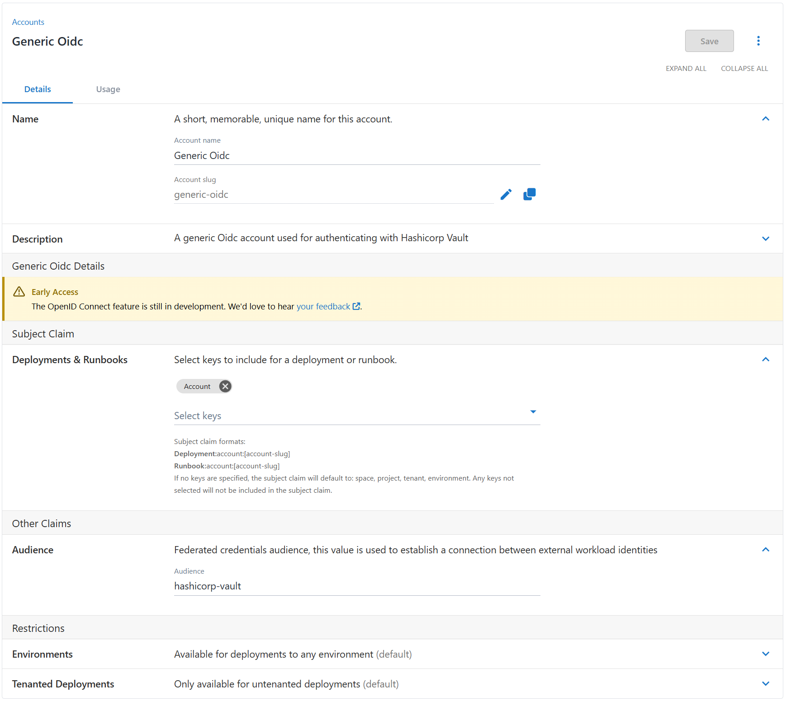

In 2025.1, Octopus is introducing Generic OpenID Connect (OIDC) accounts. This account supports Octopus acting as a client by contributing a JWT as a variable to a deployment. This offers a flexible way to authenticate with third-party systems that support OAuth 2.0 and JSON Web Tokens (JWTs). 

In this post, I explain how Generic OIDC accounts work and how to use them for systems like HashiCorp Vault, and Google Cloud using Workload Identity Federation.

## Creating a Generic OIDC account

These accounts let you configure 2 fields: 

- The audience, which is specific to the service you are integrating with
- The subject generation

For an in-depth explanation of how subjects are generated and what's required for OAuth flows, please see our [OpenID Connect docs](https://octopus.com/docs/infrastructure/accounts/openid-connect).

.

## Authenticating with HashiCorp Vault

HashiCorp Vault is a powerful tool for managing secrets and identities, and it supports authentication via OIDC.

You can configure a Vault instance to enable OAuth JWT authentication with the commands below. In this example, we include the basic JWT configuration. For full details on configuration, see the [HashiCorp Vault JWT docs](https://developer.hashicorp.com/vault/docs/auth/jwt).

``` bash
vault auth enable jwt
vault write auth/jwt/config oidc_discovery_url="https://your-instance-url" bound_issuer="https://your-instance-url"
vault write auth/jwt/role/jwttest role_type="jwt" bound_audiences="<audience>" bound_subject="account:<account-slug>" user_claim="<audience>" policies="default" ttl="1h"
```

You can use this token on our [HashiCorp Vault login step](https://octopus.com/integrations/hashicorp-vault/hashicorp-vault-jwt-login) by setting the JWT token value to `#{<your account variable>.OpenIdConnect.Jwt}`. 

You can also handle token exchange directly in the vault CLI:
```bash
vault write auth/jwt/login role="jwttest" jwt="#{[your account variable].OpenIdConnect.Jwt}"
```

This approach extends beyond Vault to any third-party service that supports OAuth 2.0 JWT flows. Whether you’re integrating with APIs, databases, or custom applications, the Generic OIDC account offers a flexible and secure solution for authentication flows.

## Using Generic OIDC accounts with Google Cloud

Google Cloud’s Workload Identity Federation allows secure access to GCP resources using OIDC tokens without the need for static service account keys. Generic OIDC accounts in Octopus integrate with the existing **Run a gcloud script** step, letting you select the account on the step.

To use a Generic OIDC account with Google Cloud, the subject generator and audience have to match your Workload Identity Federation configuration. You can find the default audience on the provider. It follows the format: `https://iam.googleapis.com/projects/{project-id}/locations/global/workloadIdentityPools/{pool-id}/providers/{provider-id}`. 

You can find more information about the configuration of Workload Identity Federations in the [Google Cloud docs](https://cloud.google.com/iam/docs/workload-identity-federation-with-other-providers). 

This authentication flow signs in as the provided Workload Identity principal. To impersonate a service account, the Workload Identity Principal requires the Workload Identity User permissions. These sessions are configured to expire after one hour.

## Conclusion 

Generic OIDC accounts bring flexibility to your deployment pipelines, so you can authenticate with systems that support OAuth 2.0 JWT flows, like HashiCorp Vault, Google Cloud, and many more. Whether you’re managing secrets, accessing cloud resources, or integrating with custom systems, these accounts provide a simple, secure, and scalable solution, removing the need for static credentials. We hope this helps you unlock new possibilities with Octopus Deploy and OIDC-based authentication. 

Generic OIDC accounts are coming soon for our Cloud customers and our self-hosted customers can expect this feature in the 2025.1 release. If you have any questions or feedback, we’d love to hear from you.

Happy deployments!