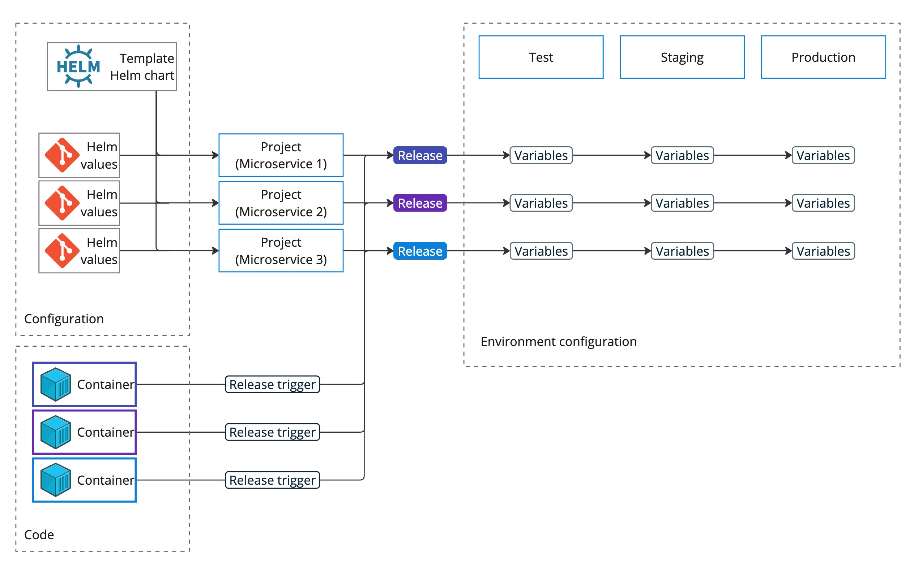

For the past few years, Kubernetes has been a focus for Octopus, and we'll continue strengthening our support for Kubernetes in 2025. We want to deliver the best experience for enterprises automating deployments to Kubernetes, especially at the scale of hundreds of microservices and many teams.

This post covers the challenges that enterprises encounter when deploying to Kubernetes at scale, and the current state of deployment best practices and tools. 

We also talk about Octopus's approach to Kubernetes deployments and recap the  capabilities we introduced in 2023 and 2024. We then walk through a scenario that shows how you can use these capabilities to improve the experience of deploying to Kubernetes at scale. Finally, you get a sneak peek into our plans for Kubernetes in 2025.

## Deployments to Kubernetes – challenges at scale

Kubernetes has influenced the way we develop and run applications. With Kubernetes’ capabilities, we can: 

- Easily break up large applications and run hundreds of microservices
- Create a bunch of environments dynamically
- Seamlessly scale resources
- Run applications in clouds, on edge devices, or in a private data center using one platform with consistent configuration

Not only that, but deployments have also evolved. Previously, a deployment would typically include steps like file shuffling, configuration changes, and service restarts. Because Kubernetes uses declarative configuration, you can instead define everything in human-readable manifests. These manifests include all the information you need about your application and the infrastructure it uses.

It's no surprise that Kubernetes is a new default platform for many organizations around the globe.

However, these new great capabilities also lead to a more intricate deployment landscape. The north star for any pipeline is still fully automated deployments from development to production. This full automation lets you ship software multiple times a day, so you can deliver small, safe and regular improvements. This lowers the cost of the cost of running deployments by reducing the number of people involved.

Deploying monolithic applications was already a challenge, but now we're faced with the need to automate deployments for hundreds of microservices. These microservices often run on the same cluster, which means they might affect one another. We also need to find a way to dynamically provision environments with the correct versions of these microservices and manage manifests that combine both application and infrastructure configuration.

Plus, existing deployment challenges remain. We need to run different sets of tests across various environments, comply with regulatory requirements, integrate with change management tools, and more. But now, we have to address these issues for a significantly larger number of applications.

The challenge for modern DevOps and Platform teams is to find the right set of tools to automate deployments. On the one hand, these tools should be capable of managing deployments at scale. On the other hand, they should be easy to adopt at the very beginning when you’re starting with just a couple of applications and a few teams on Kubernetes. You really need to plan for the future and consider questions like:

- Where will you deploy (the number of environments, regions, clusters)?
- Who will own deployments (and how easy will it be to self-serve)?
- How many applications will be deployed?
- What extra requirements does your organization have?

If you want to learn more, I recorded [a webinar about deployments to Kubernetes at scale](https://youtu.be/uXUG8s4sFMY?si=PTGchl4U1uTctHYO).

## CD problems and tools evolution

GitOps has been the main topic in Kubernetes deployments for a few years now. Argo CD is the leading OSS project in this space. Flux CD, the second mature project, is still popular, but it has noticeably lower adoption. Other projects like Jenkins X or Fleet are niche products.

This year, the focus shifted from the GitOps implementation in general to a more narrow problem of environment promotions with GitOps.

As organizations scaled on Kubernetes, they realized that OSS tools don’t have a good solution for promotion orchestration. Until recently, the only way to automate the environment promotion with GitOps tools was to build in-house automation on tools like Jenkins or GitHub Actions. However these solutions don’t scale well and are expensive to maintain long-term.

This year, the market has reacted to the challenges of environment management with GitOps OSS by introducing several specialized tools. Codefresh GitOps was the first of these tools and is the most developed project. Meanwhile, Kargo and Argo CD GitOps Promoter aim to address the same issues, but are still in their early stages.

In addition to the trend of developing GitOps OSS tools to tackle environment promotion challenges, there's another movement where sophisticated CI/CD tools are adopting more GitOps principles. GitOps significantly enhances the developer experience. It uses the tools we already use to manage code and provides greater confidence in achieving the desired state. Building on this value is a logical progression. In the following sections, we touch on how you can implement the code-first approach in Octopus.

## Octopus and Kubernetes

Octopus Deploy was designed to simplify complex deployments across various environments. This is Octopus's core job, and we do it well.

Since 2018, Octopus has focused on developing in-built Kubernetes capabilities, and it's been one of our top priorities for the past 2 years. We're simplifying Continuous Delivery for Kubernetes. By "simple", we mean a low cost of ownership, straightforward configuration, easy maintenance, and peace of mind for everyone involved.

We believe organizations should use one tool and set of practices for all their deployments, instead of starting from scratch and building a completely new stack for each hosting platform.
We simultaneously adopt Kubernetes-native tools, like Helm and Kustomize, along with best practices like declarative configurations and using Git as the source of truth. Our goal is to integrate these tools and practices into Octopus, making it easier to incorporate them into deployment pipelines.

Kubernetes introduced a few new challenges. One of the biggest challenges is that a deployment doesn't finish when you apply a configuration to a cluster. Instead, the cluster should achieve the desired state, eventually. At the same time, knowing the deployment status is vital. That’s why our focus right now is to bring more capabilities to verify deployments to Kubernetes in Octopus. See the sections below to learn more.

Currently, over 400 organizations use Octopus for regular deployments to Kubernetes. More than 300 of these deploy every week, and over 250 deploy daily.

These organizations manage more than 8,000 projects and run approximately 600,000 Kubernetes steps each month.

24% of these projects get deployed with our built-in Helm step and 18% with the plain YAML step. For 18% of the projects, our customers decided not to manage manifests outside of Octopus and configured them instead with our **Configure and apply Kubernetes resources** step (our built-in, UI form-based step to create configuration without editing YAML).

## New Kubernetes features in Octopus during 2023 and 2024

Let’s revisit 2023 and 2024 to see some of the ways the experience with Kubernetes has changed in Octopus.

**[Kubernetes Object Status](https://roadmap.octopus.com/c/73-kubernetes-object-status-check)**

With the release of 2023.2, Kubernetes Object Status became one of the most popular features in Octopus. Now, deployments in Octopus no longer end with a simple manifest application. Instead, Octopus can interpret YAML manifests and monitor the status of objects until the cluster achieves the desired state.

With this feature, the success or failure of a deployment in Octopus also reflects if the desired configuration has successfully started on the target. Octopus also provides a list of deployed objects along with basic information and health status at the time of deployment. This removes the need to check other tools for deployment verification.

**[Kubernetes Object Status for Helm](https://roadmap.octopus.com/c/171-kubernetes-object-status-for-helm)**

Recently, we enhanced the Kubernetes Object Status by adding support for Helm. Since Helm already includes built-in capabilities to verify deployment success (using the `--wait` argument), we didn’t want to replace what was already working. Instead, we decided to enhance it providing the object list, health, and details for Helm in the same way it does for all Kubernetes steps. We also improved discoverability and enabled `--wait` by default for the newly added steps.

**[Sourcing Kubernetes configuration files from Git](https://roadmap.octopus.com/c/43-sourcing-kubernetes-configuration-files-from-git)**

Kubernetes manifests are essentially code, and the most effective way to manage code is through Git. So, we streamlined the process between Git and Octopus. Octopus now directly sources files from Git. This feature is available for all built-in Kubernetes steps and for script steps.

**[Smart selection for Helm values sources](https://roadmap.octopus.com/c/114-smart-selection-for-helm-values-sources)**

Later, we incorporated sourcing from Git for Helm charts and values files. We also reimagined the entire process of managing values files in Octopus. Now, you can link as many files as you need and specify the order they should apply. This facilitates at-scale scenarios, as demonstrated in the example below.

**[Kustomize step](https://roadmap.octopus.com/c/64-kustomize-step)**

Kustomize is widely used for scaling Kubernetes configurations. Many customers prefer not to use Helm and told us they wanted a more advanced templating engine in Octopus. We knew that combining Kustomize with Octopus variables would enable users to apply a single configuration template across hundreds of projects. This prompted us to add the built-in Kustomize step in 2023.3.

**External feed triggers for [Helm](https://roadmap.octopus.com/c/72-trigger-release-creation-on-helm-chart-updates) and [container images](https://roadmap.octopus.com/c/69-trigger-release-creation-on-container-image-update)**

In 2024.2, we introduced external feed triggers. These new triggers let Octopus automatically create releases whenever a new version of a container image or Helm chart gets published. This is a crucial step towards implementing GitOps principles in Octopus and supporting at-scale scenarios. The triggers also simplify CI pipelines and make it easier to track changes in third-party applications.

**[Git triggers](https://roadmap.octopus.com/c/68-git-triggers-for-release-creation)**

In 2024.4, we released another trigger. Now, Octopus can monitor Git repositories for changes and create releases automatically upon updates. This enables advanced scenarios, like simultaneous updates for multiple projects if a configuration template is modified, or creating a release when Helm values files change.

**[Kubernetes agent](https://roadmap.octopus.com/c/84-octopus-agent-for-kubernetes)**

2024.2 was a big release for Kubernetes in Octopus. Along with the new triggers, we launched the Kubernetes agent. This is our largest enhancement to the Kubernetes experience in Octopus to date (but this won't be the case for long). The agent allows for workerless deployments to Kubernetes, greatly enhances cluster authentication, improves security, and simplifies network configuration. We recommend using the agent as the default method for connecting Octopus with Kubernetes clusters.

These aren't even all the Kubernetes improvements released in the last 2 years. [See our roadmap for more](https://roadmap.octopus.com/tabs/3-released).

## Automating deployments to Kubernetes at scale with Octopus – an example

Let’s consider an example that puts all the Octopus capabilities into a scenario of deploying to Kubernetes at scale. This example is just one way to configure Octopus, of course, there are so many more options available.

Imagine we're part of a company with dozens of developer teams — a significant player in the SaaS market, known for delivering top-notch products (we won’t specify what market it is). We're employing the full power of Kubernetes, deploying across multiple environments, and managing production clusters in various regions. Our organization handles over 500 microservices, with many of them being deployed multiple times a day. While our engineers are exceptional, they aren’t necessarily Kubernetes experts. Thankfully, however, our platform team is among the best in the industry.

Compliance and security are paramount in our environment. Our clients trust us, and we take that responsibility seriously. 

So, how can Octopus help streamline our deployments while ensuring they remain secure? Let’s explore this...

### Configuration templating with Helm

How can we simplify the process of adding a new microservice to our deployment landscape? The first step is providing a centralized configuration template — a single manifest that can be used across all our microservices while still allowing for modifications. Our goal is to strike a balance between simplicity, flexibility, and control.

Helm is an ideal solution for this. The platform team can create a Helm chart that encompasses all the configuration scenarios required by the application teams. By using values files, the application teams can easily enable or deactivate certain configuration elements, like enabling Ingress or adding PersistentVolumes.

For more complex scenarios, we can create a new Helm chart that includes the original chart as a dependency (see [library charts in the Helm documentation](https://helm.sh/docs/topics/library_charts/)). 

In this scenario, the Helm chart can be stored in a centralized place like an OCI registry or a separate Git repo. The Helm values files can be stored in the application repositories alongside the application code. This setup also clarifies ownership, as the platform team can manage the Helm chart independently from the values files that are owned by the application team.

Creating a new pipeline becomes straightforward. We simply add the Helm step, point it to the Helm chart, and copy a values file template to our application repository.

### Releasing new versions

With this configuration, we have several options for releasing new versions of our applications. We can update the values files each time we release a new container image or use Octopus’s built-in mechanism to source container information as a variable.

There’s no right or wrong approach. Using Octopus variables means you won’t have to frequently update configuration files. However, storing container information in the values files lets you maintain a history of changes in Git.

### Simple environment configuration

Our environments are similar, but there are important differences between them. We need to implement slight changes, which may not be specific to an application. For instance, these adjustments could involve an environment label or a database URL.

Should we create a separate values file for each environment? Probably not. With Octopus, we can incorporate Octopus variables directly into the values file or Helm charts.

We can also create a variable set, which is a group of variables shared among multiple projects, to manage non-specific parameters. We can also define a few project-specific variables to handle application-unique configurations, like the number of replicas.

We can also use Octopus system variables to automatically include information like releases, environments, and project names in our manifests when needed.

### Kubernetes Object Status for deployment verification

By enabling the `--wait` option for Helm deployments, our developers can rely on the deployment status in Octopus to ensure everything went as planned. Typically, we prefer not to grant direct access to production clusters or cloud interfaces, making Octopus the simplest way to verify deployments.

We also can't expect every developer to be familiar with Helm charts. By using the Kubernetes Object Status, they can easily inspect all deployed objects and their key properties to confirm their deployment configuration.

### Triggers to automate deployments

With 500 microservices, deployment orchestration can be challenging. We have 2 key tasks to address. First, we need to independently deploy each microservice when a new version is ready. Second, there may be times when we need to redeploy all the microservices, like when we introduce a critical change to our Helm chart.

To automate this process, we can create an external feed trigger for each microservice project, pointing to its corresponding container image. We can also establish an orchestration project that manages releases and initiates deployments for all or selected microservice projects. This orchestration project can include a trigger that points to the Helm chart.

You can see how it works in practice in our [Samples instance](https://samples.octopus.app/app#/Spaces-105/projects?page=1&pageSize=50). The orchestration project is the first project in each project group (Helm/Azure, Kustomize/AWS, or YAML/GCP). All other projects in the group consist of individual microservices. You can find the configuration for container image triggers in the **Project** > **Triggers** section.

### Adding new targets

Finally, what if our 500 microservices run across multiple clusters? For example, we might have a dedicated cluster for each customer or branch. In this scenario, we can expect to frequently provision new clusters and want each new cluster to have the latest versions of the microservices immediately upon creation.

To streamline this process, the first step is to add a Kubernetes agent during the cluster provisioning. This can be achieved with any IaC tool like Terraform. After the agent is installed, it automatically registers the cluster with Octopus.

You can also configure deployment target triggers to initiate deployments to a target as soon as it becomes available. This removes the need for manual intervention after adding a new cluster. With Octopus, it’s possible to install all necessary system applications plus any software you want to run on the cluster as soon as it comes online. So cluster bootstrapping can be fully automated with Octopus.

## What’s coming in 2025

2025 is poised to be another exciting year for Kubernetes in Octopus. Currently, we're focusing on a major enhancement: [Kubernetes Live Status](https://roadmap.octopus.com/c/122-kubernetes-live-object-status). With this feature, Octopus will continuously monitor deployed objects even after deployment, providing real-time insights into the health of your applications directly on the Octopus dashboard. Octopus will also show you if the cluster configuration drifts from what was deployed with a release. You'll also have access to details about objects, events, and logs.

We're also developing [manifest inspection](https://roadmap.octopus.com/c/144-kubernetes-manifest-inspection). This will complement the live status by letting you view and compare the desired manifests for all deployed objects.

Together, these improvements will equip you with a robust toolset for deployment verification and troubleshooting in Octopus.

And there’s even more on the horizon! We’re diving into the exciting world of built-in integration with [Argo CD](https://roadmap.octopus.com/c/85-argo-cd-octopus-agent-for-k8s-resource-monitoring-and-deployments) and [Argo Rollouts](https://roadmap.octopus.com/c/146-argo-rollouts-in-octopus) right here in Octopus land.

We can’t wait to sprinkle some Octopus magic on Argo CD deployments, bringing our core features like release management, environment modeling, and lifecycle management into the mix. Adding Octopus to the existing Argo CD landscape should be easy and natural as Octopus will understand and use features like ApplicationSets and will use Argo CD observability.

We’re excited about the journey ahead and want you to be a part of it. Your thoughts are like nuggets of gold for us, so we'd love to hear your feedback. Please [drop your ideas on our roadmap](https://roadmap.octopus.com/tabs/1-under-consideration) and don’t forget to mention if you're up for a friendly chat. 

## Conclusion

Kubernetes has fundamentally transformed how applications are developed and managed. It's enabled organizations to efficiently scale and automate their deployments. At the same time, the complexity of managing hundreds of microservices and ensuring smooth deployments across various environments presents hurdles.

This post explored the evolution of Octopus’s capabilities for Kubernetes and highlighted our approach to facilitating these deployments. We also reviewed a real-life example of how you can use Octopus to streamline deployments for hundreds of microservices with centralized configuration templating and flexibility at the same time.

Looking ahead, 2025 will be the most exciting year yet for Kubernetes in Octopus, with features that will enable new use cases for Octopus.

We'd love to hear your stories about deployments to Kubernetes. What challenges do you face? What tools or practices have worked for you? Your feedback is invaluable as we continue to refine our offerings and support the community in this rapidly changing environment. Thanks for being part of the journey.

## Learn more

- [Octopus roadmap](https://roadmap.octopus.com/tabs/1-under-consideration)
- [Webinar: Deployments to Kubernetes at scale](https://www.youtube.com/watch?v=uXUG8s4sFMY)
- [Webinar: 5 ways to level up your Kubernetes deployments with Octopus](https://www.youtube.com/watch?v=Eo03H_1VxGc&t=18s)
- [Kubernetes in Octopus documentation](https://octopus.com/docs/kubernetes)

Happy deployments!
