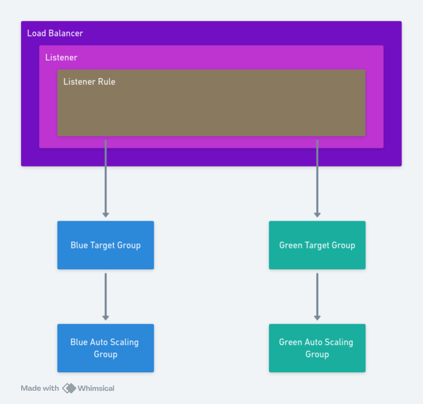
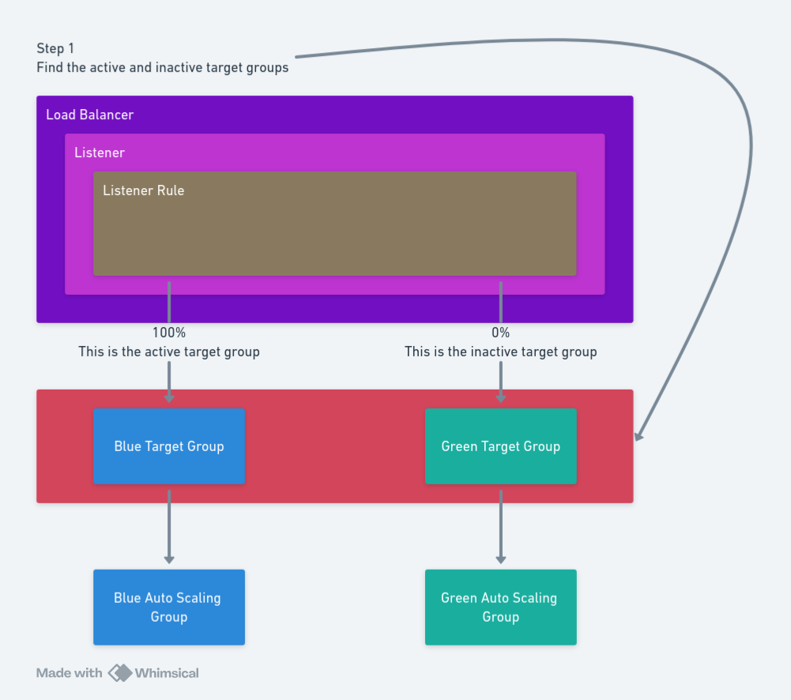
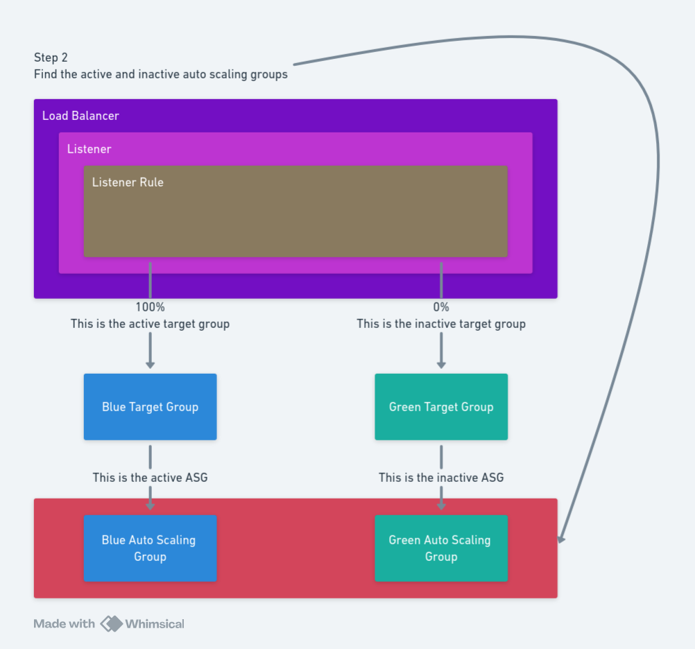
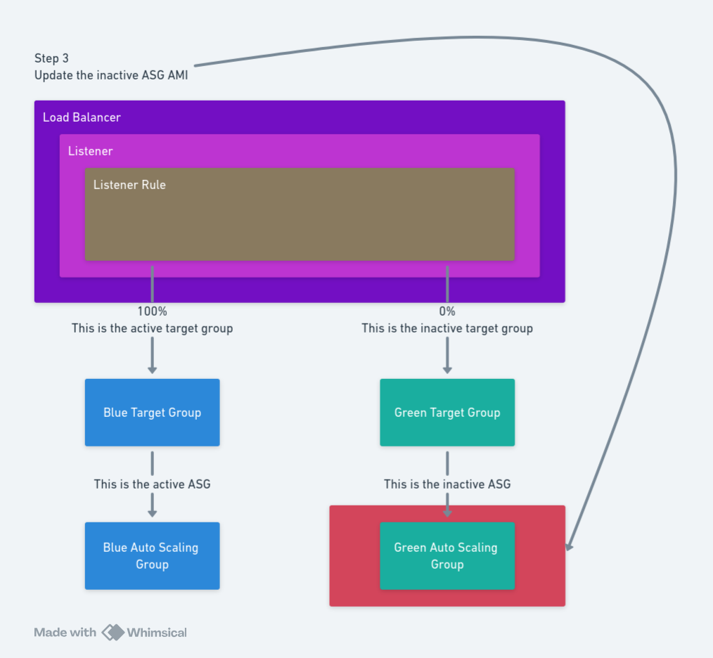
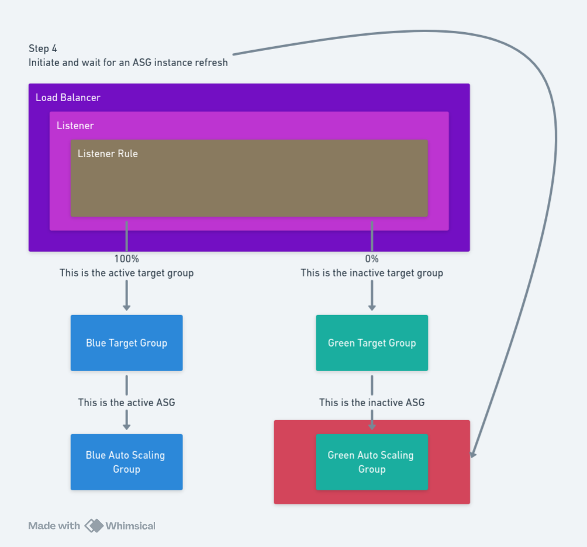
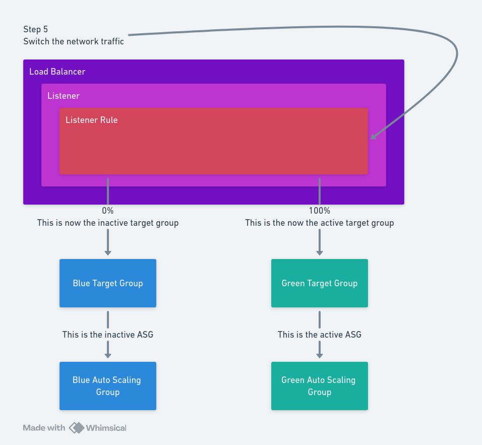

AWS EC2 Auto Scaling groups (ASG) have been the workhorse of cloud deployments for almost as long as we've had the concept of the cloud. ASGs allow teams deploying virtual machines (VMs) to scale up and down based on demand, and to replace instances that have failed. When combined with load balancers, ASGs can also provide advanced deployment processes such as blue/green deployments.

In this post, we look at how to set up blue/green deployments with ASGs, and how Octopus can help automate the process.

## What are blue/green deployments?

Blue/green deployments involve maintaining 2 stacks: the blue stack and the green stack. One of these stacks is live, while the other is inactive. When a new version of the application is ready to be deployed, the inactive stack gets updated with the new version. After the update is complete and all health checks pass, the inactive stack becomes the live stack, and the old live stack gets deactivated.

Blue/green deployments help minimize downtime and reduce the risk of a failed deployment. If the new version of the application fails to start, the inactive stack remains offline and the live stack continues to serve traffic. Or, if an issue is detected after deployment, the 2 stacks can be quickly switched back, reverting to the previous version of the application.

## Blue/green deployments with ASGs

Implementing blue/green deployments with ASGs requires a few key components:

- Two ASGs: one for the blue stack and one for the green stack.
- A [Network Load Balancer (NLB)](https://docs.aws.amazon.com/elasticloadbalancing/latest/network/introduction.html) or [Application Load Balancer (ALB)](https://docs.aws.amazon.com/elasticloadbalancing/latest/application/introduction.html) with a [Listener](https://docs.aws.amazon.com/elasticloadbalancing/latest/application/load-balancer-listeners.html) and [Listener Rule](https://docs.aws.amazon.com/elasticloadbalancing/latest/application/listener-update-rules.html) to handle network traffic.
- Two [target groups](https://docs.aws.amazon.com/elasticloadbalancing/latest/application/load-balancer-target-groups.html): one for the blue stack and one for the green stack.



Listener rules are very flexible and can distribute traffic to target groups in a variety of ways. However, for blue/green deployments, we assume that either the blue or green target group is receiving 100% of traffic, and that a deployment will switch all traffic from one target group to the other.

## Creating the AWS infrastructure

The blue/green deployment presented in this post requires you to create a number of AWS resources. 

We first need a Virtual Private Cloud (VPC) with public subnets. These subnets will host our EC2 instances, and our load balancer. It also defines a security group allowing HTTP and SSH traffic:

```yaml
AWSTemplateFormatVersion: 2010-09-09
Resources:
  VPC:
    Type: AWS::EC2::VPC
    Properties:
      CidrBlock: 10.0.0.0/16
      EnableDnsSupport: true
      EnableDnsHostnames: true
      InstanceTenancy: default
      Tags:
        - Key: Name
          Value: Test VPC
        - Key: OwnerContact
          Value: "@matthewcasperson"
        - Key: Purpose
          Value: Test VPC
  InternetGateway:
    Type: AWS::EC2::InternetGateway
  VPCGatewayAttachment:
    Type: AWS::EC2::VPCGatewayAttachment
    Properties:
      VpcId: !Ref VPC
      InternetGatewayId: !Ref InternetGateway
  SubnetA:
    Type: AWS::EC2::Subnet
    Properties:
      AvailabilityZone: ap-southeast-2a
      VpcId: !Ref VPC
      CidrBlock: 10.0.0.0/24
      MapPublicIpOnLaunch: true
  SubnetB:
    Type: AWS::EC2::Subnet
    Properties:
      AvailabilityZone: ap-southeast-2b
      VpcId: !Ref VPC
      CidrBlock: 10.0.1.0/24
      MapPublicIpOnLaunch: true
  RouteTable:
    Type: AWS::EC2::RouteTable
    Properties:
      VpcId: !Ref VPC
  InternetRoute:
    Type: AWS::EC2::Route
    DependsOn: InternetGateway
    Properties:
      DestinationCidrBlock: 0.0.0.0/0
      GatewayId: !Ref InternetGateway
      RouteTableId: !Ref RouteTable
  SubnetARouteTableAssociation:
    Type: AWS::EC2::SubnetRouteTableAssociation
    Properties:
      RouteTableId: !Ref RouteTable
      SubnetId: !Ref SubnetA
  SubnetBRouteTableAssociation:
    Type: AWS::EC2::SubnetRouteTableAssociation
    Properties:
      RouteTableId: !Ref RouteTable
      SubnetId: !Ref SubnetB
  PackerSecurityGroup:
    Type: AWS::EC2::SecurityGroup
    Properties:
      Tags:
        - Key: Name
          Value: "packer-build-sg"
      GroupName: "packer Security Group"
      GroupDescription: "Allow HTTP Traffic"
      VpcId: !Ref VPC
      SecurityGroupIngress:
        - IpProtocol: tcp
          FromPort: '80'
          ToPort: '80'
          CidrIp:  0.0.0.0/0
        - IpProtocol: tcp
          FromPort: '22'
          ToPort: '22'
          CidrIp:  0.0.0.0/0
      SecurityGroupEgress:
        - IpProtocol: -1
          CidrIp: 0.0.0.0/0
Outputs:
  VpcId:
    Value: !Ref VPC
    Description: VPC ID
  SubnetAId:
    Value: !Ref SubnetA
    Description: SubnetA ID
  SubnetBId:
    Value: !Ref SubnetB
    Description: SubnetB ID
  PackerSecurityGroupId:
    Value: !Ref PackerSecurityGroup
    Description: Security Group ID
```

Next we create an ALB, a listener, 2 target groups, and a security group that allows HTTP traffic:

```yaml
Parameters:
  VpcId:
    Type: AWS::EC2::VPC::Id
  SubnetIdAz1:
    Type: AWS::EC2::Subnet::Id
  SubnetIdAz2:
    Type: AWS::EC2::Subnet::Id
Resources:
  LBSecurityGroup:
    Type: AWS::EC2::SecurityGroup
    Properties:
      Tags:
        - Key: Name
          Value: "lb-sg"
      GroupName: "Load Balancer Security Group"
      GroupDescription: "Allow HTTP Traffic"
      VpcId: !Ref VpcId
      SecurityGroupIngress:
        - IpProtocol: tcp
          FromPort: '80'
          ToPort: '80'
          CidrIp: 0.0.0.0/0
      SecurityGroupEgress:
        - IpProtocol: -1
          CidrIp: 0.0.0.0/0
  MyNLB:
    Type: AWS::ElasticLoadBalancingV2::LoadBalancer
    Properties:
      Name: packer-alb
      Type: application
      Subnets:
        - !Ref SubnetIdAz1
        - !Ref SubnetIdAz2
      Scheme: internet-facing
      SecurityGroups:
        - !Ref LBSecurityGroup
      LoadBalancerAttributes:
        - Key: idle_timeout.timeout_seconds
          Value: '60'
  GreenTargetGroup:
    Type: AWS::ElasticLoadBalancingV2::TargetGroup
    Properties:
      HealthCheckEnabled: true
      HealthCheckIntervalSeconds: 5
      HealthCheckPath: /
      HealthCheckPort: 80
      HealthCheckProtocol: HTTP
      HealthCheckTimeoutSeconds: 2
      HealthyThresholdCount: 2
      Matcher:
        HttpCode: 200
      Name: OctopusGreenTargetGroup
      Port: 80
      Protocol: HTTP
      TargetType: instance
      UnhealthyThresholdCount: 5
      VpcId: !Ref VpcId
  BlueTargetGroup:
    Type: AWS::ElasticLoadBalancingV2::TargetGroup
    Properties:
      HealthCheckEnabled: true
      HealthCheckIntervalSeconds: 5
      HealthCheckPath: /
      HealthCheckPort: 80
      HealthCheckProtocol: HTTP
      HealthCheckTimeoutSeconds: 2
      HealthyThresholdCount: 2
      Matcher:
        HttpCode: 200
      Name: OctopusBlueTargetGroup
      Port: 80
      Protocol: HTTP
      TargetType: instance
      UnhealthyThresholdCount: 5
      VpcId: !Ref VpcId
  MyListener:
    Type: AWS::ElasticLoadBalancingV2::Listener
    Properties:
      DefaultActions:
        - FixedResponseConfig:
            StatusCode: 404
          Order: 1
          Type: fixed-response
      LoadBalancerArn: !Ref MyNLB
      Port: 80
      Protocol: HTTP
  MyListenerRule:
    Type: AWS::ElasticLoadBalancingV2::ListenerRule
    Properties:
      Actions:
        - ForwardConfig:
            TargetGroups:
              - TargetGroupArn: !Ref GreenTargetGroup
                Weight: 0
              - TargetGroupArn: !Ref BlueTargetGroup
                Weight: 100
          Order: 1
          Type: forward
      Conditions:
        - Field: path-pattern
          PathPatternConfig:
            Values:
              - /*
      ListenerArn: !Ref MyListener
      Priority: 10
Outputs:
  MyNLB:
    Description: The ALB
    Value: !Ref MyNLB
  MyListener:
    Description: The ALB listener
    Value: !Ref MyListener
  MyListenerRule:
    Description: The ALB listener rule
    Value: !Ref MyListenerRule
  BlueTargetGroup:
    Description: The blue target group
    Value: !Ref BlueTargetGroup
  GreenTargetGroup:
    Description: The green target group
    Value: !Ref GreenTargetGroup
```

Finally, we create the ASG:

```yaml
AWSTemplateFormatVersion: 2010-09-09
Parameters:
  VpcId:
    Type: AWS::EC2::VPC::Id
  SubnetIdAz1:
    Type: AWS::EC2::Subnet::Id
  SubnetIdAz2:
    Type: AWS::EC2::Subnet::Id
  SecurityGroupId:
    Type: AWS::EC2::SecurityGroup::Id
  AmiId:
    Type: AWS::EC2::Image::Id
  GreenTargetGroup:
    Type: String
  BlueTargetGroup:
    Type: String
Resources:
  BlueLaunchTemplate:
    Type: AWS::EC2::LaunchTemplate
    Properties:
      LaunchTemplateName: !Sub ${AWS::StackName}-launch-template-blue
      LaunchTemplateData:
        ImageId: !Ref AmiId
        InstanceType: t3.small
        SecurityGroupIds:
          - !Ref SecurityGroupId
        TagSpecifications:
          - ResourceType: instance
            Tags:
              - Key: Name
                Value: "Blue instance"
          - ResourceType: volume
            Tags:
              - Key: Name
                Value: "Blue volume"
  GreenLaunchTemplate:
    Type: AWS::EC2::LaunchTemplate
    Properties:
      LaunchTemplateName: !Sub ${AWS::StackName}-launch-template-green
      LaunchTemplateData:
        ImageId: !Ref AmiId
        InstanceType: t3.small
        SecurityGroupIds:
          - !Ref SecurityGroupId
        TagSpecifications:
          - ResourceType: instance
            Tags:
              - Key: Name
                Value: "Green instance"
          - ResourceType: volume
            Tags:
              - Key: Name
                Value: "Green volume"
  AutoScalingGroupGreen:
    Type: AWS::AutoScaling::AutoScalingGroup
    Properties:
      # These values priorities quickly replacing instances at the expense of availability
      InstanceMaintenancePolicy:
        MinHealthyPercentage: 0
        MaxHealthyPercentage: 100
      HealthCheckType: ELB
      HealthCheckGracePeriod: 30
      DefaultInstanceWarmup: 10
      VPCZoneIdentifier:
        - !Ref SubnetIdAz1
        - !Ref SubnetIdAz2
      LaunchTemplate:
        LaunchTemplateId: !Ref GreenLaunchTemplate
        Version: !GetAtt GreenLaunchTemplate.LatestVersionNumber
      MaxSize: '1'
      MinSize: '1'
      TargetGroupARNs:
        - !Ref GreenTargetGroup
  AutoScalingGroupBlue:
    Type: AWS::AutoScaling::AutoScalingGroup
    Properties:
      # These values priorities quickly replacing instances at the expense of availability
      InstanceMaintenancePolicy:
        MinHealthyPercentage: 0
        MaxHealthyPercentage: 100
      HealthCheckGracePeriod: 10
      HealthCheckType: ELB
      # Setting this value means new EC2 instances will be marked healthy faster
      # https://docs.aws.amazon.com/autoscaling/ec2/userguide/understand-instance-refresh-default-values.html
      DefaultInstanceWarmup: 30
      VPCZoneIdentifier:
        - !Ref SubnetIdAz1
        - !Ref SubnetIdAz2
      LaunchTemplate:
        LaunchTemplateId: !Ref BlueLaunchTemplate
        Version: !GetAtt BlueLaunchTemplate.LatestVersionNumber
      MaxSize: '1'
      MinSize: '1'
      TargetGroupARNs:
        - !Ref BlueTargetGroup
Outputs:
  AutoScalingGroupGreenId:
    Value: !Ref AutoScalingGroupGreen
    Description: Auto Scaling Group Green ID
  AutoScalingGroupBlueId:
    Value: !Ref AutoScalingGroupBlue
    Description: Auto Scaling Group Blue ID
```

## Building the AMI

The deployable artifact to an ASG is an [Amazon Machine Image (AMI)](https://docs.aws.amazon.com/AWSEC2/latest/UserGuide/AMIs.html). There are many ways to create an AMI, but here we use [Packer](https://github.com/hashicorp/packer) to automate the process of creating an EC2 instance, configuring it, and then creating an AMI based on the EC2 instance.

The following Packer template creates an EC2 instance, installs Apache, and then creates an AMI:

```hcl
packer {
  required_plugins {
    amazon = {
      source  = "github.com/hashicorp/amazon"
      version = "~> 1"
    }
  }
}

variable "ami_name" {
  type    = string
  default = "packerdemo"
}

variable "aws_region" {
  type    = string
  default = "ap-southeast-2"
}

variable "subnet" {
  type    = string
}

variable "vpc" {
  type    = string
}

variable "color" {
  type    = string
  default = "blue"
}

locals {
  versioned_ami_name = "${var.ami_name}.${formatdate("YYYY.MM.DD.hhmmss", timestamp())}"
}

data "amazon-ami" "autogenerated_1" {
  filters = {
    name                = "ubuntu/images/*ubuntu-jammy-22.04-amd64-server-*"
    root-device-type    = "ebs"
    virtualization-type = "hvm"
  }
  most_recent = true
  owners      = ["099720109477"]
  region      = "${var.aws_region}"
}

source "amazon-ebs" "AWS_AMI_Builder" {
  ami_description             = local.versioned_ami_name
  ami_name                    = local.versioned_ami_name
  associate_public_ip_address = "true"
  ena_support                 = true
  encrypt_boot                = false
  instance_type               = "t3.small"
  launch_block_device_mappings {
    delete_on_termination = true
    device_name           = "/dev/sda1"
    volume_size           = 40
    volume_type           = "gp3"
  }
  region = "${var.aws_region}"
  run_tags = {
    Name = local.versioned_ami_name
  }
  run_volume_tags = {
    Name = local.versioned_ami_name
  }
  security_group_filter {
    filters = {
      "tag:Name" = "packer-build-sg"
    }
  }
  snapshot_tags = {
    Name = local.versioned_ami_name
  }
  source_ami   = "${data.amazon-ami.autogenerated_1.id}"
  ssh_username = "ubuntu"
  subnet_id    = "${var.subnet}"
  tags = {
    Name            = local.versioned_ami_name
  }
  vpc_id = "${var.vpc}"
}

build {
  sources = ["source.amazon-ebs.AWS_AMI_Builder"]

  provisioner "shell" {
    inline = [
      "#!/bin/bash -e",
      "sudo apt-get update",
      "sudo apt-get install -y apache2",
      "sudo systemctl start apache2",
      "current_time=$(date)",
      "echo \"<html><body><h1 style=\\\"color: ${var.color}\\\">Hello Octopus!</h1><p>Build time: $current_time</p></body></html>\" | sudo tee /var/www/html/index.html",
      "echo \"<Files \"index.html\">\nHeader set Cache-Control \"no-store, no-cache, must-revalidate, max-age=0\"\nHeader set Pragma \"no-cache\"\nHeader set Expires \"0\"\n</Files>\" | sudo tee /var/www/html/.htaccess"
    ]
    pause_before = "10s"
    timeout      = "10s"
  }
}
```

## Deploying the AMI with a blue/green deployment

The previous CloudFormation and Packer templates create the necessary infrastructure in our AWS account. With this infrastructure in place, we can now orchestrate a blue/green deployment with Octopus.

### Step 1: Determine the active and inactive target groups

Step 1 is to determine which target group is receiving any network traffic. We assume this target group is the active stack, and the other target group is the inactive stack.



The [AWS - Find Blue-Green Target Group](https://library.octopus.com/step-templates/2f5f8b7b-5deb-45a9-966b-bf52c6e7976c/actiontemplate-aws-find-blue-green-target-group) step finds the active target group in a load balancer. The step requires the following inputs:

- `Region`: The [AWS region](https://aws.amazon.com/about-aws/global-infrastructure/regions_az/) hosting the load balancer.
- `Account`: The [AWS account](https://octopus.com/docs/infrastructure/accounts/aws) used to query the load balancer.
- `Listener ARN`: The ARN of the listener.
- `Blue Target Group ARN`: The ARN of the blue target group.
- `Green Target Group ARN`: The ARN of the green target group.
- `Rule ARN`: The ARN of the listener rule.

The step generates 4 [output variables](https://octopus.com/docs/projects/variables/output-variables):

- `ActiveGroupArn`: The ARN of the active (or online) target group receiving network traffic.
- `InactiveGroupArn`: The ARN of the inactive (or offline) target group not receiving network traffic.
- `ActiveGroupColor`: The color of the active target group.
- `InactiveGroupColor`: The color of the inactive target group.


### Step 2: Determine the active and inactive ASGs

Step 2 determines the active and inactive ASGs based on the inactive target group.



The [AWS - Find Blue-Green ASG](https://library.octopus.com/step-templates/6b72995e-500c-4b4b-9121-88f3a988ec71/actiontemuntitled(1)plate-aws-find-blue-green-asg) step provides this functionality. The step requires the following inputs:

- `Region`: The [AWS region](https://aws.amazon.com/about-aws/global-infrastructure/regions_az/) hosting the load balancer.
- `Account`: The [AWS account](https://octopus.com/docs/infrastructure/accounts/aws) used to query the load balancer.
- `Inactive Color`: The inactive color as determined by the previous step.
- `Green ASG Name`: The name of the green ASG.
- `Blue ASG Name`: The name of the blue ASG.

The step generates 2 output variables:

- `ActiveGroup`: The name of the active (or online) ASG.
- `InactiveGroup`: The name of the inactive (or offline) ASG.

### Step 3: Update the inactive ASG with the new AMI

Step 3 is to update the inactive [ASG launch template](https://docs.aws.amazon.com/autoscaling/ec2/userguide/launch-templates.html) with the new AMI.



The [AWS - Update Launch Template AMI](https://library.octopus.com/step-templates/143400df-19a9-42f5-a6c0-68145489482a/actiontemplate-aws-update-launch-template-ami) step provides this functionality. The step requires the following inputs:

- `Region`: The [AWS region](https://aws.amazon.com/about-aws/global-infrastructure/regions_az/) hosting the load balancer.
- `Account`: The [AWS account](https://octopus.com/docs/infrastructure/accounts/aws) used to query the load balancer.
- `ASG Name`: The name of the ASG to update. This will be the inactive ASG group found in the previous step.
- `AMI`: The AMI ID to use in the launch template.
- `Launch Template Version Description`: The description of the new lunch version template.

### Step 4: Initiate an instance refresh

Step 4 is to initiate an [instance refresh](https://docs.aws.amazon.com/autoscaling/ec2/userguide/asg-instance-refresh.html) which recreates the EC2 instances in the inactive ASG with the new AMI. We must also wait for the instance refresh to complete, after which the new EC2 instances are healthy and ready to receive network traffic.



The [AWS - Initiate Instance Refresh](https://library.octopus.com/step-templates/150c46d1-f33f-493b-a8c6-f5bd22f540f3/actiontemplate-aws-initiate-instance-refresh) step provides this functionality. The step requires the following inputs:

- `Region`: The [AWS region](https://aws.amazon.com/about-aws/global-infrastructure/regions_az/) hosting the load balancer.
- `Account`: The [AWS account](https://octopus.com/docs/infrastructure/accounts/aws) used to query the load balancer.
- `ASG Name`: The name of the ASG to update. This will be the inactive ASG group found in step 2.

### Step 5: Adjust the listener rule

Step 5 is to adjust the listener rule to direct network traffic to the target group associated with the ASG that was just updated.

After the network traffic gets directed to the new target group, the blue/green deployment is complete.



The [AWS - Set Blue-Green Target Group](https://library.octopus.com/step-templates/4b5f56c1-61f9-4d85-88f8-14dbe8cf8122/actiontemplate-aws-set-blue-green-target-group) step provides this functionality. The step requires the following inputs:

- `Region`: The [AWS region](https://aws.amazon.com/about-aws/global-infrastructure/regions_az/) hosting the load balancer.
- `Account`: The [AWS account](https://octopus.com/docs/infrastructure/accounts/aws) used to query the load balancer.
- `Rule ARN`: The ARN of the listener rule. 
- `Offline Target Group ARN`: The ARN of the target group to stop receiving network traffic. This is the active target group found in step 1.
- `Online Target Group ARN`: The ARN of the target group to start receiving network traffic. This is the inactive target group found in step 1.

## Conclusion

By combining the power of AWS ASGs, load balancers, and Octopus Deploy, you can create a robust blue/green deployment process that minimizes downtime and reduces the risk of failed deployments. You can automate the steps outlined in this post with Octopus Deploy, providing a repeatable and reliable deployment process that you can execute with the click of a button.

Happy deployments!