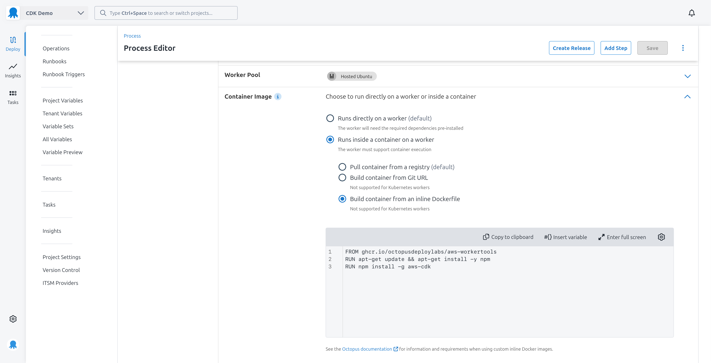
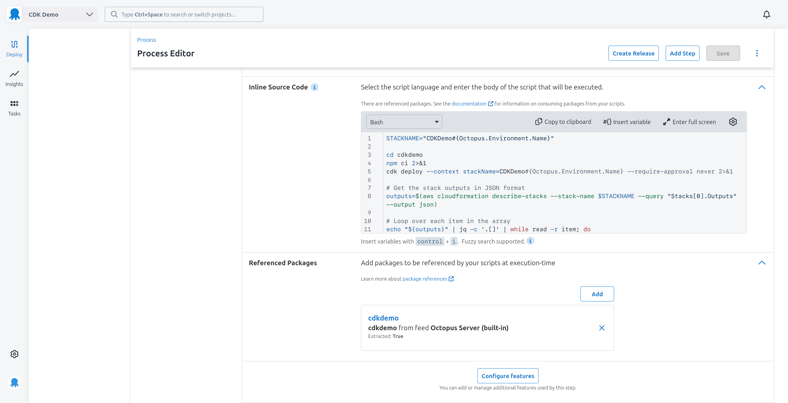
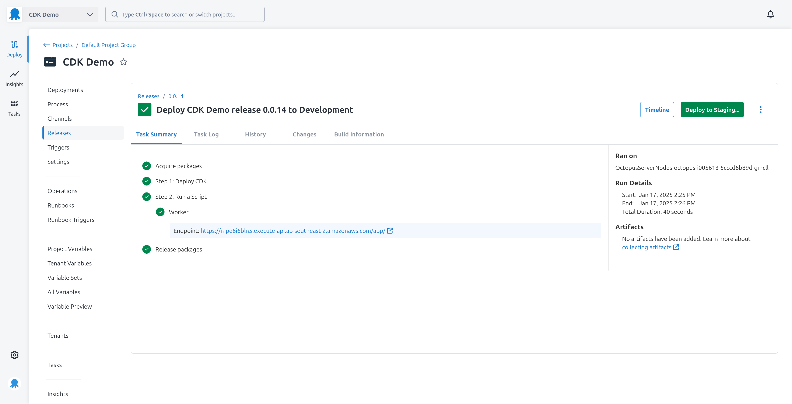

Cloud providers have invested a lot of effort into streaming the development and deployment of cloud native applications. Developers used to be responsible for provisioning infrastructure and developing their applications separately, but this made local testing difficult, and often forced developers to have a deep understanding of network configuration like VPCs and subnets.

The AWS Serverless Application Model (SAM) introduced tooling and streamlined CloudFormation syntax to automate the testing and deployment of Lambdas. While the CLI tooling improved developers local testing experience, it was not mandatory, as the application code and SAM CloudFormation templates were still separate entities and could be deployed like any other CloudFormation stack. The post [Deploying AWS SAM templates with Octopus](https://octopus.com/blog/aws-sam-and-octopus) describes how to deploy a SAM application using standard Octopus Deploy features such as uploading files to S3 and deploying CloudFormation stacks.

The AWS Cloud Development Kit (CDK) takes this concept further by allowing developers to define their infrastructure and applications using a programming language like TypeScript or Python. While conceptually similar to AWS SAM, CDK approaches the process of developing and deploying applications differently enough that we must adopt a new way to deploy CDK applications with Octopus Deploy.

## Differences between SAM and CDK

You are responsible for writing CloudFormation templates directly with SAM. The SAM CloudFormation syntax is simplified to remove much of the boilerplate configuration required to deploy a Lambda, but you're still writing JSON or YAML files.

CDK also uses CloudFormation to deploy infrastructure and applications, but [the generated CloudFormation templates are treated as an implementation detail](https://docs.aws.amazon.com/cdk/v2/guide/best-practices.html#best-practices-code):

> Treat AWS CloudFormation as an implementation detail that the AWS CDK uses for robust cloud deployments, not as a language target. You're not writing AWS CloudFormation templates in TypeScript or Python, you're writing CDK code that happens to use CloudFormation for deployment.

SAM treats application code and CloudFormation infrastructure templates as separate concepts (with [inline code](https://docs.aws.amazon.com/serverless-application-model/latest/developerguide/sam-resource-function.html#sam-function-inlinecode) being the exception to the rule). While it is common to have a SAM template stored alongside the application code, each can be deployed independently.

[CDK combines the application code and infrastructure into a single codebase](https://docs.aws.amazon.com/cdk/v2/guide/best-practices.html#best-practices-code):

> In addition to generating AWS CloudFormation templates for deploying infrastructure, the AWS CDK also bundles runtime assets like Lambda functions and Docker images and deploys them alongside your infrastructure. This makes it possible to combine the code that defines your infrastructure and the code that implements your runtime logic into a single construct. It's a best practice to do this. These two kinds of code don't need to live in separate repositories or even in separate packages.

The different approaches taken by SAM and CDK mean we need to adopt a new strategy to deploy CDK applications with Octopus Deploy.

## Deploying CDK applications

Because CDK provides a self-contained package for deploying application code and infrastructure, the most reliable way to deploy CDK packages is to use the cdk CLI. If we look at the [sample GitHub Actions workflows provided by AWS for deploying CDK packages](https://github.com/aws-samples/aws-cdk-golang-serverless-cicd-github-actions/blob/f3be84fde0e8b378ab1f9ce37b3c596f8071b7e1/.github/workflows/reusable-cd.yaml#L67), we can see that they call `cdk deploy` directly:

```yaml
- name: Deploy CDK Stack
  run: |
    cd ${{ inputs.FILE_PATH }}
    ENV=${{ inputs.Environment }} IMAGETAG=${{ inputs.DOCKER_TAG}} ECR_ARN="arn:aws:ecr:${{ inputs.AWS_REGION }}:${{ inputs.AWS_ACCOUNT_ID }}:repository/${{ inputs.ECR_REPOSITORY }}" cdk deploy --require-approval never
```

We'll do the same in Octopus.

### Bootstrapping the CDK application

The region must be [bootstrapped](https://docs.aws.amazon.com/cdk/v2/guide/bootstrapping.html) to support CDK with the command:

```bash
cdk bootstrap
```

### Building the CDK package

We'll make use of GitHub Actions to package our CDK application into a zip file and push it to Octopus:

```yaml
name: Deploy to Octopus

on:
  push:
    branches:
      - main
  workflow_dispatch:

jobs:
  build-and-deploy:
    runs-on: ubuntu-latest

    steps:
      - name: Checkout code
        uses: actions/checkout@v3

      - name: Set Version
        run: echo "PACKAGE_VERSION=$(date +'%Y%m%d').${{ github.run_number }}.${{ github.run_attempt }}" >> $GITHUB_ENV
        shell: bash

      - name: Compress directory
        run: zip -r cdkdemo.${PACKAGE_VERSION}.zip .

      - name: Push packages to Octopus Deploy
        uses: OctopusDeploy/push-package-action@v3
        env:
          OCTOPUS_API_KEY: ${{ secrets.OCTOPUS_API_KEY }}
          OCTOPUS_URL: ${{ secrets.OCTOPUS_URL }}
          OCTOPUS_SPACE: ${{ secrets.OCTOPUS_SPACE }}
        with:
          packages: cdkdemo.${{ env.PACKAGE_VERSION }}.zip
          overwrite_mode: OverwriteExisting

      - name: Create Octopus Release
        uses: OctopusDeploy/create-release-action@v3
        env:
          OCTOPUS_API_KEY: ${{ secrets.OCTOPUS_API_KEY }}
          OCTOPUS_URL: ${{ secrets.OCTOPUS_URL }}
          OCTOPUS_SPACE: ${{ secrets.OCTOPUS_SPACE }}
        with:
          project: CDK Demo
          packages: cdkdemo.${{ env.PACKAGE_VERSION }}
```

This workflow requires 3 secrets to be defined in the GitHub repository:
* `OCTOPUS_API_KEY`: The API key for the Octopus Deploy user.
* `OCTOPUS_URL`: The URL of the Octopus Deploy server.
* `OCTOPUS_SPACE`: The name of the Octopus Deploy space.

### Environment specific CDK deployments

Our CDK application must be able to deploy to a new CloudFormation stack for each environment. This is done by setting the `stackName` value in the `StackProps` object passed to the `cdk.Stack` constructor. Here we extract the stack name from the `stackName` [context value](https://docs.aws.amazon.com/cdk/v2/guide/context.html):

```typescript
#!/usr/bin/env node
import * as cdk from 'aws-cdk-lib';
import { CdkDemoStack } from '../lib/cdk_demo-stack';

const app = new cdk.App();
const stackName = app.node.tryGetContext('stackName') ?? 'CdkDemoStack';
new CdkDemoStack(app, 'CdkDemoStack', {
    stackName: stackName
});
```

### Deploying the CDK package

Our CDK application will be deployed as part of a `Run an AWS CLI Script` step. This step requires access to the `cdk` CLI which we will install into the [AWS Worker Tools](https://github.com/OctopusDeployLabs/workertools?tab=readme-ov-file#aws-workertools) Docker image using the [inline docker image](https://octopus.com/docs/projects/steps/execution-containers-for-workers#inline-execution-containers) feature:

```Dockerfile
FROM octopuslabs/aws-workertools
RUN apt-get update && apt-get install -y npm
RUN npm install -g aws-cdk
```



This is the script used to deploy the CDK package:

```bash
STACKNAME="CDKDemo#{Octopus.Environment.Name}"

cd cdkdemo
npm ci 2>&1
cdk deploy --context stackName=CDKDemo#{Octopus.Environment.Name} --require-approval never 2>&1

# Get the stack outputs in JSON format
outputs=$(aws cloudformation describe-stacks --stack-name $STACKNAME --query "Stacks[0].Outputs" --output json)

# Loop over each item in the array
echo "${outputs}" | jq -c '.[]' | while read -r item; do
    OutputKey=$(echo "${item}" | jq -r '.OutputKey')
    OutputValue=$(echo "${item}" | jq -r '.OutputValue')

    set_octopusvariable "${OutputKey}" "${OutputValue}"
    echo "Output variable ##{Octopus.Action[#{Octopus.Step.Name}].Output.${OutputKey}}"
done
```

We call `npm ci` to restore the node dependencies explicitly defined in the `package-lock.json` file. This ensures the build process is repeatable and does not restore different versions of packages between builds.

We also pass the `stackName` context value to the `cdk deploy` command. This value is set to `CDKDemo#{Octopus.Environment.Name}` which will be replaced with the name of the Octopus environment at deployment time.

This example uses a CDK application defining a `CfnOutput` which creates a CloudFormation output variable named `Endpoint`:

```typescript
new CfnOutput(this, 'Endpoint', { key: 'Endpoint', value: endpoint.url })
```

We use the `aws` CLI to query the CloudFormation stack for the output values. We then loop over these values to define equivalent [Octopus output variables](https://octopus.com/docs/projects/variables/output-variables).

Note the step must also define a [referenced package](https://octopus.com/docs/deployments/custom-scripts/run-a-script-step#referencing-packages) pointing to the `cdkdemo` package uploaded by GitHub Actions.



To demonstrate how the output variable is consumed, we have a second script step with a single line writing the output variable as a [highlight](https://octopus.com/docs/deployments/custom-scripts/logging-messages-in-scripts):

```bash
write_highlight "Endpoint: [#{Octopus.Action[Deploy CDK].Output.Endpoint}](#{Octopus.Action[Deploy CDK].Output.Endpoint})"
```

This is what a highlight message looks like in the deployment log:



And with that we have deployed the CDK application to an environment specific CloudFormation stack and captured the output of the stack in an Octopus output variable.

## Conclusion

CDK provides a powerful framework to define application infrastructure and code in a self-contained package. Making use of CDK context allows us to inject environment specific values into the deployment, and the combination of CloudFormation output variables and Octopus output variables allows us to capture the results of the deployment for use in subsequent steps. Scripting the deployment of CDK packages in an `Run an AWS CLI Script` step means Octopus takes care of building the execution environment, specifically exposing account credentials and region settings.