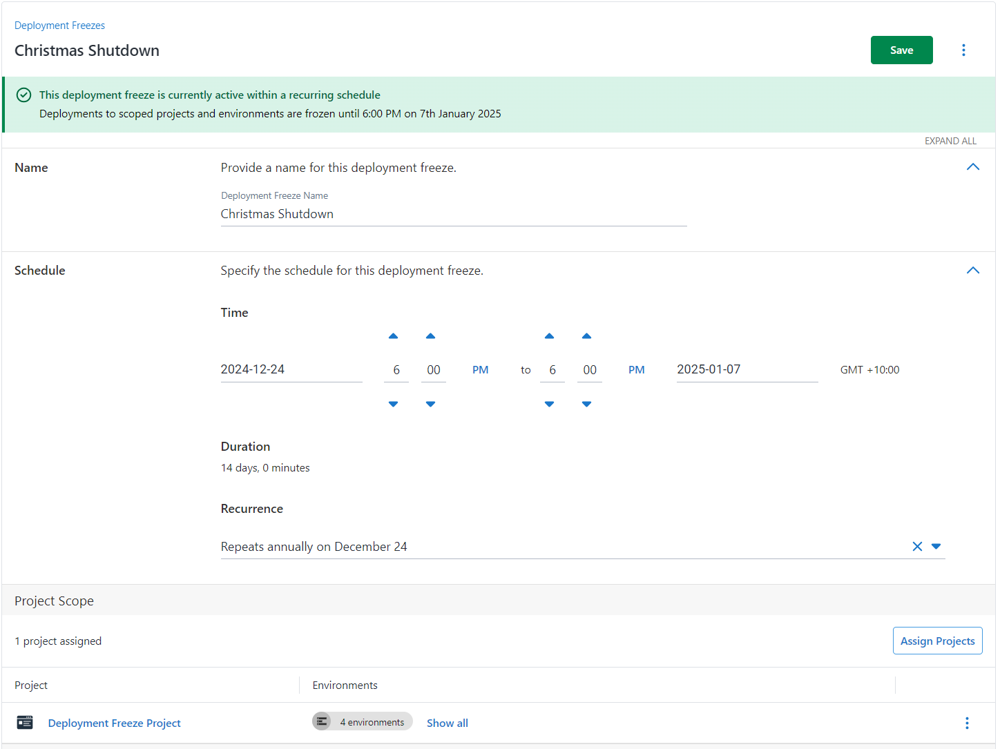
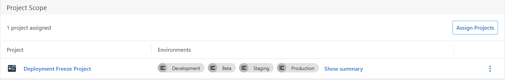
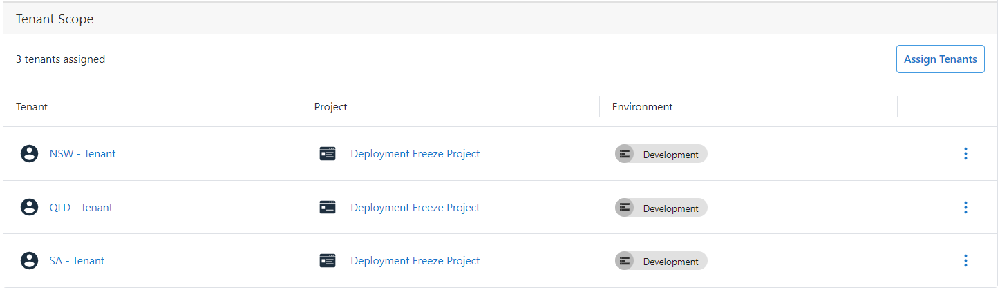
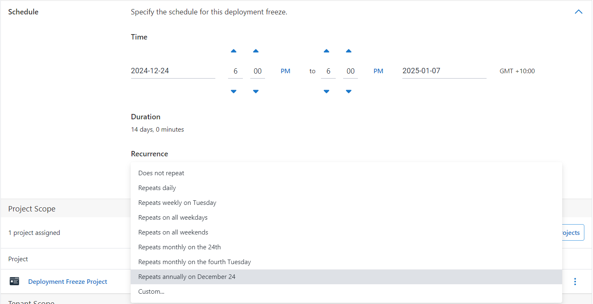
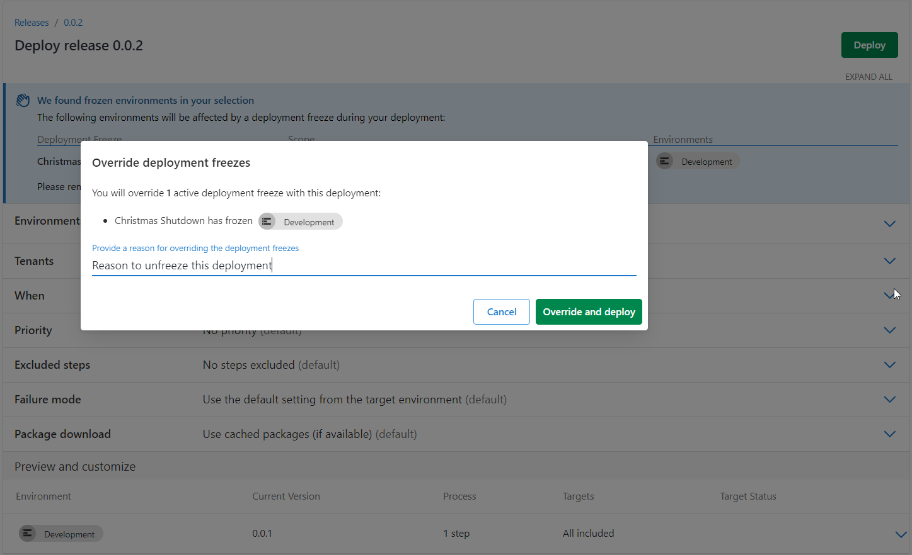

Do you have specific windows where you don't want deployments going out? Do you want to prevent deployments to certain tenants without blocking the whole project?
We've got great news! We're releasing improvements to our Deployment Freezes feature in Octopus Deploy to allow you to do just that.

## Why you need deployment freezes

There are times when deploying new changes is just too risky. For example:

- Holiday seasons when your team is short-staffed.
- Critical business periods like tax season or elections.
- Important demos or testing cycles when you need system stability.
- When you need to prevent deployments to production during business hours.
- When your customers or branches are modelled with tenants and you need more granular control around when deployments to those customers can proceed.

Our improvements to deployment freezes help you handle all these cases. They let you control when and where deployments can happen, keeping your systems stable when it matters most.

## Setting up your freezes

You can create deployment freezes for immediate use or schedule them for later. You get to choose:

- A clear name so everyone knows what the freeze is for.
- When it starts and ends.
- How long it lasts.
- Which projects, environment, and tenants it affects.

If you need to set up regular maintenance windows, you can configure automated recurring freezes that match your schedule.

## Choosing what to freeze with project and tenant freezes

You can control your freezes by scoping them to projects or tenants.

With project scopes, you can freeze specific projects by environment. For example, you might want to freeze your online store production deployments during Black Friday but keep working on your development and test environments.

Tenant scope lets you get even more specific. You can freeze deployments for particular tenants in selected projects and environments. This is helpful if you're managing systems across different time zones or regions.

By mixing these options, you can create freezes that match exactly what your team needs.

## What happens during a freeze?

Here's what you can expect when a freeze is active:

- Existing deployments that started before the freeze will continue to completion.
- New deployments attempted during the freeze will need to provide an override reason to be able to deploy.
- Scheduled deployments that would start during a freeze period will not execute.
- Automatic deployments based on deployment target triggers still execute, which ensures your deployment targets stay updated when scaling up.
- Other automatic deployments, like scheduled deployments or automatic lifecycle promotions, get blocked during the freeze.

## Setting up regular freezes

You can also set up regular freeze periods with uur recurring schedule feature. You can:

- Set up different freezes for each global region.
- Match your maintenance windows
- Create daily protection windows

The system lets you set up these recurring patterns:
- Daily windows to protect business hours
- Weekly schedules for regular maintenance
- Monthly patterns for release cycles
- Annual schedules for recurring business events

## Override capabilities and audit trail

We know that sometimes you need to make exceptions. That's why we've made it easy for authorized users to override active freezes. They just need to provide a reason, which Octopus keeps track of in the audit trail.

The audit trail keeps a record of:

- Freeze creation and modification
- Deployment Freeze Override and their justifications
- Deployment attempts during freeze periods

## Automation and integration

You can automate and integrate deployment freezes into your workflows using the Octopus REST API or the Terraform provider. For example, you can use the Go client to automate the creation and management of deployment freezes as part of your CI/CD pipeline. The Terraform provider offers an `octopusdeploy_deployment_freeze` resource for creating and managing deployment freezes. For more information, see the following resources:

- [Octopus REST API - Go Client](https://github.com/OctopusDeploy/go-octopusdeploy)
- [Terraform provider: Deployment Freeze example](https://github.com/OctopusDeployLabs/terraform-provider-octopusdeploy/tree/main/examples/resources/octopusdeploy_deployment_freeze)

## Conclusion

Deployment freezes in Octopus let you control your deployment schedule. This feature helps you protect critical systems during peak times. It helps with reduced staffing and coordinating deployments across teams. It lets you stay agile while maintaining stability. 

To get started or learn more, you can read our [deployment freeze documentation](https://octopus.com/docs/deployments/deployment-freezes).

Happy deployments!