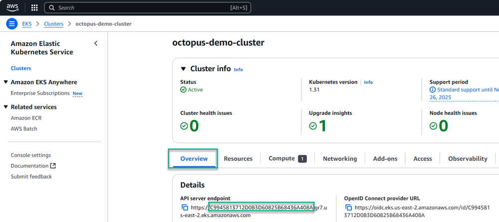

Our [Kubernetes worker](https://octopus.com/docs/infrastructure/workers/kubernetes-worker) lets you scale workers on demand. The Kubernetes worker automatically scales pods to carry out tasks using a single worker registration. This means you no longer need to provision worker machines or containers, which may be idle most of the time. 

Assigning workers an IAM role is common practice when using AWS to interact with other AWS resources securely. In this post, I show you how to attach an IAM role to the worker pods.

## Methods for assigning the IAM roles to the Kubernetes worker

You can use 2 methods to assign an IAM role to an Elastic Kubernetes Service (EKS) pod: 

- IAM roles for service accounts 
- EKS Pod Identity

The steps to configure these differ based on the method you choose.


### IAM roles for service accounts

The first method is to assign the IAM role to the Kubernetes service account that the pods will run as. To configure a Kubernetes service account to use an IAM role:

- Configure the OIDC provider for the EKS cluster 
- Create or update the IAM role for use with a service account 
- Specify the service sccount (sa) annotation in the Octopus Deploy Helm Chart values


#### Configure the OIDC provider for the EKS cluster

To use the IAM roles for service account method, you need to configure the OIDC provider for the EKS cluster. You can configure the OIDC provider via: 

- AWS Management Console
- [eksctl](https://eksctl.io/) command-line utility


##### AWS Management Console

This post doesn't cover the steps for the AWS Management Console. See the [AWS official documentation](https://docs.aws.amazon.com/eks/latest/userguide/enable-iam-roles-for-service-accounts.html) for more details.

##### Using EKSCTL

The `eksctl` utility is included in the `octopusdeploy\worker-tools` Docker image and you can use it to automate configuration of the OIDC provider. Below is an example PowerShell script to configure the OIDC provider using the eksctl command-line utility:

```powershell
# Assign variables
$clusterName = $OctopusParameters["Project.AWS.EKS.Cluster.Name"]
$region = $OctopusParameters["Project.AWS.Region.Code"]


# Enable OIDC on the cluster
eksctl utils associate-iam-oidc-provider --cluster $clusterName --region $region --approve
```

#### Create/update the IAM role

As well as granting permissions to the IAM role you wish to use, you also need to configure the **Trust relationships** for the role.  Below is the minimum JSON needed for the service account to assume the role:

```json
{
  "Version": "2012-10-17",
  "Statement": [
    {
      "Effect": "Allow",
      "Principal": {
        "Federated": "arn:aws:iam::<account-id>:oidc-provider/oidc.eks.<region>.amazonaws.com/id/<eks-cluster-id>"
      },
      "Action": "sts:AssumeRoleWithWebIdentity",
      "Condition": {
        "StringEquals": {
          "oidc.eks.<region>.amazonaws.com/id/<eks-cluster-id>:sub": "system:serviceaccount:<namespace>:<service-account-name>"
        }
      }
    }
  ]
}
```


:::info
You need the **cluster id** for the Trust relationship as indicated above. You can find the ID on the **Overview** tab of an EKS cluster on the AWS console.  The ID is in the first part of the `API server endpoint` or the last part of the `OpenID Connect provider URL`.
:::



#### Create/update the Kubernetes service account

The last step adding the annotation to the service account.  You do this by assigning the `scriptPods.serviceAccount.annotations` value for the Octopus Deploy Helm Chart.

```bash
helm upgrade --install --atomic \
--set agent.acceptEula="Y" \
--set agent.serverUrl="https://YourUrl/" \
--set agent.serverCommsAddresses="{http://octopusserver1:10943,http://octopusserver2:10943}" \
--set agent.space="Default" \
--set agent.name="MyCluster" \
--set agent.deploymentTarget.initial.environments="{development}" \
--set agent.deploymentTarget.initial.tags="{Octopub-Audit,Octopub-Frontend,Octopub-Product}" \
--set agent.deploymentTarget.enabled="true" \
--set agent.bearerToken="BearerTokenValue" \
--set scriptPods.serviceAccount.annotations."eks\.amazonaws\.com/role-arn"="arn:aws:iam::<account-id>:role/<iam-role-name>" \
--version "2.*.*" \
--create-namespace --namespace octopus-agent-mycluster \
mycluster \
oci://registry-1.docker.io/octopusdeploy/kubernetes-agent
```

With everything above configured, all pods used for executing worker activities get assigned the specified IAM role.

#### Adding annotation after agent is already installed

You can also add the annotation manually using the following command:

```
kubectl annotate sa <service-account-name> eks.amazonaws.com/role-arn=arn:aws:iam::<account-id>:role/<iam-role-name> -n <namespace>
```

### EKS Pod Identity

An alternative method is to use the Amazon EKS Pod Identity Agent add-on. This add-on facilitates the IAM role assignment to pods created by the agent.  

Before installing the add-on:

- Create/update the IAM role
- Create a Pod Identity Association
- Add the `Amazon EKS Pod Identity Agent` add-on to your EKS cluster


#### Create/update the IAM role

You first need to configure an IAM Role for the pods to use. Below is the minimum JSON for the **Trust relationships** needed for the add-on to work:

```json
{
    "Version": "2012-10-17",
    "Statement": [
        {
            "Sid": "AllowEksAuthToAssumeRoleForPodIdentity",
            "Effect": "Allow",
            "Principal": {
                "Service": "pods.eks.amazonaws.com"
            },
            "Action": [
                "sts:AssumeRole",
                "sts:TagSession"
            ]
        }
    ]
}
```

#### Create a Pod Identity Association

With the role configured, run the `aws eks create-pod-identity-association` CLI command to associate the role to the service account `octopus-agent-scripts`.


```powershell
aws eks create-pod-identity-association --cluster-name <ClusterName> --role-arn <RoleArn> --namespace "<Namespace>" --service-account octopus-agent-scripts
```

#### Add the Amazon EKS Pod Identity Agent add-on to your EKS cluster

The final step is installinf the [Amazon EKS Pod Identity Agent](https://docs.aws.amazon.com/eks/latest/userguide/pod-identities.html) add-on to your EKS cluster. This agent grants the identity to pods when they're created. 

You can add the add-on manually using the AWS Management Console or programmatically using the AWS CLI. This post doesn't cover installing the add-on via the AWS Management Console.

```powershell
# Add pod identity addon
aws eks create-addon --cluster-name <ClusterName> --addon-name "eks-pod-identity-agent"
```

#### Example script to automate

You can place all the above commands conveniently in a [runbook](https://octopus.com/docs/runbooks) to automate installation when spinning up a new cluster.

```powershell
# Assign variables
$clusterName = $OctopusParameters["Project.AWS.EKS.Cluster.Name"]
$region = $OctopusParameters["Project.AWS.Region.Code"]
$roleName = $OctopusParameters["Project.AWS.EC2.Role.Name"]


# Get role
$iamRole = ((aws iam get-role --role-name $roleName) | ConvertFrom-Json)


# Attach service role
aws eks create-pod-identity-association --cluster-name $clusterName --role-arn $iamRole.Role.Arn --namespace "octopus-worker-awsagentworker" --service-account octopus-agent-scripts


# Add pod identity addon
aws eks create-addon --cluster-name $clusterName --addon-name "eks-pod-identity-agent"
```

## Conclusion

In this post, I showed you 2 two ways to apply IAM roles to the Octopus Kubernetes worker pods to facilitate secure communication and access to other AWS resources.

Happy deployments!