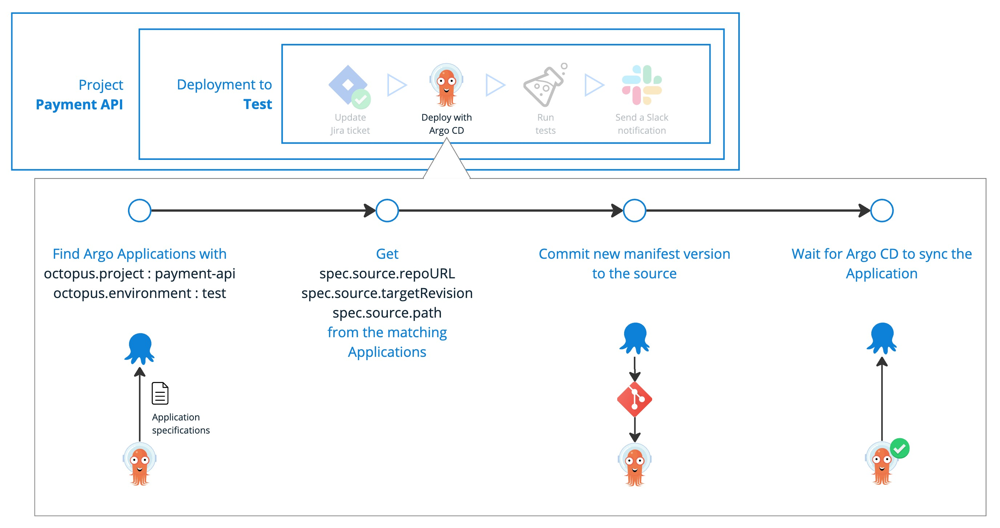

Less scripting, more deploying when you orchestrate Argo CD with Octopus!

🚀 Coming in 2025

Argo CD is a great tool, but as you scale, it can become difficult to manage. You often end up managing hundreds of manual scripts, which leads to configuration chaos and deployment guesswork.

Octopus is a continuous delivery platform that automates software deployments at scale in ways no other tool can. It enables teams to model complex scenarios, like multi-environment releases, version-dependent promotions, and compliance workflows, without scripting everything from scratch.

Now, we’re bringing the power of Octopus orchestration to Argo CD, combining GitOps simplicity with enterprise-grade automation.

With Argo CD in Octopus, you don’t need to find a compromise between GitOps and powerful CD. You have both: GitOps experience and powerful CD without custom scripting.

Octopus also provides one pane of glass to monitor the deployment progress and state of all your applications across all clusters and environments.

## What the solution does

✅ Automate manifest promotion across environments while keeping Git as the source of truth.

✅ Monitor Argo CD for health status and react accordingly.

✅ Incorporate GitOps-based deployments into full CD workflows with testing, approvals, notifications, and rollback automation.

A manifest update can be included in a deployment pipeline among other steps like integration tests, notifications, approvals, etc. Application health status or following test results can trigger next pipeline actions like promotion to the next environment or rollback.

Octopus generates manifest updates per environment from Helm charts, Kustomize configuration or YAML templates. Combining tools like Helm and Kustomize with Octopus variables, you reuse one confguration template for many applications and teams. At the same time, you can store and evolve configurations in Git and trigger deployments on the Git, Helm chart or container image updates.

## Why should you try it?

###  Less custom scripting, more time for innovation  

Octopus makes Argo CD easier to use with environment modeling and deployment orchestration built-in. Automate everything from environment promotion and compliance to tests and change management. Add new projects and environments in minutes, no custom scripting required. Spend less time building and maintaining code, and more time focusing on innovation.  

###  A single place to manage your deployments  

No more bouncing between systems to get the full picture or find issues. Octopus shows you the version, stage, environment, and state of each deployment across all your Argo and non-Argo apps, on one dashboard. It's quicker and easier to deploy and troubleshoot with everything in one place.  

###  Quick, reliable deployments your developers can self-serve  

Automate and standardize your processes with Octopus so developers can self-serve without needing to be Kubernetes experts. No more manual updates or custom scripting, let Octopus deploy, test, notify, and more. Deployments are faster and more frequent, while retaining all the benefits of GitOps.  

###  Reduce risk with security, expert support, and compliance built-in  

Deploy to Argo CD with enterprise-level security. Octopus is secure by design with ISO 27001, SOC 2 Type I and II, and GDPR compliance. You also get audit logs, role-based access control (RBAC), and single sign-on (SSO) as standard, plus world-class support from our experts  

## How it works

We've made it easy to integrate Octopus with Argo CD without having to reinstall it or make configuration changes. Octopus then adds CD orchestration to improve your GitOps workflows. 

1. Connect Octopus with Argo CD by installing an Octopus agent in the same cluster that hosts Argo CD.
2. In Octopus, add your Argo CD deployment (manifest update) alongside the other steps in your deployment pipeline.
3. Organize your Argo Applications into environments with annotations.
4. To streamline Application configuration, use ApplicationSets with the Octopus generator.
5. During your deployment, Octopus identifies relevant Applications, retrieves Git source details, and updates the stored manifest. Octopus will then either: 
    - Generate a complete YAML manifest from Helm, Kustomize, or raw YAML
    - Modify specific fields or the manifests (“pathing”) while leaving the rest of the manifest unchanged.
6. After the deployment, Octopus shows you a live Application status from Argo CD.

## Join the Early Access Program (EAP)

Argo CD in Octopus will be available at the end of 2025, but you can sign up now for early access!

By joining the EAP, you’ll:

**Get access to Argo CD in Octopus in mid-2025.**
Get early access to UX designs, technical proposals, and prototypes.
Provide feedback and help shape the final product.
Stay updated on progress and be the first to deploy with it.

[Join the Early Access Program](link)

## Q&A

**Will the solution support my existing GitOps workflows with Argo CD**

Yes. We believe CD orchestration should improve your GitOps workflows — not replace them.

Octopus Deploy will source manifests from Git, trigger deployments on Git changes, and will open PRs to control environment promotions.  The rest of the flow will be managed by Argo CD.

**How does Octopus know which Argo Applications map to my environments?**

Octopus will use Argo CD Application annotations to match Applications to Octopus projects and environments.

During deployment, Octopus will identify relevant Applications, retrieve Git source details, and update the stored manifest.

**Will integration be difficult?**

No, it should be easy — we want to simplify automation, not complicate it! We aim to add Octopus to your existing Argo CD setup without you having to reinstall it or make major configuration changes.

**How does Octopus update manifests?**

Octopus will provide two options

- **Render a full YAML manifest (hydration)** and replace the previous one in the Argo CD source.
- **Patch only specific fields** (e.g., Helm values, Kustomize overlays, YAML files) while keeping the rest of the files in the Argo CD source untouched.

## Let’s sum up

With Octopus + Argo CD, you get GitOps simplicity and powerful CD automation in one platform. No more manual scripting, configuration chaos, or deployment guesswork.

🚀 Join the EAP and help us build the future of Argo CD orchestration!

[🔗 Sign up now](link)