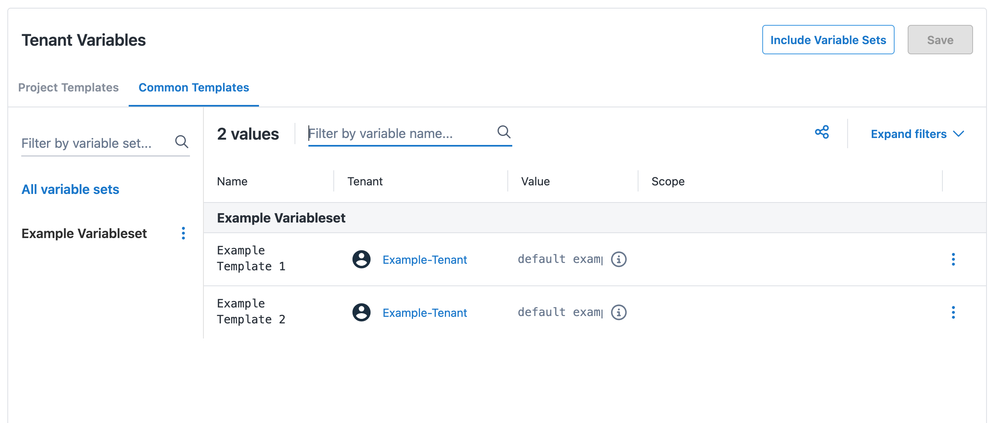
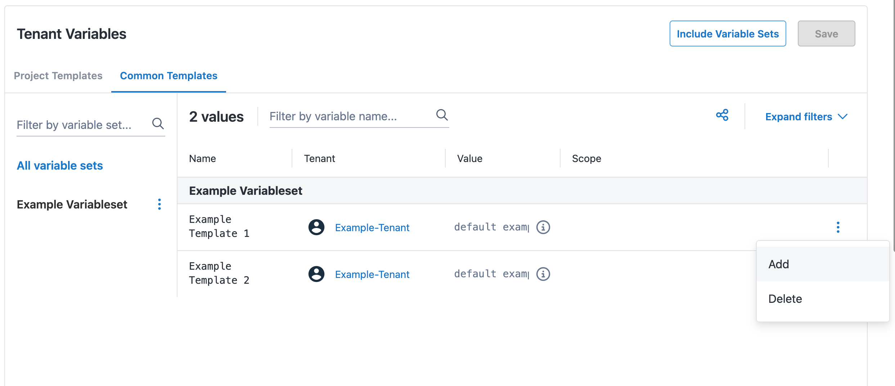
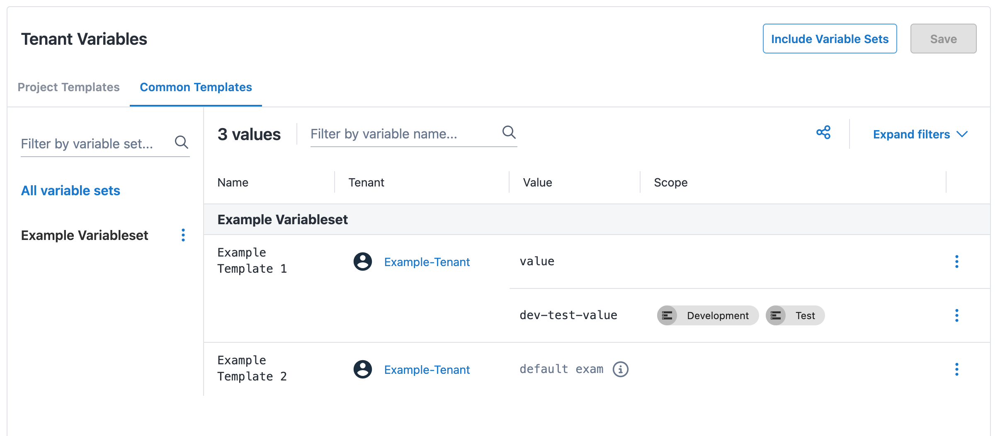

We recently improved tenant variables by introducing scoped tenant variables.

[Common tenant variables](https://octopus.com/docs/tenants/tenant-variables) are great for managing variables within tenants. Assigning a common tenant variable means that every connected project has access to that variable. This is great for deploying and managing multi-tenanted deployments at scale, and simplifies deployments by using the same value for every connected environment. We wanted to create more flexibility by letting customers set different common variable values for each environment across all tenant projects. Scoped common tenant variables aim to solve this.

Assigning environment scopes to your common tenant variables will make variable management across tenant projects so much simpler. 

In this post, I walk you through how to scope tenant variables and discuss the integration capabilities.

These updates are now available to our Cloud customers and will be available to self-hosted customers from v2025.2.

## Why should I scope tenant variables?

Previously, there were both constraints and differences in how you managed tenant variables  for environments. 

- Tenant project variables required one value per project environment. 
- Tenant common variables were limited to one value across all environments connected to a tenant. 

Now, you can scope common variables to environments as needed. This means they can be unscoped (variable applies to all connected environments), singly-scoped, or multi-scoped. 

The ability to assign scopes to tenant variables creates more simplicity and flexibility with variable management. For example, to assign different variable values for different environments across all tenant projects, you previously had to create a tenant for each environment. You could then set a common variable for each tenant. Now, you simply set multiple common variables with the appropriate environment scope. 

This is particularly useful if your non-production environments all share one value, while production has a separate value. Maintaining variables becomes more straightforward as you only need to update values once.

## How to assign scopes to your tenant variables

You can set tenant variables from the projects page and from the tenants page. To set tenant common variables from the project page, you need to create a tenant with a connected project and connected environments. Then you create a variable set with a variable template and connect it to the tenanted project. 

- Select the **Tenant Variables** page from the sidebar and click on the **Common Templates** tab.



- To add a new tenant variable, select the overflow menu and click **Add**. 
- Type in a value and select the environments in the **Scope** column. Click **Save**.



- The page should now show the new tenant variable values and scopes.



Unscoped variables apply to all environments with no explicitly scoped variables. [See our docs for more information on scoping variables](https://octopus.com/docs/projects/variables/getting-started#scoping-variables).
 
### Migrating existing tenant variables

Existing tenant variables will automatically get migrated to the new scoped tenant variables when upgraded to 2025.2. The migration will scope tenant project variables to the previous single scope and common variables will be unscoped. This ensures your deployments can proceed without making any changes. After your instance detects scoped tenant variables in use, it will prevent the use of the old tenant variable endpoint. 

:::warning
We'll deprecate the endpoint ```tenants/{tenantId}/tenantvariables``` from 2026.2.
:::

We introduced 2 new endpoints for GET/UPDATE requests for scoped tenant variables. These will replace the use of the endpoint above: 

- ```tenants/{tenantId}/projectvariables```
- ```tenants/{tenantId}/commonvariables```
 
## Automation and integration

Scoped tenant variables are now supported through our .NET, TypeScript, and Go clients. [See our docs for more information on our API clients](https://octopus.com/docs/octopus-rest-api/getting-started#api-clients).

Octopus CLI will also support the use of scoped tenant variables. As our CLI matches tenant variables on the variable's name and environment, the tenant variable update function currently doesn't support changing variable scopes of existing tenant variables. To select the correct tenant variable, you must specify the exact scope. 

Our Terraform provider doesn't currently support the new scoped tenant variables. If you'd like this to be supported, please don't hesitate to [get in contact](https://octopus.com/support) with us.

## Conclusion

Scoped tenant variables give you finer control of your tenant variables. Now, you can simply assign a scope to your tenant variables and watch the magic happen.

To get started or learn more, you can read our [tenant variables documentation](https://octopus.com/docs/tenants/tenant-variables).

Happy deployments!