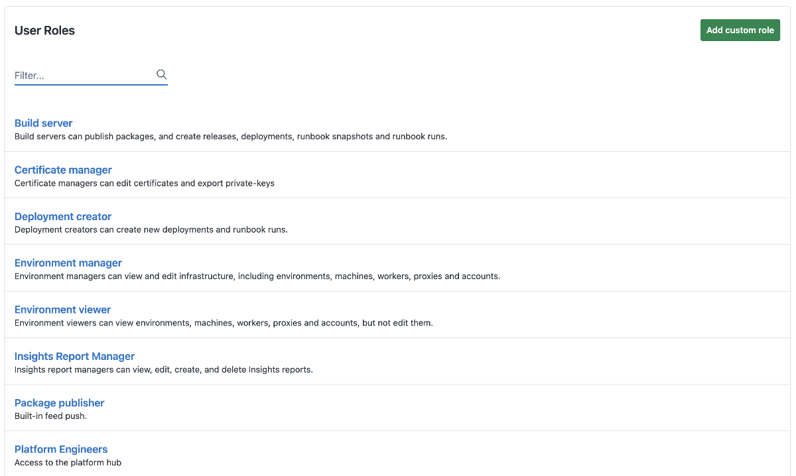
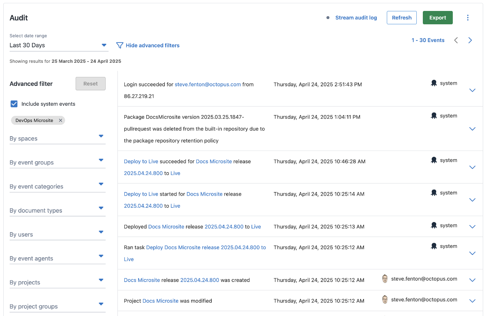
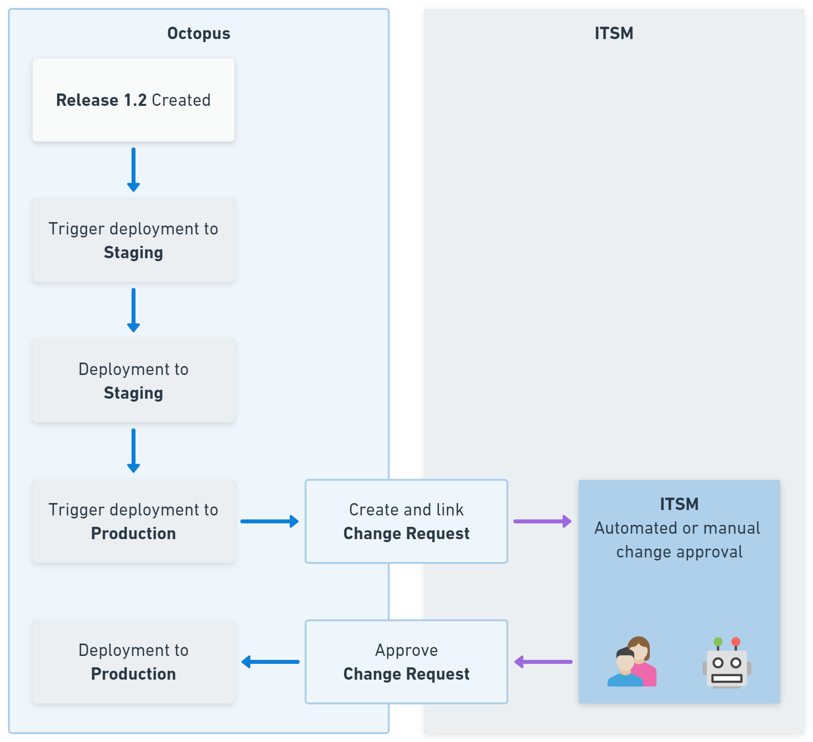
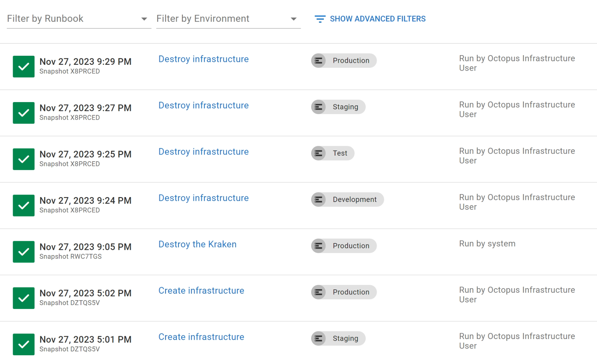

If you work in the financial industry, you know there can sometimes be a high burden of regulation. This is understandable when you consider the risk of financial loss and how it can impact people's lives. But if you don't take the right approach to compliance, it can become a time and energy leak that threatens your ability to compete in the market.

The best compliance teams look for ways to protect the organization and its customers from risk without overburdening teams with bureaucratic procedures. You want compliance set to maximum and the ability to deliver high-quality, valuable software set to maximum, not some compromise between the two.

## Good compliance sounds like DevOps

If you know DevOps, this will sound familiar. Traditional managers saw software delivery as a compromise between throughput (creating and improving software features) and stability (keeping everything working). They measured developers on throughput and ops teams on stability, then wondered why there was so much conflict between them.

Just as the solution to the software delivery problem was to align both teams to the shared goal of throughput and stability, you must do the same with other desirable system qualities, like security and compliance.

Rather than calling this DevSecOps or DevSecCompOps, we can call it DevOps because everything that relates to software fitness is part of DevOps.

The non-DevOps way is for stability to be an afterthought and compliance to be an ominous late reaction to an upcoming audit. The DevOps way is to make these part of the daily work, automate as much as possible, and deliver the outcome of compliance instead of the frantic output of audit theatre.

It's about being safe and secure, not looking safe and secure.

## Compliance automation

You can approach compliance by copying what other organizations are doing. Most organizations have a spreadsheet with obliquely referenced requirements that developers are regularly asked to update and evidence. Who doesn't love an ORG-05.15-ACCESS-CONTROL line item in a spreadsheet?

However, the best compliance teams I've worked with took a different approach. They spent more time educating developers like me about the reasons for these requirements so we could find ways to satisfy them, collect evidence, and keep customers safe.

This meant we considered compliance needs when writing features, selecting tools, or changing our process. When we looked at tools for builds, deployments, and monitoring, ease of meeting compliance needs and automation of evidence collection were part of the buying decision.

This isn't just about making audits easy; it's about making compliance easy, and it's about making the desired outcomes of compliance more likely. Your toolchain can do much of the heavy lifting, leaving you to show and tell during an audit while listening out for opportunities to make things even better.

## How Octopus supports easy compliance

Octopus has many features that will ease your compliance burden and increase safety, from enterprise-grade access controls and audit trails to innovative automation. Let's take a quick tour of some crucial compliance features:

- Role-based access control
- Extensive audit trails
- IT service management integrations
- Octolint
- Runbooks

### Role-based access control

Octopus Deploy has fine-grained role-based access controls (RBAC) that integrate with single sign-on providers. You can define roles and permissions to control who can change deployment processes, runbooks, and other configurations and who can access the automation for different projects and environments.

You can use RBAC to prevent unauthorized changes and enforce segregation of duties. You can also safely create self-service actions, like letting testers deploy to the test environment or clear a web cache to speed up their testing without giving them more extensive permissions.



### Extensive audit trail

Octopus Deploy automatically captures a detailed audit log for all significant system events, including deployments, configuration changes, user access events, and more. Every action that changes state is recorded, including who initiated it.

These tamper-resistant audit logs let you demonstrate what changes were made to applications or infrastructure. When you need to delve into the audit trail, it's easy to filter actions by user or by a specific area within Octopus, like spaces, projects, environments, event types, and more.



### IT service management integrations

Our integrations with ServiceNow and Jira Service Management remove manual hand-offs between Octopus and your IT service management (ITSM) platform. This makes it easy to ensure changes have the appropriate approval before progressing.

The integrations automatically create change requests associated with a deployment. You can block deployments until the change approval is given. This increases compliance, as no unapproved changes get deployed to production - but it does so without creating toil for the developers.



### Octolint

Octolint is a tool that scans your Octopus instance and recommends improvements to your setup. It detects potential issues such as perpetual API keys, shared Git user names, and unused deployment targets.

Instead of manually auditing for good practices, Octolint can automatically scan and report on items that need your attention.

```text
[OctoLintDefaultProjectGroupChildCount] The default project group contains 79 projects. You may want to organize these projects into additional project groups.
[OctoLintEmptyProject] The following projects have no runbooks and no deployment process: Azure Octopus test
[OctoLintTooManySteps] The following projects have 20 or more steps: K8s Yaml Import 2
```

### Runbooks

Financial institutions need good plans for both daily operations and emergencies. Octopus Runbooks help with this. You can turn routine and emergency operations tasks into reusable automations, whether for database maintenance, restarting systems, applying urgent fixes, or recovering backed-up data.

Automated runbooks are safer and more reliable, reducing the need for broad distribution of elevated access. Runbooks in Octopus also log changes and runs to the standard Octopus audit trail. You may even find opportunities to use runbooks to automate compliance tasks.



## Octopus loves compliance

Octopus Deploy has many features that reduce the compliance burden and help you build security, privacy, and compliance into your DevOps process. As an organization, Octopus also maintains compliance with ISO 27001:2013, SOC 2 Type II, and SOC 3 with regular third-party audits and technical assessments for security, safety, and privacy. You can find out more about this in our trust center.

Tools that reduce the compliance burden are crucial to organizations in the financial industry or other regulated and safety-critical environments. Your toolchain can help maintain innovation and compliance just like it brings your throughput and stability.

Happy deployments!
