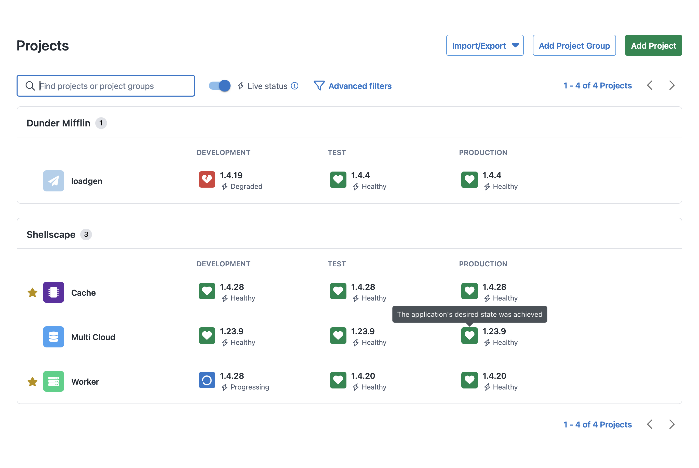

Kubernetes is rapidly becoming the dominant platform for hosting and running applications. At Octopus, we want to provide the best experience for deploying to and monitoring your applications on Kubernetes.
To make your deployments to Kubernetes simpler, faster, and safer, Octopus has a deployment target called the Kubernetes agent.
 
The Kubernetes agent is a small, lightweight application you install into your Kubernetes cluster. The Kubernetes monitor is the next major expansion of capabilities of this deployment agent.

## Post deployment monitoring
Monitoring is an important part in a deployment process and is even more important when it comes to Kubernetes. It gives you confidence that your applications are running as expected.
 
When troubleshooting an unhealthy app, you often need to use a combination of tools and login credentials to figure out what's going wrong, and that can be quite fiddly, especially with Kubernetes. Your Octopus Deploy instance already has these credentials and awareness of your apps similar-to run books. We're aiming to make octopus the first port of call as you and your team continuously deliver software.

We roll up the combined status for the objects in a given release, per environment into a single live status.

*Project view with live status*

## Already using the Kubernetes agent
Great! Your upgrade path will be simple.

### Upgrading your agents to the version containing the monitor
[Upgrading an existing Kubernetes agent](https://octopus.com/docs/kubernetes/live-object-status/installation#upgrading-an-existing-kubernetes-agent)
We are working on a one click upgrade process you can access within Octopus Deploy. If you can’t wait until then, you can upgrade existing Kubernetes agents by running a Helm command on your cluster.
[See this documentation page for all the details.](https://octopus.com/docs/kubernetes/live-object-status/installation#upgrading-an-existing-kubernetes-agent)

## New to using Octopus for Kubernetes deployments?
After the agent is installed, it registers itself with Octopus Server as a new deployment target. This lets you deploy your applications and manifests into that cluster, without the need for Workers, external credentials, or custom tooling. All new installations of the agent will have the monitor enabled.
 
### Installing the agent
 
The Kubernetes agent gets packaged and installed via a Helm chart. This makes installing and managing the agent very simple and makes automated installation easy.

The Kubernetes monitoring component comes along for the ride, see [this page for detailed instructions](https://octopus.com/docs/kubernetes/live-object-status/installation#upgrading-an-existing-kubernetes-agent).

*Kubernetes agent configuration options*

## New to Octopus Deploy entirely?
How exciting!
 
### Who
Everyone involved in continuous delivery of applications.
 
### What
Scalable, simple, and safe Kubernetes CD with Octopus.
 
### Why
Empowering teams spend less time managing and troubleshooting Kubernetes deployments and more time shipping new features to improve your software.
 
Octopus models environments out-of-the-box and reduces the need for custom scripting. You define your deployment process once and reuse it for all your environments. Go to production confidently as your process has already worked in other environments.
 
### How
Octopus is one user-friendly tool for developers to deploy, verify, and troubleshoot their apps. Platform engineers use this powerful tool to fully automate Continuous Delivery, manage configuration templates, and implement compliance, security, and auditing best practices.
 
### Where
If you’re interested in trying it out, sign up for a [free 30-day trial](https://octopus.com/start).

### Getting started with the agent & monitor
 
The Octopus Kubernetes agent targets are a mechanism for executing Kubernetes steps and monitoring application health from inside the target Kubernetes cluster, rather than via an external API connection.

Similar to the Octopus Tentacle, the Kubernetes agent is a small, lightweight application that is installed into the target Kubernetes cluster.

The Kubernetes agent is installed using Helm via the octopusdeploy/kubernetes-agent chart, see the “[Installing the Kubernetes(https://octopus.com/docs/kubernetes/targets/kubernetes-agent#installing-the-kubernetes-agent)” page for the complete details.

### When can I use it?
The Kubernetes agent is available now as an Early Access Preview (EAP) in Octopus Cloud starting today! If you don’t see the feature available, please reach out and we can fast track your cloud instance getting this release.

Remember this is an opt-in upgrade for existing Octopus Agents installed on your cluster(s), [see this documentation page for all the details.](https://octopus.com/docs/kubernetes/live-object-status/installation#upgrading-an-existing-kubernetes-agent)

*Kubernetes agent as Deployment Targets*

## How we built it
To facilitate a potentially large flow of new data coming to Octopus Server a separate and non-disruptive web host runs alongside the main host. This isolation level gives us confidence that this is an additive feature and if there are performance complications they will be isolated and managed with minimal impact to Octopus Server regular operations.

The cluster-based monitoring capability uses two values to identify the incoming request: the client certificate thumbprint and an installation ID in the request headers. Octopus Server uses a long lived bearer token as shared secret for authentication, that is generated when the monitoring capability installs in the cluster and registers with Octopus Server. This token will be rotatable by customers and only be valid for use on the gRPC endpoint.

This allowed us to build gRPC services to handle the data flowing from the monitoring agent in the Kubernetes clusters. [gRPC](https://grpc.io/) is a modern open-source high performance Remote Procedure Call (RPC) framework. This is the first time we’re using gRPC as part of an Octopus feature.

Within the cluster alongside the Octopus Kubernetes Agent, we have this new component that's responsible for the monitoring aspect. It sits in the cluster and monitors the resources that are deployed, pumping relevant live-status data back out over gRPC to Octopus Deploy.

As we also run Octopus Deploy in Kubernetes for customers as part of our hosted offering, we have new nginx based ingress controllers to help with scalability. To find out more have a look at [How we use Kubernetes for Octopus Cloud](https://www.youtube.com/watch?v=DH7YDySEPHU)
 
### Written in Go
This is the first large scale feature our team has built in [Golang](https://go.dev/) within Octopus Deploy. This has given us access to a large set of great libraries built for Kubernetes, examples include Helm packages, the Argo GitOps engine as we got the expertise uplift from the Codefresh engineers that are now part of Octopus.

The GitOps engine is a flexible library, with enough configuration and extension points for us to save very specific information on a per resource basis to help get the right information out of the cluster and back to Octopus.

Along with Go being the de facto programming language for Kubernetes.
 
We are exploring options about what and when we can open-source parts of our implementation, so stay tuned when that’s all decided we will have a follow up blog post. The likely first step will be making the source available for inspection, as part of offering more transparency into the tools we’re asking customers to run within the security context of their clusters.
 
## What is coming next
Today’s release is the EAP, this list currently represents more capabilities we think are worth adding next (it is not the complete list). If you have thoughts and opinions please reach out to us – see the bottom of the blog post for ways to contact us. 

 - Terraform based setup
 - Support Kubernetes API targets 
 - Self-hosting; this feature is only available on Octopus Cloud
 - Octopus HA (multi-node server) support
 - Custom health checks
 - Orphan and drift detection

### This looks cool, but what if I don’t deploy to Kubernetes?
Currently there’s no plans to extend this beyond Kubernetes deployments, but please reach out and let us know where and why you would like to use this monitoring capability.

## Let us know your thoughts
We're excited to see how you find using this monitoring feature. Please let us know in the comments section below or on our [community slack](https://octopus.com/slack), what new capabilities this does (or doesn't) open-up for your application delivery objectives.

Happy deployments and post deployment monitoring!
