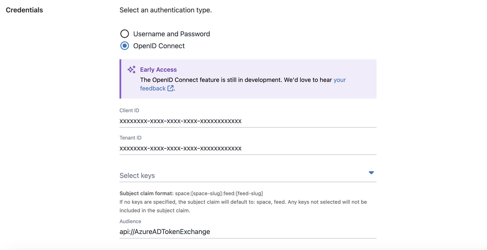

We recently updated our external feeds to support OpenID Connect (OIDC) authentication. 

Octopus can now use OAuth 2.0 to access your container feeds. This means you won’t have to manage or rotate credentials manually. This includes OIDC support for AWS, Azure, and Google Container Registries.

This is especially beneficial for AWS Elastic Container Registries, where authentication tokens expire after 12 hours. OIDC eliminates the need for stored access keys by generating fresh credentials at deployment time.

This feature is now available for our Cloud customers and will be available to self-hosted customers in 2025.2.

In this post, I explain how OIDC external feeds work and how to set them up for each provider.

## Why use OIDC external feeds in Octopus?

Using OIDC with external feeds removes the need to store and rotate credentials. During deployment, Octopus requests short-lived credentials to authenticate with your container registry. This improves security and simplifies credential management.

You can also customise the OIDC subject to include the space and feed. This helps enforce access control by ensuring tokens issued by Octopus are only valid for the intended feed and space. Here is an example subject claim: `space:default:feed:feed-name`. 

For more information on generating subjects and OAuth flows, check out our [OpenID Connect docs](https://octopus.com/docs/infrastructure/accounts/openid-connect).

## AWS Elastic Container Registry (ECR)

You can now select OpenID Connect as an authentication method when setting up an AWS ECR feed in Octopus. This is a great fit if you want to avoid managing access keys and use short-lived credentials instead.

To get started, create an IAM role with a trust policy that allows `sts:AssumeRoleWithWebIdentity`. When configuring your OIDC external feed, you’ll need to provide the Role ARN and Audience. Octopus uses these values to request temporary ECR credentials at deployment time.

If you're new to this setup, take a look at our [AWS Elastic Container Registry docs](https://octopus.com/docs/packaging-applications/package-repositories/guides/container-registries/amazon-ec2-container-services#adding-an-aws-openid-connect-ecr-external-feed).

## Azure Container Registry (ACR)

OIDC is now supported for authentication with Azure Container Registry in Octopus. This removes the need for client secrets by using federated credentials instead.

To set it up, create an app registration in Azure and add a federated credential. To configure your feed in Octopus, make sure to add the Client ID, Tenant ID, and Audience from your identity provider. Octopus will use these to request a token from Azure. This ensures it can securely authenticate with your container registry.

For full setup instructions, check out our [Azure Container Registry docs](https://octopus.com/docs/packaging-applications/package-repositories/guides/container-registries/azure-container-services#adding-an-azure-container-registry-with-openid-connect-as-an-octopus-external-feed).

## Google Container Registry (GCR)

Octopus now supports OIDC authentication for Google Container Registry via Workload Identity Federation. This means you no longer need to manage service account keys.

Start by configuring a Workload Identity Pool and an OIDC provider in Google Cloud. Then, create a trust configuration. This links the subject and audience from Octopus to a Google service account. In Octopus, set up a GCR external feed and provide the Audience and the registry URL. Octopus will use these to exchange its token for temporary credentials during deployment.

For more guidance, see our [Google Container Registry docs](https://octopus.com/docs/packaging-applications/package-repositories/guides/container-registries/google-container-registry#adding-an-openid-connect-google-container-registry-to-octopus).

## Conclusion

OIDC external feeds bring security and flexibility to your deployments by removing the need for static credentials. This method is consistent with modern cloud practices and gives you more control over your feeds. With support for AWS, Azure, and Google registries, Octopus makes it easy to integrate secure, token-based authentication into your pipelines. 

We hope you give it a try, and let us know what you think. If you have any questions or feedback, we’d love to hear from you.

Happy deployments!