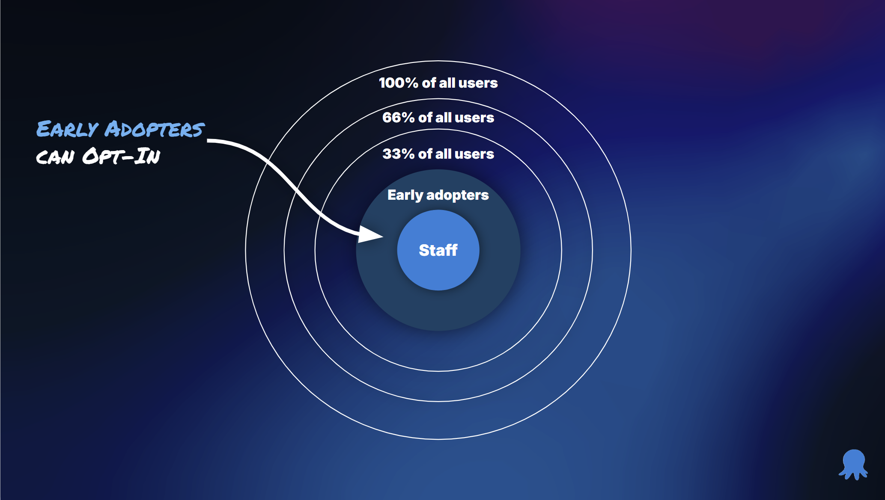

Every production deployment is risky.  Some deployments are low risk, some are high risk.  Too often, canary deployments is seen as a panacea to reduce all deployment risk.  That is a false belief.  

The best way to reduce deployment risk is three-fold.

- Have a small batch of change
  - The less that changes, the less of a chance something goes wrong.  
  - If something does go wrong, it's easier to determine the root cause.
- Short lead times
  - Rolling back to a previous code version is extremely risky.  The window to safely rollback is much smaller than most people think.
  - It should take less than an hour to commit a fix into main and deploy it to production.
- Separate the concept of deploying a new version of code from releasing new functionality
  - The main cause of critical bugs is new functionality.
  - You must be able to release new functionality to users in a controlled manner.

All that can only be accomplished by combining [Trunk based development](https://trunkbaseddevelopment.com/), [Progressive delivery (canary, blue/green, or staging)](https://octopus.com/blog/common-deployment-patterns-and-how-to-set-them-up-in-octopus), and [Feature toggles](https://martinfowler.com/articles/feature-toggles.html).  Or, as I like to call it, TPF.  

This article will walk through how TPF de-risks your deployments.

## Limitations of canary deployments

I understand the appeal of canary deployments.  Deploy a new version of your application.  Route a percentage of traffic and monitor logs.  Increase the traffic when everything looks "right."  Redirect to the previous version when something looks "wrong."

Source: https://aws.amazon.com/blogs/containers/create-a-pipeline-with-canary-deployments-for-amazon-ecs-using-aws-app-mesh/

During implementation, you'll discover a many limitations.

1. No guarantee all code paths are executed.  Unless you are a FAANG-sized company, a subset of traffic is unlikely going to execute every code path in a short period of time.  
2. Long deployment durations.  The natural reaction to the code path limitation is to extend the canary deployment duration.  Hours to days isn't uncommon.
3. Indiscriminate traffic routing.  It is nearly impossible to target a specific set of users via a load balancer.  Best case, you can use http headers, but that is often too broad.
4. Disjointed user experience.  When canary deployments takes days or even weeks and indiscriminate traffic routing, you cannot rely on "sticky sessions" to keep a user on a particular version.
5. User expectations.  I have a laptop and an iPad.  When I go to a website I expect the same experience when using my laptop or iPad (even when used within minutes of one another).

The main limitation of canary deployments is they cannot de-risk new features and functionality.  They should be used to de-risk deployment failures and provide zero-downtime.  More on that later.

## Trunk based development

[Trunk based development](https://trunkbaseddevelopment.com/) promotes frequent check-ins to the main or default branch.  

> A source-control branching model, where developers collaborate on code in a single branch called "trunk", resist any pressure to create other long-lived development branches by employing documented techniques. 

The goals of trunk based development are:

- Avoiding merge hell: How many times have you worked on a long-lived feature branch and merging to main took hours or days?
- Small batch sizes: Bigger batch sizes are much riskier to deploy than smaller batch sizes.  A bigger batch size means more code has changed, meaning there is more something can go wrong.
- Minimize [yak shaving](https://en.wiktionary.org/wiki/yak_shaving): Complex branching strategies, such as [GitFlow](https://www.atlassian.com/git/tutorials/comparing-workflows/gitflow-workflow) are complex.  That complexity results in a lot of yak shaving to handle merging between branches, releasing, and other ceremonies.  

My personal preference is trunk based development "at scale."  

Source: https://trunkbaseddevelopment.

Trunk based development at scale works nicely with [GitHub flow](https://docs.github.com/en/get-started/using-github/github-flow), where changes are made in short-lived branches and merged via pull requests.

It requires developers to adopt two key concepts.

1. Short-lived feature branches - no more than a couple of days.  Ideally, less than a day.
1. Incremental changes - no more delivering a feature as a "big bang."  

That does not mean merging unfinished code into main after a few hours or a couple of days.  Many features can take weeks or months to finish.  It is the responsibility of the developers and product managers to create small units of work that incrementally add functionality (and tests) until the feature is "done."  Each incremental change can be deployed to production.  Until the feature is ready for users, it should be hidden behind a feature toggle.

## Progressive delivery

Trunk based deployments encourage frequent production deployments.  As each merge into main should be production ready.  Deploying frequently to production will require progressive delivery strategies.  That is because progressive delivery, canary, blue/green, or staging, de-risks deployments failures and provides zero-downtime deployments.

A deployment failure is when one or more happens:
- A database migration fails.
- Infrastructure cannot be created or updated properly.
- The new application version cannot be deployed due to environmental problems.
- The new application version won't start after deployments.
- The new application version crashes minutes after the deployment.

Deploying a new application version to a "staging" location in production while the previous version continues to run is how to prevent deployment failures from causing production outages. 

A zero-downtime strategy is required because applications are often provide critical business functionality.  Any downtime might breach SLAs, frustrate customers, or prevent employees from doing their work.  Progressive delivery strategies allow you to deploy when it is convenient for developers and operations.  But, at the same time, allow the business to control when users should get the latest version.  For example, deploying the change at 2 PM, and then redirecting all users at 9 PM when usage isn't as high.

## Feature Toggles

The vast majority of critical bugs are due to new features and functionality.  It is often a result of an unknown use cases, edge cases that occur much more frequently than expected, performance, security, or unexpected user configurations with other features.  As stated earlier, progressive delivery strategies, canary, blue/green, or staging, will not solve this challenge.

The best way to de-risk new functionality is to get a subset of users to use it.  But users don't want a "sandbox" or an empty application.  They want to use it with what they've already configured within the application.

The only way to accomplish that is with feature toggles.

The challenge is many people believe feature toggles are a simple binary.  It's either on or off for everyone.  Turn it on in testing environments, but leave it off for production.  Feature toggles must follow the specification provided by [Openfeature](https://openfeature.dev).  Instead of a application level binary, multiple segments of users are created.  The feature toggle is then turned on for each segment.  

The segments can be whatever you want them to be:

- Staff or internal users
- Early adopters or beta users
- Timezone
- State or Province
- Country
- Specific entitlements

The advantages to this approach are numerous:

1. Internal or staff users can [dogfood](https://en.wikipedia.org/wiki/Eating_your_own_dog_food) new functionality in production before anyone else.
2. Provide early access to a subset of alpha users for early feedback.
3. Beta test new functionality with a large group of users before it goes live for everyone.
4. Being able to pivot and change functionality based on user feedback.
5. Rolling back involves turning off a feature toggle, not redeploying a previous version.
6. Turning off the toggle is often low-risk, as it has already been off for weeks or months in production.

## Combining all three into TPF

All three items, trunk based development, progressive delivery, and feature toggles are required to successfully de-risk an application.

- Without feature toggles, developers are unable to incrementally add new functionality to an application.  Instead they rely on "big bang" changes. Progressive strategies struggle, as verification times stretch from hours to days.
- Without trunk-based development, features are delivered in "big bang" chunks.  That results in merge hell, and functionality that frequently breaks.  Just like before, progressive strategies struggle, as verification times stretch from hours to days.
- Without progressive strategies, developers have to batch changes into weekly or fortnightly deployments (or, whenever the business lets them).  Trunk-based development, while useful looses it's impact as changes are delivered in "big bang" chunks anyway.

## Rollbacks become a thing of the past

The number one driver of rolling back is critical bugs in new functionality.  By adopting TPF, you are preventing that from happening by: 

- Incrementally adding functionality instead of merging everything as a "big bang."
- Providing the capability _from the start_ of the new feature to turn it off.
- Frequently deploying with that functionality turned off.

That is not to say every feature will be bug free.  Far from it.  You'll always encounter unknown use cases, random configurations you weren't expecting that cause your feature to fail, or substandard performance.

The big difference is with feature toggles you can turn off that functionality for specific users.  Before TPF, you'd rollback to a previous version and turn it off _for all users_.  Imagine being able to say to a user "we've identified the root cause, we'll push out a fix overnight, in the meantime, we've turned it off for you to prevent any issues."

The deployment pipeline should be treated like an assembly line.  Always moving forward.  Never backwards.  

## More to come...

