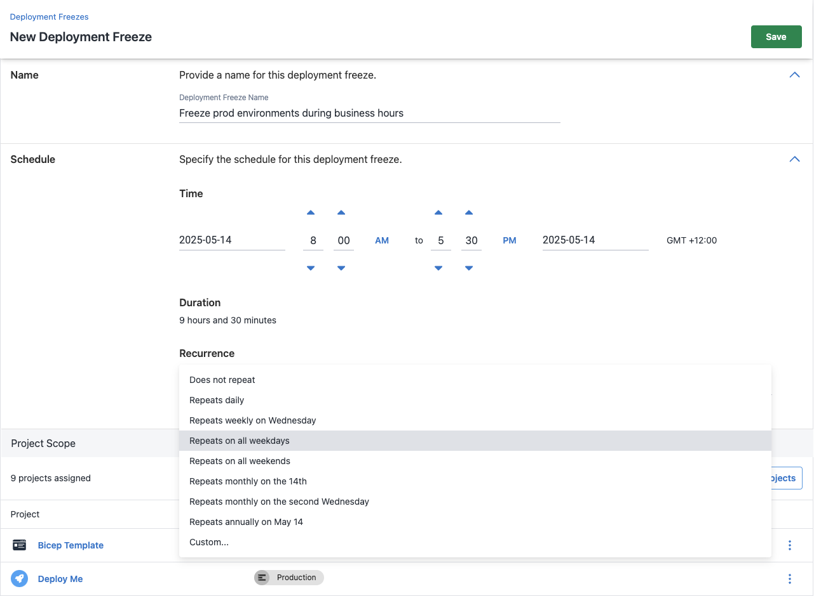
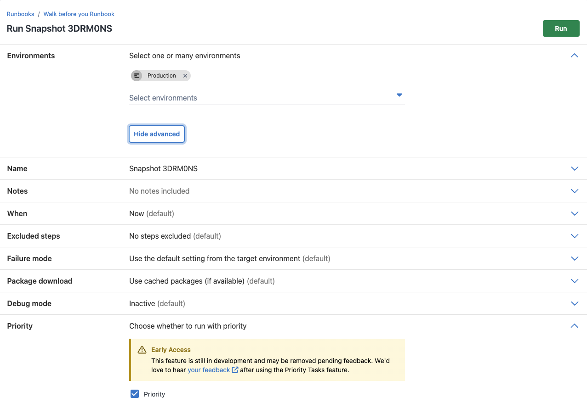
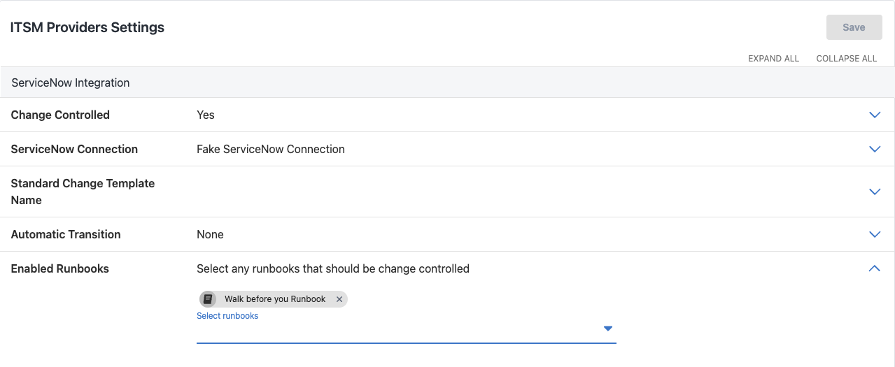

This quarter, we challenged ourselves to make small but impactful changes to our enterprise offering. In Octopus Server 2025.2, we added:

- Global deployment freezes 
- Priority deployments 
- ITSM for runbooks 

We also added new capabilities to the Deployment Freeze and Priority Deployments features.

In this post, I take you through the changes to our Enterprise tier.

### Deployment freezes

From Octopus Server 2025.2, all enterprise customers have access to both global freezes and our new project-level freezes. 

Project freezes provide an entry level to deployment freezes with lower permission requirements. They empower your teams to create their own freezes for projects without needing administrator permissions. [Read more about project freezes](https://octopus.com/docs/deployments/deployment-freezes/project-deployment-freezes).

Recent enhancements to our Deployment Freeze feature include:

- Recurring deployment freezes—providing the ability to create maintenance windows.
- Freeze by tenant—for more granular freezes.

### Priority deployments

Our Priority Deployments feature provides 2 ways to automate deployment priority:

1. Prioritize the deployment when creating a new deployment.
2. Prioritize an environment in a lifecycle phase. This prioritizes all deployments to the environments in the lifecycle.

In 2025.2, we expanded priority deployments to Runbooks. This makes it easier to proactively manage your task queue. Inidividual runbooks will inherit the lifecycle priority, or you can prioritize individuals runs on an adhoc basis.

### ITSM for runbooks

You can now create ITSM change requests from your runbooks. This is particularly useful if you use runbooks to provision infrastructure and need to attach change requests to progress through the relevant approvals. You can choose which runbooks you'd like to be change-controlled in your ITSM settings.

## What's next?

We also have more exciting changes coming soon to our Enterprise tier.

#### Standardized, reusable, and flexible deployment processes with Process Templates

Process Templates will soon be available as an early access preview (EAP) for enterprise customers. This gives teams reusable blocks of steps to use as blueprints to reduce process duplication and standardize best practices across pipelines. 

Platform Teams can update and roll out changes to these templates from a new area in Octopus, the Platform Hub, making them easier to maintain in the long term. Some steps will also be flexible, so teams have the freedom to diverge without sacrificing quality or compliance.     

This is the first feature from our Blueprints and Guardrails set of capabilities, letting you automate compliance and standardize best practices across your organization's deployment processes. Keep an eye on [our roadmap](https://roadmap.octopus.com/tabs/2-planned) for what else the team has planned, including:

- Deployment Policies
- Project Templates

#### Interested in upgrading to the Enterprise tier?

Please contact our helpful [Sales team](sales@octopus.com).

Happy deployments!