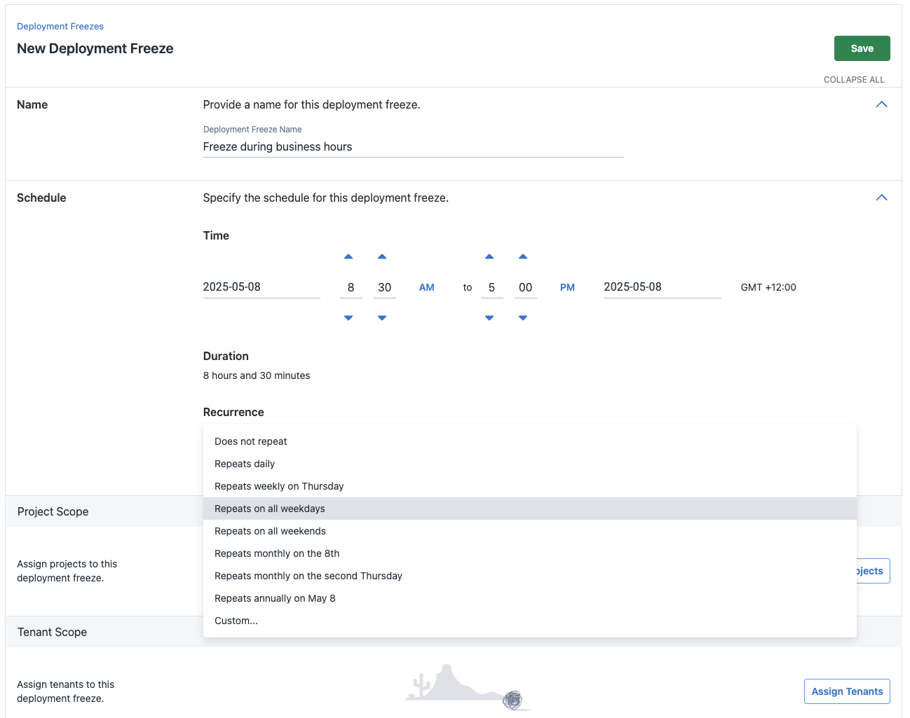
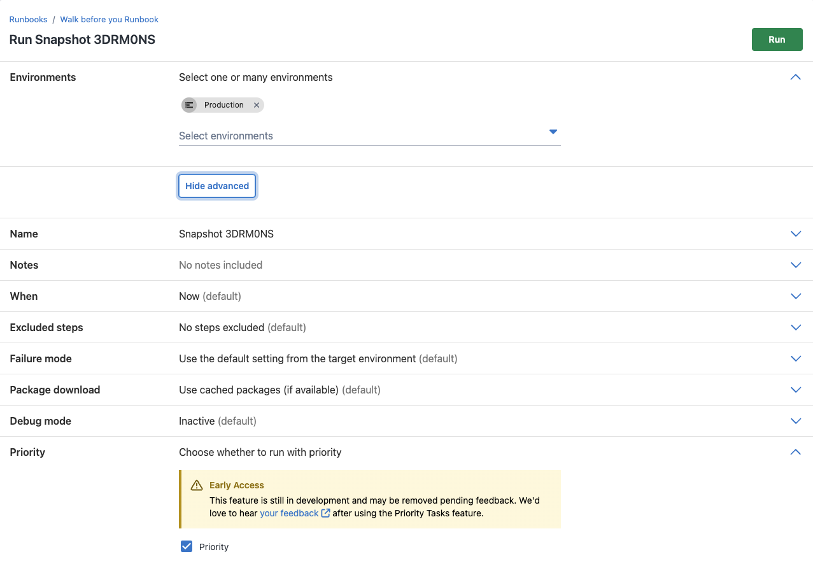
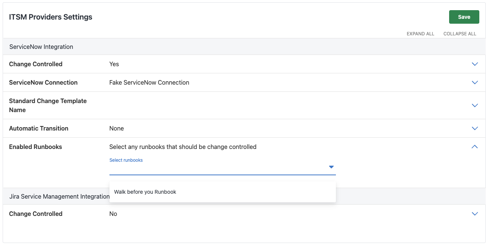

## Additions and improvements to our enterprise tier offering

This quarter we challenged ourselves to make small but impactful changes to our enterprise offering.  In 2025.2 we have added;
- Global Deployment Freezes 
- Priority Deployments 
- ITSM for Runbooks 

We have also added new capabilities to both Deployment Freezes and Priority Deployments as explored below.

### Deployment Freezes
From 2025.2 all enterprise customers will have access to both Global Freezes and our new Project Level Freezes. Project Freezes provide an entry level to Deployment Freezes with lower permission requirements, empowering your teams to create their own freezes for projects without needing administrator permissions. Read more about Project Freezes [here](https://octopus.com/docs/deployments/deployment-freezes/project-deployment-freezes).

Recent enhancements to our Deployment Freeze feature are;
- Recurring Deployment Freezes providing the ability to create maintenance windows
- Freeze by Tenant for more granular freezes

### Priority Deployments
Our priority deployments feature provides two ways to automate deployment priority:

1. Prioritize the deployment when creating a new deployment
2. Prioritize an environment in a lifecycle phase. This prioritizes all deployments to that environment(s) in the lifecycle.

In 2025.2 we have expanded priority deployments to Runbooks, improving the ability the proactively manage your task queue. Inidividual Runbooks will inherit the lifecycle priority or individuals runs can be prioritised on an adhoc basis.

### ITSM for Runbooks
ITSM change requests can now be created from your Runbooks. This functionality will be particularly useful for customers who use Runbooks to provision infrastructure and need change requests attached to these to progress through the relevant approvals. Choose which Runbooks you would like to be change controlled within your ITSM settings.

### What's next for Enterprise?
#### Standardized, reusable, and flexible deployment processes with Process Templates
Process Templates will soon be available for Early Access Preview for Enterprise customers. This gives teams reusable blocks of steps to use as blueprints to reduce process duplication and standardize best practices across pipelines. Platform Teams can update and roll out changes to these templates from a new area within Octopus, the Platform Hub, making them easier to maintain in the long term. Some steps can also be flexible, so teams have the freedom to diverge without sacrificing quality or compliance.     

This is the first feature from our Blueprints and Guardrails set of capabilities, allowing you to automate compliance and standardize best practices across your organization's deployment processes. Keep an eye on our roadmap for what else the team has planned, including:
- Deployment Policies
- Project Templates

#### Interested in upgrading to the Enterprise tier?
Please contact sales@octopus.com.

\
Happy deployments!
