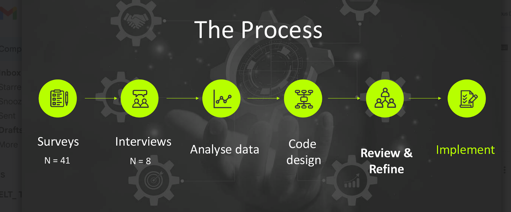

Octopus has changed a lot in the past few years. We’ve grown to over 300 people, now spread across 17 countries and time zones. A year ago, we joined forces with Codefresh, and we’re still finding our rhythm as we bring together different ways of working, cultures, and perspectives.

Our managers reflect this diversity—different backgrounds, different strengths, and different approaches. And while that makes us stronger, it also makes leadership more complex. We’re moving fast, navigating change daily, and building the plane as we fly it.

In the midst of this momentum, we realized something important: to stay grounded in who we are and focused on where we’re headed, we needed a shared foundation. A way to align on what great leadership looks like *here*, *now*, at Octopus.

Enter: the Leadership CODE.

Octopus was founded with a philosophy of creating a working environment where employees can [do the best work of their lives](https://octopus.com/company/careers), and our leaders are key in maintaining and strengthening this culture in the face of our growth and development. As time went by, we understood we were missing a framework to help them do that, so we put our heads together to come up with our new Leadership CODE. The process of its creation was much more meaningful than I had expected, so we're excited to share its story with you.

## The Leadership CODE concept

There are countless leadership behaviors and skills out there, and just like with values, none are inherently wrong. But part of leading well is knowing how to focus. As we grow and evolve as a company, we recognize the need to align on the *core* leadership principles that matter most right now, at this particular stage in our journey.

That’s what inspired the Leadership CODE. Our idea was to create a simple, concrete, and actionable guide to help leaders at Octopus balance delivering on ambitious goals while staying deeply committed to their people and to our values.

The CODE isn’t meant to capture every great leadership trait—it’s a purposeful selection of the principles we believe leaders should **embrace and model today**, to help us scale thoughtfully, collaborate effectively, and stay true to what makes Octopus special.

In essence, the CODE serves as a shared leadership language. It helps us set clear expectations, strengthen consistency across teams, and support each other as we tackle tough challenges. It’s also a way to reflect our values in how we lead every day—intentionally, and together.

## How we built it

Creating the Leadership CODE was as meaningful as the outcome itself. We started by gathering insights from across the organization—through surveys and interviews with all managers and senior leaders—to uncover what makes leadership successful at Octopus. Leading themes we found were humility, trust, and clear communication, alongside the need to foster contagious energy and leadership by example.

After we analyzed the data, we focused on  defining principles that could act as a shared leadership vocabulary  to promote the themes we discovered. These practices focused on effective communication,  aligning on priorities, and modeling the behaviors we want to see across the organization. This shared language, our CODE, is the basis for building trust, breaking down silos, and enabling collaboration.

## The CODE

Our CODE relies on 5 guiding principles:

- Be humble and stay curious
- Level up the team
- Communicate directly, and with anyone
- Aim for the greater good
- Make it happen

Each principle is more than just a statement—it’s a call to action. When we set out to define these, we didn’t just want to say *what good leadership looks like*. We also felt it was equally important to clarify *what it doesn’t look like*.

This was intentional. In fast-moving environments like ours, ambiguity can lead to misalignment. So we wanted to provide more clarity, not in the form of rigid rules, but as **guidance leaders can interpret thoughtfully for themselves**. These are starting points, not the full story. We trust our leaders to bring their own judgment and experience to the table.

### Be humble and stay curious

Leadership means staying open—open to learning, to being wrong, and to hearing perspectives different from your own. It’s about listening thoughtfully, admitting when you don’t have all the answers, and being willing to adapt.

What it means:

- You actively listen and ask thoughtful questions.
- You admit when you don’t know something and seek help.
- You embrace change and adapt as you learn.

What it doesn’t mean:

- Getting stuck in endless exploration without making progress.
- Using curiosity as a shield to avoid decisions.
- Blindly accepting others’ ideas without critical thinking.

### Level up the team

At Octopus, great leaders grow great people. It’s about empowering others, building their confidence, and setting them up to thrive. You lead by example, support experimentation, and share in the team’s success.

What it means:

- You care about your team’s growth—both personally and professionally.
- You walk the talk by modeling the standards you expect from others.
- You trust your team to own their work and support them in their endeavors.

What it doesn’t mean:

- Micromanaging or stepping in unnecessarily.
- Abandoning your team under the guise of trust.
- Needing to have all the answers yourself.

### Communicate directly, and with anyone

We believe communication is a leadership superpower. It’s not just about speaking clearly—it’s about creating space for honest dialogue, listening with intent, and maintaining transparency at every level.

What it means:

- You speak and listen openly, clearly, and respectfully.
- You ask for and give honest feedback on a regular basis.
- You’re transparent about challenges and work collaboratively to address them.

What it doesn’t mean:

- Being harsh or blunt under the guise of honesty.
- Using feedback to criticize instead of constructively build.
- Tuning out opinions you disagree with.

### Aim for the greater good

Leadership isn’t about ego—it’s about making an impact that benefits everyone. We lead in service of our team, our customers, and our overall mission. Great leaders look beyond personal accolades and focus on the bigger picture.

What it means:

- You prioritize the collective success of the team and company over personal recognition.
- You collaborate effectively toward shared goals.
- You act with unwavering integrity at all times.

What it doesn’t mean:

- Burning yourself out for the team.
- Ignoring the value of personal wins.
- Dismissing the importance of small progress—it all counts.

### Make it happen

Leaders at Octopus drive real impact. We don’t just talk about ideas—we turn plans into action. Our approach is about taking ownership, making decisive choices, and moving with purpose to deliver results.

What it means:

- You own your outcomes and see your initiatives through to completion.
- You make smart, timely decisions that align with our company goals.
- You bring enthusiasm and focus to tackle challenges head-on.

What it doesn’t mean:

- Rushing into decisions without a clear plan.
- Taking on too much and risking burnout.
- Engaging in busy work that lacks tangible impact.

## What’s next?

Creating the CODE was only the beginning. We now have a lot of work to embed these principles into daily leadership practices. This includes:

- Mentor and provide feedback to the company leaders on following the CODE.
- When assessing potential new leaders, understand if they can embrace the CODE and embody its principles.
- Challenging ourselves as leaders by regularly reflecting on our actions and identifying ways to better support our people and the company.
- Fostering a culture of accountability, where feedback is a two-way conversation and leaders at all levels strive to improve continuously.

By making the CODE central to how we hire, develop, and assess leaders, we aim to build a leadership culture that supports our people and drives Octopus toward its long-term goals.

## Reflections 

This journey reinforced my belief that leadership is  a collaborative effort. By defining and sharing our expectations, we set our leaders up for success and create a culture where everyone can thrive.

Whether you’re a leader yourself or aspire to become one, my advice is simple: take the time to define what leadership means to you personally. It’s one of the most impactful ways to ensure alignment, growth, and success.

If you’re curious to learn more about Octopus and how we’re building our future, stay tuned for more stories from our People team.

Happy deployments!
