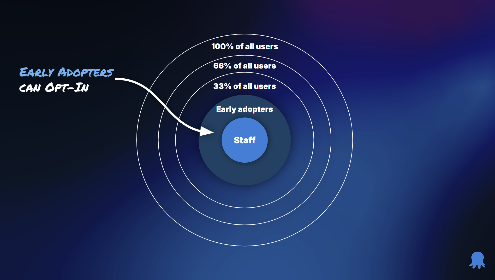
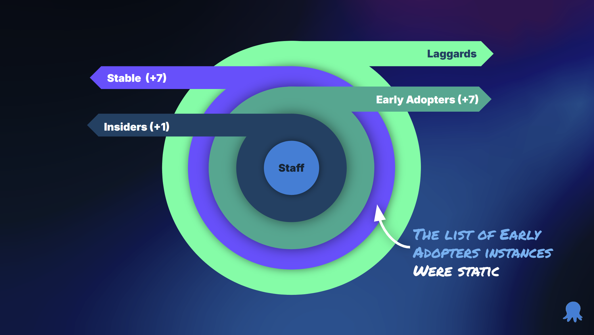
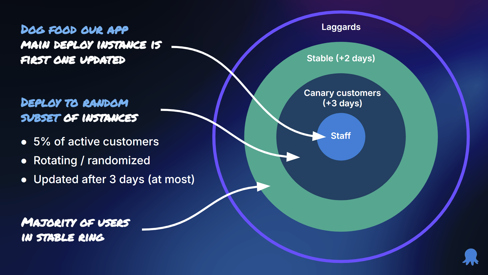

Everyone building deployment pipelines sees two revolutions.

- The initial automation, implementing a modern build server and a deployment tool like Octopus Deploy.  Doing that results in going from quarterly multi-hour deployments with frequent failures to 15 minute (or less) deployments every week with infrequent failures.
- Implementing [something] to go from weekly deployments to daily deployments.  The prevalent opinion is that [something] is implementing progressive delivery, canary deployments, blue/green deployments, or feature flags.

The problem to solve is **not** downtime.  That is not what continuous delivery is about.  [Continuous Delivery](https://continuousdelivery.com) focuses on getting changes of all types—including new features, configuration changes, bug fixes and experiments—into production, or into the hands of users, _safely and quickly_ in a _sustainable_ way.  

Applications that require daily deployments will generally have more than two developers working on them.  There are multiple streams of work in flight.  Continuously delivering to production requires a fundamental change in how you _create and release functionality_ to your users.  It requires TPF, [trunk based development](https://trunkbaseddevelopment.com/), [progressive delivery](https://octopus.com/blog/common-deployment-patterns-and-how-to-set-them-up-in-octopus), and [feature toggles](https://martinfowler.com/articles/feature-toggles.html). 

## Coordinating multiple streams of work

Ten years ago, I was an Octopus Deploy customer.  After implementing Octopus Deploy (and Redgate for DB changes), my application went from quarterly deployments taking two (or more) hours to taking 15 minutes and deploying every ten(ish) days.  Even better, deployment failures and emergency fixes went from a virtual guarantee to never happening.  Our deployments were consistent and reliable.  It was a considerable accomplishment involving many people.  

But, we hadn't improved on how we _create and release new functionality_ to our users.  We were still making feature changes like we did when we had monthly or quarterly releases.

- Over a half-dozen programming pairs all working in the same code base, each working on a new feature, fixing a bug, or improving performance.
- To "avoid stepping on each others toes," feature branches would live for multiple days or weeks.  
- The features were delivered in a nearly complete state. Because of long-lived feature branches, we'd frequently encounter merge hell.
- To avoid merging into main, we often demoed new functionality to our Business Owner from our local machines to see if we were on the right track.
- Because we didn't merge into main for weeks, we couldn't get direct feedback from users in early stages of building new features.
- Main wasn't always ready to deploy.  After merging a feature into the main, finding and fixing all the bugs might take another week or two.
- Often, one feature would create a conflict with another feature.  It could be a UX quirk with naming, or it could be on the backend.  We wouldn't know until both features were merged into main.  It might be a month or two until we knew there was a conflict.
- When a critical bug needed to be fixed, we'd implement a simplistic configuration to turn on the feature for dev and QA but off for staging and production.
- We'd "turn on" the feature during a production deployment, but it'd be on for everyone. Users could access the new feature while we were verifying, resulting in bug reports or panicked emails (often because a third-party system hadn't finished updating).
- Merge "freezes" preventing new features from being merged after deploying a new feature to allow a few days for hot fixes and performance improvements.

## The risk of adding new features and functionality

Building new features and functionality is risky.  Software development is a zero-sum game, a developer working on one feature cannot work on other features.  It requires an investment from the company in both time and resources.  Building the wrong feature is even worse, as the time and money could have been spent elsewhere.  In the [Phoenix Project](https://www.amazon.com/Phoenix-Project-DevOps-Helping-Business/dp/0988262592), one of the main characters Erik states "If you're lucky, ten percent will get the desired benefits. So the faster you can get those features to market and test them, the better off you'll be."

## Trunk based development

[Trunk based development](https://trunkbaseddevelopment.com/) promotes frequent check-ins to the main or default branch.  

> A source-control branching model, where developers collaborate on code in a single branch called "trunk", resist any pressure to create other long-lived development branches by employing documented techniques. 

The goals of trunk based development are:

- Avoiding merge hell: How many times have you worked on a long-lived feature branch, and merging to main took hours or days?
- Small batch sizes: Bigger batch sizes are much riskier to deploy than smaller ones.  A bigger batch size means more code has changed, meaning more can go wrong.
- Minimize [yak shaving](https://en.wiktionary.org/wiki/yak_shaving): Complex branching strategies, such as [GitFlow](https://www.atlassian.com/git/tutorials/comparing-workflows/gitflow-workflow) are complex.  That complexity results in a lot of yak shaving to handle merging between branches, releasing, and other ceremonies.  

My personal preference is trunk based development "at scale."  

Source: https://trunkbaseddevelopment.

Trunk based development at scale works nicely with [GitHub flow](https://docs.github.com/en/get-started/using-github/github-flow), where changes are made in short-lived branches and merged via pull requests.

It requires developers to adopt two key concepts.

1. Short-lived feature branches - no more than a couple of days.  Ideally, less than a day.
1. Incremental changes - no more delivering a feature as a "big bang."  

That does not mean merging unfinished code into main after a few hours or a couple of days. Many features can take weeks or months to finish. Developers and product managers are responsible for creating small units of work that incrementally add functionality (and tests) until the feature is "done."  Each incremental change can be deployed to production, including database changes.

Hide the feature behind a feature toggle until it is ready for users.  

This allows you to have multiple features "in flight" and merged into main.  Because developers are incrementally checking in code, they can find conflicts with other developer's work much sooner.  Changes are integrated much sooner, and tests can be created to verify sensible combinations of features.  

## Progressive delivery

Trunk based deployments encourage frequent production deployments. However, you cannot deploy to production daily if each deployment has downtime. Any downtime might breach SLAs, frustrate customers, or prevent employees from doing their work. In addition, automation isn't perfect; a deployment could still fail. Progressive delivery solves those problems.

Blue/Green, Canary, or "staging" strategies follows the same core principle.  Deploy a new version to a "staging" location in production.  Verify the new version while all the users remain on the old version.  Once verification is complete, route users to the new version.  The difference between canary, blue/green, and staging is the percentage of traffic routed.

Source: https://aws.amazon.com/blogs/containers/create-a-pipeline-with-canary-deployments-for-amazon-ecs-using-aws-app-mesh/

Deployments can fail for a number of reasons.
- A database migration fails.
- Infrastructure cannot be created or updated properly.
- The new application version cannot be deployed due to environmental problems.
- The new application version won't start after deployments.
- The new application version crashes minutes after the deployment.

The advantage of progressive delivery is that every user remains on the old version while those failures are happening. Users don't have to be routed to the new version as soon as verification is completed. For example, you might deploy at 2 pm and wait to route traffic at 9 pm when there are fewer users. 

[Many articles](https://codefresh.io/learn/software-deployment/understanding-progressive-delivery-concepts-and-best-practices/) on [progressive delivery](https://launchdarkly.com/blog/what-is-progressive-delivery-all-about/), use [feature flags](https://amplitude.com/explore/experiment/what-is-progressive-delivery).  Lorem ipsum (more to come).

## Feature Toggles

Many people believe feature toggles are a simple binary.  It's either on or off for everyone.  Turn it on in testing environments, but leave it off for production.  Feature toggles must follow the specification provided by [Openfeature](https://openfeature.dev).  Instead of an application-level binary, multiple user segments are created.  The feature toggle is then turned on for each segment.  

The segments can be whatever you want them to be:

- Staff or internal users
- Early adopters or beta users
- Timezone
- State or Province
- Country
- Specific entitlements

The advantages to this approach are numerous:

1. Internal or staff users can [dogfood](https://en.wikipedia.org/wiki/Eating_your_own_dog_food) new functionality in production before anyone else.
2. Provide early access to a subset of alpha users for early feedback.
3. Beta-test new functionality with a large group of users before it goes live for everyone.
4. Being able to pivot and change functionality based on user feedback.
5. Rolling back involves turning off a feature toggle, not redeploying a previous version.
6. Turning off the toggle is often low-risk, as it has already been off for weeks or months in production.

## Rollbacks become a thing of the past

The number one driver of rolling back is critical bugs in new functionality.  By adopting TPF, you are preventing that from happening by: 

- Incrementally adding functionality instead of merging everything as a "big bang."
- Providing the capability _from the start_ of the new feature to turn it off.
- Frequently deploying with that functionality turned off.

That is not to say every feature will be bug-free, far from it.  You'll always encounter unknown use cases, random configurations you weren't expecting that cause your feature to fail, or substandard performance.

The big difference is that with feature toggles, you can turn off that functionality for specific users. Before TPF, you'd roll back to a previous version and turn it off _for all users_. Imagine being able to say to a user, "We've identified the root cause. We'll push out a fix overnight. In the meantime, we've turned it off for you to prevent any issues."

The deployment pipeline should be treated like an assembly line.  Always moving forward.  Never backward.  

## TPF and Octopus Cloud

In the early days of Octopus Deploy, we implemented canary deployments using release rings.  

- We'd deploy to our staff instances and wait a day to see if anything blew up.
- After a day, we'd deploy to the Octopus Insiders and get their feedback.
- Assuming none of the Octopus Insiders found problems, we'd deploy to our early adopters after seven days.  
- We'd wait seven says, and if the early adopters didn't report anything, we'd deploy to the stable customers.
- Then we'd deploy to any laggards (very rarely did we have any).

We thought that canary deployments would be a panacea.  But in truth, it had many limitations.

1. No guarantee all code paths are executed by a subset of users.  Unless you are a FAANG-sized company, a subset of traffic is unlikely to execute every code path in a short period of time.  
2. Long deployment durations.  The natural reaction to the code path limitation is to extend the canary deployment duration to hours or even days.
3. Indiscriminate traffic routing.  Targeting a specific set of users via a load balancer is nearly impossible.  In the best case, you can use HTTP headers, but that is often too broad.
4. Disjointed user experience. When canary deployments take days or even weeks, and traffic routing is indiscriminate, you cannot rely on "sticky sessions" to keep a user on a particular version.
5. User expectations.  I have a laptop and an iPad.  When I go to a website, I expect the same experience when using my laptop or iPad (even when used within minutes of one another).

Even with a 15-day canary cycle, critical bugs still got to the stable ring on Octopus Cloud! The 15-day cycle was the best case, as we might find a show-stopping bug. At one point in 2022, customers in the stable ring didn't get updates for almost 50 days!

Our engineering leaders (managers and senior engineers), realized we needed to change.  We adopted TPF.

- Trunk based development with short lived branches, no more than a few days.
- Feature toggles, which could be turned on or off for a specific customer instance.
- Shorten release rings, and deploy to our main instance that deploys Octopus Deploy (we use Octopus Deploy to deploy Octopus Deploy).

There have been numerous benefits to this approach.

- We have four concurrent early access programs for features on our [roadmap](https://roadmap.octopus.com/tabs/2-planned).  Each program has a different list of customers.
- We can incrementally add new functionality to features and gather feedback. For example, I have early access to process templates, and every other day, I see the feature taking shape. This gives us the opportunity to get feedback from our customers (not just from me) and adjust before releasing it to everyone.
- We can eat our own dog food and find the rough spots.  For example, internally we were using the updated Octopus Deploy UI released last year for months.  
- Rolling out new functionality is an update to a feature toggle.  Even better, if a customer reports an issue, we can turn it off to unblock them.  Meanwhile, everyone else can use the new functionality.  

## Conclusion

TPF, trunk based development, progressive delivery, and feature toggles are a tripod.  All three are needed to achieve true Continuous Delivery; getting changes of all types—including new features, configuration changes, bug fixes and experiments—into production, or into the hands of users, _safely and quickly_ in a _sustainable_ way.  Without trunk-based development, you cannot iteratively make changes to a feature to gather feedback faster.  Without progressive delivery, you increase the risk of a deployment failure or prolonged downtime.  And without feature toggles, you cannot get feedback for the feature from a subset of users, or if something wrong happens, unable to turn off the new feature.

We have seen two revolutionary jumps happen with our customers.  The first one is from two-hour deployments to 15-minute deployments.  The second one is from 15-minute deployments to zero downtime.  The first revolution is accomplished by implementing Octopus Deploy, having a single deployment process for all environments, automating the deployment for all components, and leveraging runbooks for day 0 and day 2 operations.  The second revolution is accomplished by implementing TPF.  In 2025, expect more functionality in Octopus Deploy to support this.  [Feature Toggles](https://roadmap.octopus.com/c/121-feature-toggles) and [Ephemeral Environments](https://roadmap.octopus.com/c/31-ephemeral-environments) are actively being worked on.  With easier [modeling of canary and blue/green deployments](https://roadmap.octopus.com/c/145-easy-blue-green-and-canary-modeling) is being shaped.

Until next time, Happy Deployments!
