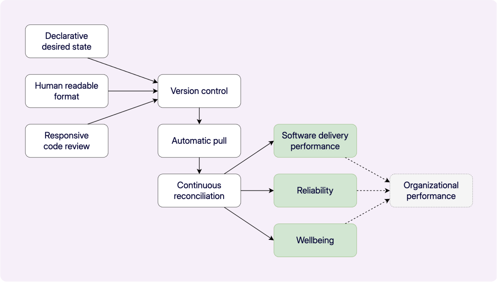

We're thrilled to announce the release of the [State of GitOps report](https://octopus.com/publications/state-of-gitops-report). This report is the first to explore how practitioners apply GitOps concepts in the real world. Based on data from 660 survey responses and interviews with a panel of experts and practitioners, our goal was to understand what "good" GitOps looks like, explore different adoption styles, and analyze whether GitOps delivers the expected benefits.

Combining version control, developer practices, and an automated reconciliation loop, GitOps can deliver a secure and auditable way to drive system state with human-readable files. While teams with well-established GitOps practices are seeing a return on their investment, those who haven't achieved a sufficient depth and breadth of adoption are struggling to beat the j-curve to get the benefits. This is where the State of GitOps report can help.

## Four key findings

Our research explored various aspects of GitOps adoption and its impact, and we've uncovered 4 key findings:

1. **Better software delivery:** High-performing GitOps teams demonstrated higher software delivery performance, as measured by the DORA 4 key metrics (change failure rate, time to recover, deployment frequency, and lead time for changes).  
2. **Increased reliability:** These high-performing teams also reported the best reliability records, based on user satisfaction, meeting uptime targets, and avoiding slowdowns and outages.  
3. **Security and compliance:** We found a clear link between GitOps maturity (how many practices teams adopt) and achieving security and compliance benefits.  
4. **Adoption is increasing:** Most organizations (93%) plan to continue or increase their GitOps adoption, indicating strong confidence in the approach.

The report delves into the nuances of adoption, distinguishing between 'breadth' (the extent across production systems) and 'depth' (how many practices are implemented and how well).

We found that GitOps is most often used for application or service deployments (79%), application configurations (73%), and infrastructure (57%). We also challenge the idea that GitOps is *only* for Kubernetes, with 26% of organizations applying it to other technology stacks.

## The GitOps model

A significant part of the report introduces the GitOps Model, outlining the 6 practices we found necessary for successful adoption and positive outcomes:

1. Declarative desired state  
2. Human readable format  
3. Responsive code review  
4. Version control  
5. Automatic pull  
6. Continuous reconciliation

We developed a GitOps score based on how closely organizations align with these practices and found organizations with higher scores are most likely to obtain the benefits of GitOps. This means teams with higher scores were significantly more likely to report: 

- Increased security
- Prevention of configuration drift
- Improved auditability
- Easier compliance
- Reduced elevated access 

The ability to recreate applications from version control is also strongly linked to higher scores.

## GitOps practices and DevOps outcomes

Beyond specific GitOps benefits, the report also examines the relationship between GitOps and broader DevOps outcomes, like software delivery performance, reliability, and even wellbeing. Higher GitOps scores correlate positively with these outcomes.

It's essential to be aware of the potential "j-curve" effect when adopting new practices like GitOps. You might see an initial dip in performance as you introduce new skills and practices, but sticking with it leads to significant long-term gains. The 6 GitOps practices are mutually supportive; leaving one out can create gaps in the effectiveness of others.

Of course, adopting GitOps isn't without its challenges. The report identifies potential "trip hazards", like the risk of accidental resource deletion, leaking secrets in version control, overloading version control systems, and gaps in deployment processes or access controls. Understanding these pitfalls and adopting protective measures, like dry-runs, approval workflows, secret management tools, and robust access control, is crucial.

The State of GitOps Report is a comprehensive baseline for where GitOps stands today. It offers valuable insights into the practices that drive success and helps you understand how to improve your own outcomes.

We encourage you to [dive into the full report](https://octopus.com/publications/state-of-gitops-report) to explore the findings, understand the GitOps model, and identify areas for continuous improvement on your GitOps journey.

Happy deployments!