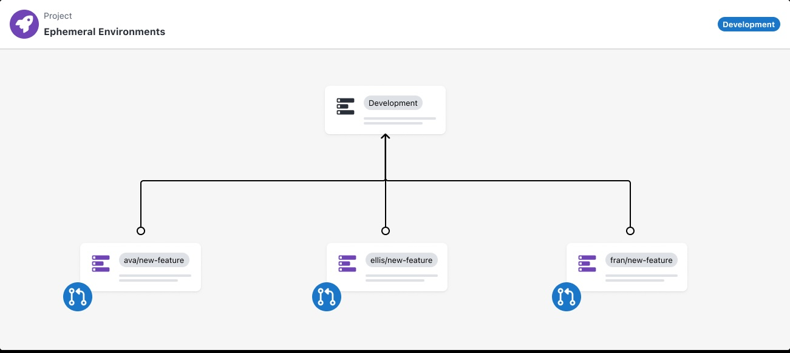

# Ephemeral Environments are coming: Help us shape it.

In the fast-paced world of software development, few phrases provoke as much frustration as “It works on my machine.” It’s the ultimate debugging roadblock: your code works flawlessly in your local environment, but everything breaks when it merges. But what if there was a way to ensure your code wasn’t just “working on your machine” but on an environment that mirrors your production environment before you merge?

## What’s been Happening?
What Are Ephemeral Environments? At Octopus, we’ve been hard at work developing Ephemeral Environments tailored for modern development workflows. These environments are automatically generated and linked to feature branches created through pull requests (PRs). They offer a temporary space for testing code changes without affecting the main lifecycle environments. 
The primary goal is to **shift left** in the development process: identifying issues earlier when they are easier and less costly to address, thus minimizing surprises later in the workflow. 
### Here’s how it will work:
- **Feature Branch-Based:** When you create a pull request (PR) from your feature branch, the ephemeral environment will automatically spin up.
- **Temporary by Design:** Once the PR is closed or merged, the environment will be spun down in a hassle-free manner.
- **Designed for Early Feedback:** The feature will provide developers and collaborators with early integration testing, UI validation, and fast feedback loops.

## Why Should You Get Excited?
Catching issues earlier in the development lifecycle leads to better software, faster delivery, and happier teams. Here’s why we’re excited about ephemeral environments—and why you should be, too:
- **Fewer Environment Bottlenecks:** Don’t waste time waiting for staging slots or shared resources. Every feature branch gets its own environment.
- **Increased Confidence in Merges:** Know your code works before merging into the main branch, so there are fewer surprises and regressions.
- **Seamless Feedback Loops:** Ephemeral Environments are dynamic and easy to share, increasing collaboration across teams and stakeholders.

## The Future Is Ephemeral Environments - Be Part of It
We’re building this feature to make pull request workflows smarter, faster, and more reliable— *but we can’t get there without your input.*
We want your feedback. Whether you want to sign up for a product demo, participate in our alpha testing, or simply be notified when early access is available, we want to hear from you.
### What’s in it for you?
- **Get Early Access:** Get access to ephemeral environment feature before it’s widely available.
- **Influence Design:** Your feedback will directly shape how we refine the feature, ensuring it meets real-world workflows.
Let’s make “It works on my machine” a thing of the past—together.

## How to Sign Up
Register your interest [here](https://admin.typeform.com/form/ZOia9Aje/create?block=9ded49c0-1887-400a-a9ba-5e2ae8aab68d)

*Ephemeral Environments is targetted to be available in all instances in the 2025.3 release* 
