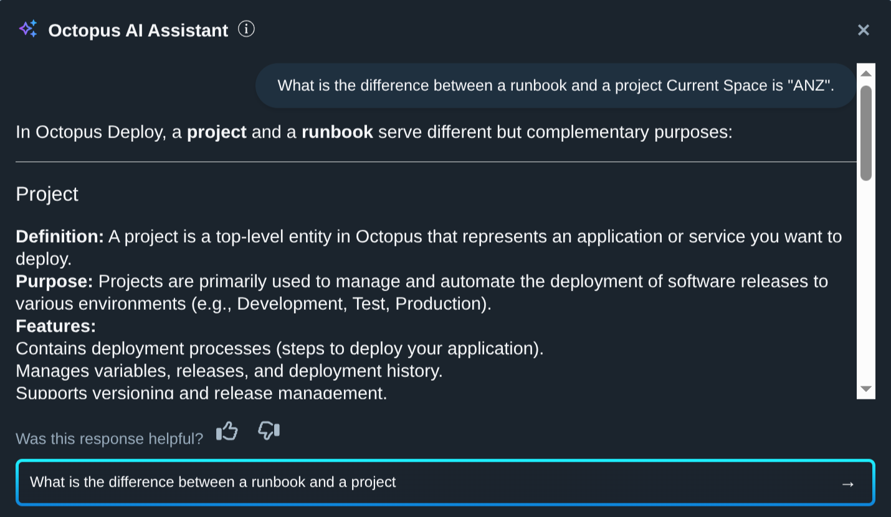
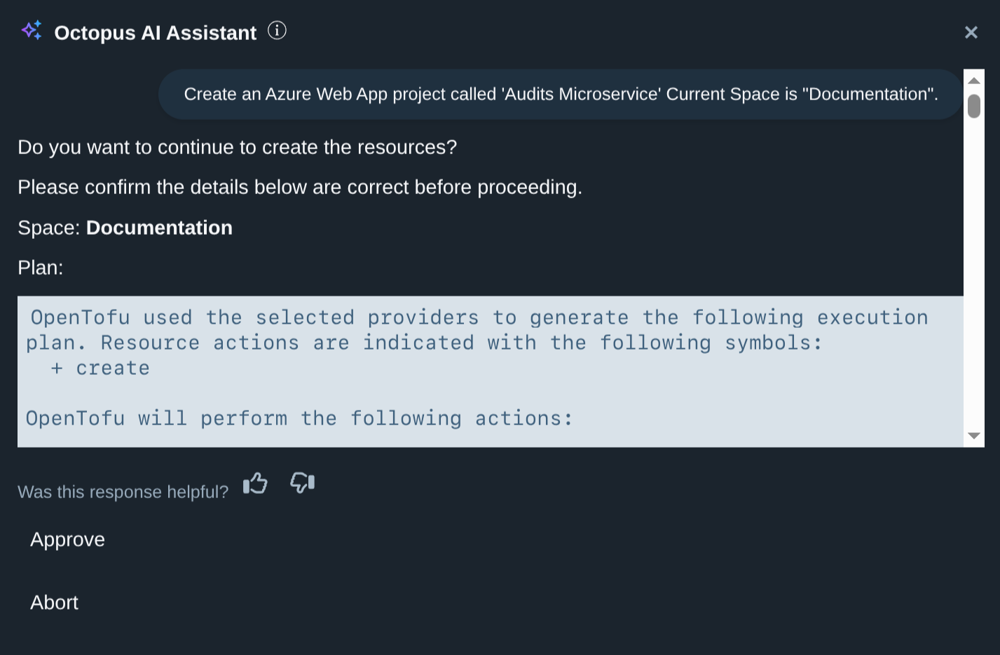
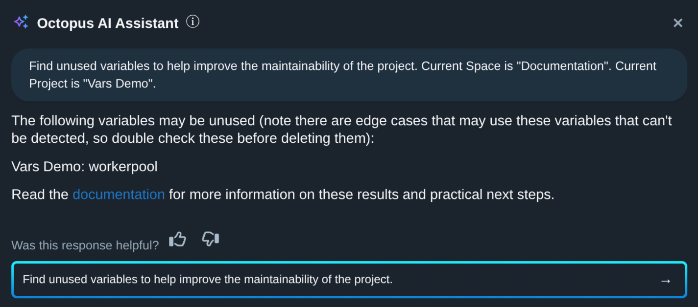
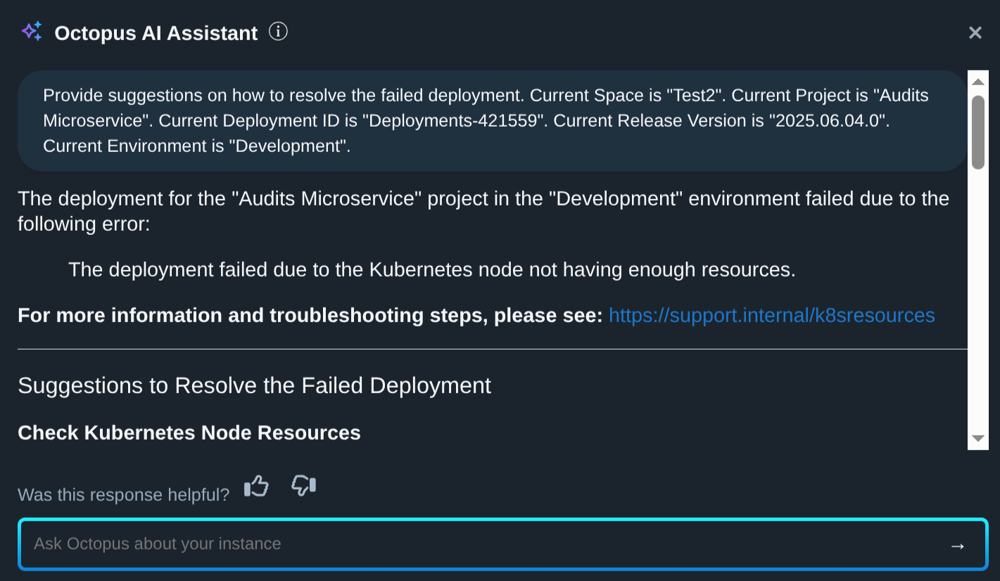

"Create an Azure Web App project called 'Audits Microservice'."

"Provide suggestions to resolve the failed deployment."

"Find unused variables in my project."

These are just a sample of the tasks, insights, and advice you can expect from the new Octopus AI Assistant. Teams can now create projects, with all supporting resources, and based on best practices, in minutes instead of hours. Level 0 support, customized with local business knowledge, is available to every Octopus user without submitting a ticket. And Octopus administrators get actionable suggestions to improve their Octopus instance.

In this post, I'll explain how the Octopus AI Assistant, powered by GenAI, can help DevOps teams deliver software faster and more reliably.

## What is the problem we are trying to solve?

Are you part of a software company? It seems like an obvious question, and one that is straightforward to answer if your company sells software or technical services. But what about a bank, insurance provider, hospital, airline, school, supermarket, or government agency? Many of these organizations don't think of themselves as software companies.

The way to determine if you are a software company is to ask yourself: "What would happen if all the computers were turned off?"

If the answer is that your business would grind to a halt, then you are a software company. If you are a software company, then you must deliver software to your employees and users.

DevOps teams are responsible for keeping software companies running. It is a complex job, and it will only ever get more complex. And the reality is this complexity is always going to be met with the demand to do more with less.

When you look at the metrics used to measure DevOps performance, such as DORA metrics, you will see that every one of them measures some aspect of a production deployment:

* Deployment Frequency is a direct measurement of production deployment frequency
* Mean Lead Time for Changes measures the time it takes to get changes into production
* Mean Time to Restore measures how quickly a change can be made in production to restore service
* Change Failure Rate measures how many production deployments introduce failures

Anything that prevents a DevOps team from delivering software to production reduces their performance. There is simply no way to be a high-performing DevOps team without delivering software to production.

This is the problem we are trying to solve: how do we remove the barriers to delivering software to production? Because this is the foundation of high-performing DevOps teams, and every software company demands their DevOps team be high-performing.

## How do we think about the DevOps journey?

There are two stages in the DevOps adoption process that we want to focus on:

* How do we help new teams get up and running quickly, creating a solid foundation based on best practices?
* How do we reduce the friction for existing teams as they deliver software to production?

Thinking about the DevOps journey from these two perspectives helps us to identify the areas where GenAI can provide the most value. We thought about what a DevOps engineer would ask a knowledgeable colleague during these stages and how GenAI could provide an answer.

## How does GenAI get teams up and running quickly?

The Octopus AI Assistant provides a number of features to help new teams get up and running quickly.

### Using GenAI to answer questions

The first, and perhaps most obvious, way GenAI can help is by providing the ability to ask conceptual questions about Octopus, for example:

* What is a project?
* How is a project different from a runbook?
* How is an environment related to a lifecycle?

The documentation may answer some of these questions directly, but GenAI excels at providing direct answers to these kinds of questions. This GenAI functionality is table stakes these days, but still incredibly useful for new users.

### Using GenAI to bootstrap new projects

The next way we will help teams get up and running is by providing the ability to build new projects, along with all the supporting resources, from prompts like:

* Create an Azure Web App project called "My Web App"
* Create an Azure functions project called "My Function App"
* Create an AWS Lambda project called "My Lambda App"
* Create a Kubernetes project called "My K8s App"

These prompts hide a lot of complexity. To build a project with nothing more than the instruction that it deploys to Azure means making decisions about:

* Environments and lifecycle progression
* Feeds to consume application packages from
* Accounts to authenticate with Azure
* Steps to deploy the application
* Variables to configure the application
* Targets to represent the Azure Web App
* Supporting runbooks to manage the application

It is asking a lot of new users to understand all of these concepts and how they relate to each other to get even a simple project up and running.

With GenAI, we can train an LLM on hand-crafted template projects that bake in best practices and recreate those projects from a simple prompt. This removes the dread of the blank page and allows teams to see what a year-5 deployment project looks like and then customize it to suit their needs.

The real power of GenAI comes from its ability to model the relationships between plain text descriptions of features and how they are implemented in Octopus. This means projects created via GenAI can be customized by adding new instructions to the prompt, such as:

* Create an Azure Web App project called "My Web App". Enable variable debugging. Enable guided failure mode. Place the project in the "Web Apps" project group. Add tenant tags based on geographic regions. Add 5 tenants named after major capital cities in Europe, the US, and Asia. Apply the tenant tags to the tenants. Link the tenants to the project.

The result of this prompt is a project based on a hand-crafted example of best practices with additional tenants and custom settings. It would take even an experienced user hours to create a project like this, but GenAI can do it in minutes, which sets new teams up with a solid foundation for success.

This is the power of GenAI: it puts a DevOps expert in the seat next to you.

## How does GenAI reduce friction for existing teams?

Teams that have been using Octopus for a while will have built up a collection of projects, runbooks, and other resources. Keeping these resources running smoothly requires constant discipline.

### Maintaining Octopus with GenAI

One of the challenges with maintaining a complex platform is knowing what practical next steps to take to improve performance, clean up unused resources, combine duplicated values, and so on.

With GenAI, we provide the ability to ask questions like:

* What are the unused projects in my Octopus instance?
* List the unused variables in my project
* List projects variables that look like plaintext passwords
* Suggest tenant tags to make tenants more manageable

By distributing strong opinions about the best practices through the AI integration, we aim to help teams make those small improvements that allow them to deliver software faster and more reliably.

### Providing Level 0 support with GenAI

The final major feature is the ability to provide suggestions to resolve failed deployments with a prompt like:

* Help me understand why the deployment failed. Provide suggestions for resolving the issue.

To answer this question, we collect all the available information about the deployment, including:

* The deployment logs
* The steps that make up the deployment
* Any custom scripts defined in script steps
* Release notes

These details are passed to the LLM, and it provides suggestions much like the AI tooling found in IDEs today.

The aim is to help DevOps teams resolve issues faster without having to wait for a support team to respond to a ticket. Given how disruptive a failed deployment can be, saving even just a few hours for each team member over the course of a year can add up to significant time savings.

More importantly, teams can share their own prompts that embed custom business knowledge, for example:

* Why did the deployment fail? If the logs indicate that the smoke test failed, provide instructions to visit https://softwarecompany.support.internal/smoketest for more information.

You can measure the tenure of a DevOps engineer by whether they have tried to build a general purpose error handling tool. I've attempted to build more than one during my career, and they have always failed. This is because such a general-purpose solution necessarily attempts to provide reliable outputs from unpredictable inputs. No matter how clever I was with regexes and parsing, I could never cover all the edge cases.

LLMs, on the other hand, are excellent at extracting meaningful information from unpredictable inputs. You can provide a high-level description of a problem, such as failing a smoke test. The LLM can match that description to a blob of unstructured text like deployment logs and deployment step configuration to determine if a smoke test failed and print the associated support URL.

These custom prompts can embed a wealth of business knowledge and are easily distributed amongst DevOps teams. A well-crafted prompt could easily remove the tedious back-and-forth that first level support teams often engage in, allowing DevOps teams to resolve issues faster.

## Conclusion

Software companies demand high-performing DevOps teams, and high-performing DevOps teams must deliver software to production.

We're supporting DevOps teams with GenAI to:

* Answer common questions about Octopus and DevOps concepts
* Bootstrap new projects with best practices baked in
* Provide strong opinions about how to improve existing Octopus spaces
* Quickly resolve failed deployments with suggestions based on the deployment logs and other context

By putting a DevOps expert in the seat next to you, we aim to help teams deliver software faster and more reliably.