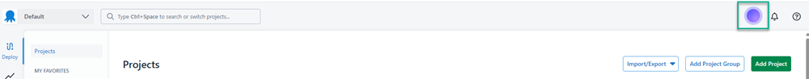
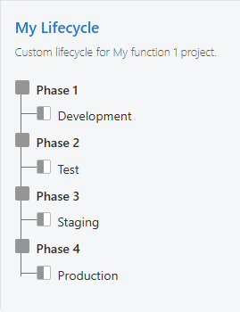
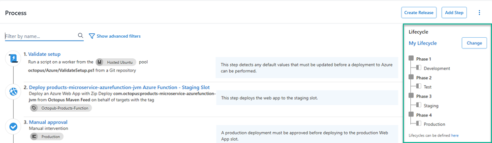

Onboarding a new, complex tool can be a daunting task.  Watching tutorials, documentation, and quick start guides help, but don't take away from the sometimes dozens of tasks required to even get started.  Octopus Deploy has created an Artificial Intelligence (AI) Chrome Extension called Octopus Intelligence. Octopus Intelligence can be used to set up and configure all the necessary components required to deploy a project using simple prompts and Artificial Intelligence (AI).  This means that you can spin up a completely new Octopus instance, type in a prompt, and having a working example within minutes!  This post will walk you through creating a project that deploys an Azure Function.

## Octopus Intelligence Chrome Extension
Octopus Intelligence is an Extension created for the Chrome browser.  Installation is quite easy:
- Go here to find it (fill this in)
- Do this to install it (fill this in)

Once you have the Octopus Intelligence extension installed, it will present itself whenever you're logged into an Octopus Deploy instance.



Clicking on the Octopus Intelligence circle will bring up the AI prompt dialogue.


### Requirements to use Octopus Intelligence to create projects

Octopus Intelligence has a couple of requirements for use:
- Google Chrome browser:  Octopus Intelligence is currently only offered as a Google Chrome extension and not available for other browsers
- Permission to create objects in your Octopus instance:  Octopus Intellignece uses the currently logged in context to perform Terraform operations against your instance.  The logged in user will need permissions to:
  - Create Projects
  - Create Environments
  - Create External Feeds
  - Create Accounts
  - Create Targets
- Octopus instance is Internet accessible:  In order to perform the Terraform operations, the extension needs to be able to contact your Octopus instance.  Octopus Cloud customers have this already, self-hosted customers will need to allow (x) for communication to work correctly.

## Using Octopus Intelligence to create an Azure Function project

Octopus Deploy has already done the heavy lifting to train the Large Language Model (LLM) to create functional examples to easily get started.  To create a project that deploys an Azure Function, simply type the following into the prompt

```
Create an Azure Function project called "My function 1".
```

This simple prompt will create the following:
- Environments
  - Development
  - Test
  - Production
  - Security
- Accounts
  - An Azure Service Principal Account (within Octopus)
- External Feeds
  - An anonymously accessible Maven feed
  - An anonymously accessible GitHub Container Registry feed
- Project
  - Deployment process
  - Variables
  - Runbooks
    - Create Infrastructure
    - Destroy Infrastructure

Octopus has provided the LLM with examples of what is necessary to create an Azure Function project and will include everything for you.  You'll note that the prompt didn't tell the LLM to create environments, but we know that you cannot do anything without them so they're automatically included.  It is possible to be more specific with the prompt and it will act accordingly when instructed to do so.

### Environments
Environments are a core component of the Octopus Deploy product and a requirement for any deployment or runbook operations.  By default, the LLM will create the environment list from above.  It is possible to override this by using a more complex prompt such as:

```
Create an Azure Function project called "My function 1".  Create a Lifecycle called "My Lifecycle".  The Lifecycle will have a Phase called "Phase 1" with an Environment called "Development", a Phase called "Phase 2" with an Environment called "Test", a Phase called "Phase 3" with an Environment called "Staging", and a Phase called "Phase 4" with an Environment called "Production".  The Project "My function 1" will use the Lifecycle "My lifecycle"
```

As the prompt suggests, it will create a new Lifecycle called **My Lifecycle** and place the specified Environments within the designated Phases



In addition, it will set the Project lifecycle of My Funciton 1 to My Lifecycle



### Azure Account
Deploying an Azure Function requires that an Azure Web App target to be created (the Create Infrastructure runbook can do this for you).  Azure Web App targets require an Azure Account be created within the Octopus instance.  The LLM will create an Azure Service Principal account by default, however, you can instruct Octopus Intelligence to create an OIDC Azure Account by altering the prompt.  For example:

```
Create an Azure Function project called "My function 1".  Use OIDC for the Azure Account.
```

The created account will have default values, these values will need to be updated for your specific Azure instance.

### External Feeds
The example project creates two External Feeds:
- Octopus Maven Feed
- GHCR Anonymous

#### Octopus Maven Feed
The example project the LLM uses sources the package for the function to deploy from a publically accessible Maven feed managed by Octopus Deploy.

#### GHCR Anonymous
The deployment process uses the [Execution Containers](https://octopus.com/docs/projects/steps/execution-containers-for-workers) feature as a way to ensure the step has the proper tools to execute.  For Cloud customers, the LLM will automatically select the `Hosted Ubuntu` Worker Pool, self-hosted customers will need to configure this worker pool with a worker or select a different one in the deployment process.

### Project
Octopus Intelligence creates a fully functional Azure Function project, complete with a Deployment Process, Project Variables, and Runbooks.

#### Deployment process
The created project will come with a fully functional deployment process consisting of the following steps:
- Validate Setup
- Deploy products-microservice-azurefunction-jvm Azure Function - Staging Slot
- Manual approval
- Deploy products-microservice-azurefunction-jvm Azure Function - Production Slot
- Scan for Vulnerabilities

### Configure X

Break the steps the user needs to take into logical groups:

1. Step one.
1. Step two.
1. Step three.

Let the users know they're on the right track by telling them the outcome of the procedure they just completed. Include as many procedures as necessary for the user to achieve the goal of the post. Try to avoid saying things like Configure X without providing the actual steps the users need to take.

Use screenshots to help orient the user if they're moving between screens/systems and/or if screenshots will provide additional clarity (or they're cool and you want to show them off). 

If including screenshots or images, please include alt text. Alt text is primarily used to describe images to people unable to see them, and can be 125 characters max including spaces. You can also include an image caption if the reader would benefit from additional information or context.:

![Alt text, a description of the screenshot][image-name.png]*Optional caption text*

### Configure Y

1. Include as many procedures as necessary.
2. Use clear declarative language.
    1. Break steps into multiple nested parts so you're not asking the user to process too much all at once.

If there are any previous blog posts on the same topic, please link to them to help with our SEO efforts. For example:
The VPC, subnets, and route tables were described in our previous post about [creating a private AWS VPC with CloudFormation](https://octopus.com/blog/aws-vpc-private).

## Conclusion

Close off the post by restating what was achieved in the how-to, share any closing thoughts, and invite feedback.

## Learn more

- [link](https://www.example.com/resource)
- [repo with examples if used](https://www.github.com/repo)

## Register for the webinar: {webinar title here}

Short webinar description here, for example: A robust rollback strategy is key to any deployment strategy. In this webinar, we’ll cover best practices for IIS deployments, Tomcat, and full stack applications with a database. We’ll also discuss how to get the rollback strategy right for your situation. 

We're running 3 sessions of the webinar, from {webinar dates here, for example: 4 November to 5 November, 2021.}

<span><a class="btn btn-success" href="/events/rollback-strategies-with-octopus-deploy">Register now</a></span>

## Watch the webinar: {webinar title here}

<iframe width="560" height="315" src="https://www.youtube.com/embed/F_V7r80aDbo" title="YouTube video player" frameborder="0" allow="accelerometer; autoplay; clipboard-write; encrypted-media; gyroscope; picture-in-picture" allowfullscreen></iframe>

We host webinars regularly. See the [webinars page](https://octopus.com/events) for details about upcoming events, and live stream recordings.

Happy deployments!
