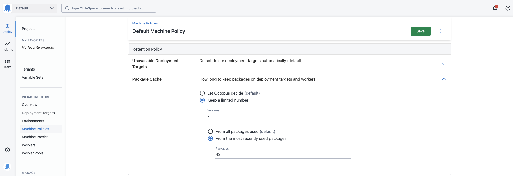
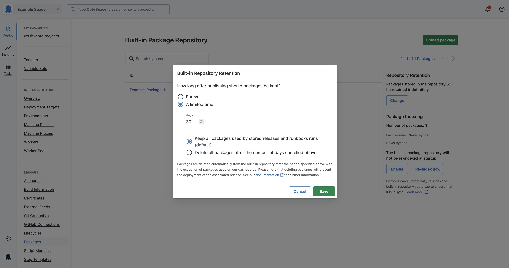

Retention isn’t the most glamorous part of the deployment process, but it is critical to get right. When storage is efficiently used, it can improve deployment times and performance. To help achieve this, we’ve made two improvements to package retention, with more to come. 

These changes are available to cloud customers now and will be included in the server release 2025.3.

## Recent improvements (and why they matter to you)

1. Package caching
2. Decoupling release and package retention

### Package caching

Package cache retention currently runs by default when the target machine hits less than 20% storage. These retention rules can be problematic for users with both small and large amounts of disk space;
Smaller machines with large packages involved in deployments may be prematurely deleted due to storage constraints, causing deployment failures or delays when subsequent deployments need to re-download them
Machines with larger disk space may experience more infrequent cache clearing, accumulating obsolete deployment files that degrade performance or consume space needed for higher-priority files

Now, within the default machine policies, you have the choice of allowing Octopus to set the default for them or keep a specific number of packages. For your larger machines, you can ensure their package cache doesn’t get too big and for smaller machines, you can set a sensible default based on your deployment patterns. 

### Decoupling release and package retention

Lifecycle policies control the retention of releases and the associated packages. Customers with frequent deployments or large packages typically require shorter retention periods to stay within storage limits. Tightening retention policies reduces the number of deployments kept, which limits your ability to audit or troubleshoot old failed deployments. 

We've added new flexibility to give you better control over your package retention. You can now choose between two approaches: keeping packages for all retained releases and runbooks (our current default), or only keeping packages for releases visible on your dashboard.
The dashboard-only option is a game-changer for storage management, this will keep relevant deployment history without the overhead of keeping the associated packages. While it means some older releases won't be redeployable after their packages get cleaned up, we’ve found customers rarely need to redeploy those old releases. What you want is to keep more of your release history at your fingertips.
It's all about giving you the right balance between storage efficiency and the information you need.

### What's Next?

Our next iteration of this project will focus on centralising where you view all retention policies.  We aim to provide better context and the ability to standardise retention policies based on your organization's guidelines.
If you have examples of where retention inefficiencies have cost you time or money, please [submit your examples here](https://roadmap.octopus.com/c/77-centralise-and-improve-retention-across-octopus). The more information we have, the better solutions we can build.

Happy deployments!
