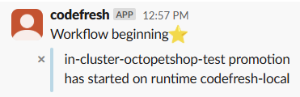

The acquisition of Codefresh gave me an exciting opportunity to learn new tech.  Initially, I thought Argo was just Argo CD, I didn't realize that Argo consists of four distinct projects; [Argo CD](https://argoproj.github.io/cd/), [Argo Events](https://argoproj.github.io/argo-events/), [Argo Rollouts](https://argoproj.github.io/rollouts/), and [Argo Workflows](https://argoproj.github.io/workflows/).  One of the key features of the Codefresh product is [Promotion Flows](https://codefresh.io/docs/docs/promotions/promotion-flow) which makes heavy use of Argo Workflows.  To better understand its capabilities, I decided to create a workflow so I can see how it works and put it in action.  In this post, I'll go over the project the I undertook!

## The problem to solve
To get this project underway, I needed a problem to solve.  I had read that Kubernetes worked with external secrets providers, but it wasn't something I'd ever used myself.  Having a local instance of HashiCorp Vault running, I decided to try my hand at including a Slack notification in a Codefresh Promotion Flow where it pulled the secrets for Slack from HashiCorp Vault in a Just In Time (JIT) fashion.  It is worth nothing that while I created this to work as a Promotion Workflow, this will work as a standard Argo Workflow.

## Prep work
To support this endeavor, there were a couple of things that I needed to configure first:
- Create a Slack channel to work with
- Configure Vault to work with Kubernetes authentication/authorization

### Slack channel
To post a message to Slack, I first need to create an App.  I used this [guide](https://api.slack.com/tutorials/tracks/getting-a-token) to create an App quickly.  Installing the App generated a Bot User OAuth Token which is what is used retrieve secrets from Vault.

### Vault
For the Vault instance, there were two things I needed for this project:
- Some secrets to retrieve
- Allow a Kubernetes Service Account access to my Vault instance

#### Vault Secrets
Secrets in Vault can be created via the UI or through an API call.  My Vault instance runs in a container without any data persistence, so I created a quick PowerShell script to automate it

<details>
<summary>View the script</summary>

```powershell
# Get variable values
$slackChannel = <Slack channel name>
$slackToken = <Slack OAuth token>
$vaultToken = <HashiCorp Vault token>
$header = @{ "X-Vault-Token" = $vaultToken } 

# Create Hashtable
$jsonPayload = @{
	data = @{  
		SLACK_CHANNEL = $slackChannel
        SLACK_TOKEN = $slackToken
    }
}

$jsonPayload | ConvertTo-Json -Depth 10

Invoke-RestMethod -Method Post -Uri "http://<Vault URL>:8200/v1/secret/data/slack" -Body ($jsonPayload | ConvertTo-Json -Depth 10) -Headers $header
```
</details>

#### Kubernetes Service Account authentication and authorization
There are a few files that needed to be created to configure the integration between my Kubernetes cluster and my HashiCorp vault instance:
- vault-auth-service-account.yaml
- vault-auth-secret.yaml
- configmap-json.yaml
- vault-policy.hcl (this one is actually generated in the script)

##### vault-auth-service-account.yaml
This file will creates a new Kubernetes Service Account, then assign some permissions to it.

:::info
The commented out portion is for using vanilla Argo Workflows, my example is configured to be a Codefresh Promotion Flow so I've used the default Service Account of `promotion-template` which has the necessary permissions to execute a Promotion Flow in the Codefresh product.  If using vanilla Argo Workflows, the `vault-auth` Service Account can be used.
:::

```yaml
# Uncomment if using vanilla Argo Workflows
#apiVersion: v1
#kind: ServiceAccount
#metadata:
#  name: vault-auth
#  namespace: argo
#---
apiVersion: rbac.authorization.k8s.io/v1
kind: ClusterRoleBinding
metadata:
  name: role-tokenreview-binding
  namespace: codefresh-gitops-runtime # Change namespace to either your GitOps Runtime namespace or argo if you're using vanilla Argo Workflows
roleRef:
  apiGroup: rbac.authorization.k8s.io
  kind: ClusterRole
  name: system:auth-delegator
subjects:
- kind: ServiceAccount
  name: promotion-template # Change to vault-auth is using vanilla Argo Workflows
  namespace: codefresh-gitops-runtime  # Change namespace to either your GitOps Runtime namespace or argo if you're using vanilla Argo Workflows
```

##### vault-auth-secret.yaml
The Service Account being used will need a token created to perform the authentication operations.  This token is what is used with Vault so it can authenticate and retrieve secrets.

```yaml
apiVersion: v1
kind: Secret
metadata:
  name: vault-auth-secret
  namespace: codefresh-gitops-runtime  # Change namespace to either your GitOps Runtime namespace or argo if you're using vanilla Argo Workflows
  annotations:
    #kubernetes.io/service-account.name: vault-auth # Uncomment this line and comment out the next if using vanilla Argo Workflows
    kubernetes.io/service-account.name: promotion-template
type: kubernetes.io/service-account-token
```

##### configmap-json.yaml
This file creates a configMap resource that the Vault container uses to connect your Vault instance.  The template section defines what you want the container to do.  In this case, I'm writing JSON to a file with the contents of the secrets we retrieved.

```yaml
apiVersion: v1
data:
  vault-agent-config.hcl: |
    # Comment this out if running as sidecar instead of initContainer
    exit_after_auth = true

    pid_file = "/home/vault/pidfile"

    auto_auth {
        method "kubernetes" {
            mount_path = "auth/kubernetes"
            config = {
                role = "argo"
            }
        }

        sink "file" {
            config = {
                path = "/home/vault/.vault-token"
            }
        }
    }

    template {
    destination = "/etc/secrets/slack.json"
    contents = <<EOT
    {{- with secret "secret/data/slack" }}
    {
        "SLACK_CHANNEL": "{{ .Data.data.SLACK_CHANNEL }}",
        "SLACK_TOKEN": "{{ .Data.data.SLACK_TOKEN }}"
    }
    {{ end }}
    EOT
    }
kind: ConfigMap
metadata:
  name: vault-agent-config
  namespace: codefresh-gitops-runtime # Change namespace to either your GitOps Runtime namespace or argo if you're using vanilla Argo Workflows
```

##### valut-policy.hcl
This file is used to grant the Service Account permissions in Vault so it can read secrets.  This example grants the Service Account read and list permissions to any secret.  In real-world situations, I’d limit what the Service Account has access to. This is just a skmple example to get started.

```hcl
path "secret/data/*" {
  capabilities = ["read", "list"]
}
```

##### Helper script
Since I was doing this over and over while testing, I wrote a PowerShell script to automate it.

<details>
  <summary>Click to see PowerShell script</summary>

  ```powershell
  # Reference: https://developer.hashicorp.com/vault/tutorials/kubernetes/kubernetes-external-vault
  #            https://developer.hashicorp.com/vault/tutorials/kubernetes/agent-kubernetes

# Declare working variables
$vaultUrl = "http://<Vault URL>:8200"
$vaultToken = "<Vault Token>"
$namespaceName = "<Namespace>"
$serviceAccountName = "<Service Account Name>"

# Set environment variables
$env:VAULT_ADDR = $vaultUrl
$env:VAULT_TOKEN = $vaultToken

# Create the Kubernetes service account and secret
kubectl apply -f vault-auth-service-account.yaml
kubectl apply -f vault-auth-secret.yaml

# Get the secret
$secret = (kubectl get secrets -n $namespaceName --output json | ConvertFrom-Json)
$secret = ($secret.Items | Where-Object {$_.metadata.name -eq "vault-auth-secret"})

# Get JWT token
$jwtToken = (kubectl get secret $secret.metadata.name --output 'go-template= {{ .data.token }}' -n $namespaceName)
$jwtToken = [System.Text.Encoding]::UTF8.GetString([System.Convert]::FromBase64String($jwtToken))

# Get CA certificate 
$saCaCRT = (kubectl config view --raw --minify --flatten --output 'jsonpath={.clusters[].cluster.certificate-authority-data}' -n $namespaceName)
$saCaCRT = [System.Text.Encoding]::UTF8.GetString([System.Convert]::FromBase64String($saCaCRT))

# Get cluster hostname
$k8sHost = (kubectl config view --raw --minify --flatten --output 'jsonpath={.clusters[].cluster.server}')

# Create read-only policy for kubernetees
$vaultPolicy = @"
path "secret/data/*" {
  capabilities = ["read", "list"]
}
"@

Set-Content -Path .\vault-policy.hcl -Value $vaultPolicy

.\vault policy write k8s-ro $PWD/vault-policy.hcl

# Enable Kubernetes authentication in Vault
.\vault auth enable kubernetes

# Configure the Kubernetes authentication
.\vault write auth/kubernetes/config `
token_reviewer_jwt="$jwtToken" `
kubernetes_host="$k8sHost" `
kubernetes_ca_cert="$saCaCRT" `
issuer="https://kubernetes.default.svc.cluster.local"

# Create a role for the Kubernetes authentication
.\vault write auth/kubernetes/role/argo `
bound_service_account_names=$serviceAccountName `
bound_service_account_namespaces=$namespaceName `
token_policies=k8s-ro `
ttl=24h

# Create config map for agent
kubectl apply -f configmap-json.yaml
```
</details>

:::info
This [tutorial](https://developer.hashicorp.com/vault/tutorials/kubernetes/agent-kubernetes) from HashiCorp contains the same commands used in this post, but in bash format.

Both the bash and PowerShell scripts will require the use of the [HashiCorp Vault CLI](https://developer.hashicorp.com/vault/install).  Please be sure to grab this binary if you intend on following along with this post.
:::

## Workflow template
If you've never worked with Argo Workflows before, this template may look somewhat intimidating.  I'll break it down by section to make it more digestable.

<details>
  <summary>Click to see full template</summary>
 
  ```yaml
# DO NOT REMOVE the following attributes:
# annotations.codefresh.io/workflow-origin (identifies type of Workflow Template as Promotion Workflow)
# annotations.version (identifies version of Promotion Workflow used)
# annotations.description (identifies intended use of the Promotion Workflow)
apiVersion: argoproj.io/v1alpha1
kind: WorkflowTemplate
metadata:
  name: slack-notification
  annotations:
    codefresh.io/workflow-origin: promotion
    version: 0.0.1
    description: promotion workflow template
spec:
  arguments:
    parameters:
        - name: APP_NAME
        - name: RUNTIME
  serviceAccountName: promotion-template
  entrypoint: vault-auth
  volumes:
    - configMap:
        items:
          - key: vault-agent-config.hcl
            path: vault-agent-config.hcl
        name: vault-agent-config
      name: config
    - emptyDir: {}
      name: shared-data
  templates:
    - name: vault-auth
      steps:
        - - name: get-slack-data
            template: call-vault
        - - name: post-slack-message
            template: post-message
            arguments:
              parameters:
                - name: SLACK_CHANNEL
                  value: >-
                    {{=jsonpath(steps['get-slack-data'].outputs.parameters['slack-data'],
                    '$.SLACK_CHANNEL')}}
                - name: SLACK_TOKEN 
                  value: "{{=jsonpath(steps['get-slack-data'].outputs.parameters['slack-data'], '$.SLACK_TOKEN')}}"
                - name: SLACK_MESSAGE
                  value: "{{workflow.parameters.APP_NAME}} promotion has started on runtime {{workflow.parameters.RUNTIME}}"

    - name: call-vault
      container:
        command:
          - vault
        args:
          - agent
          - '-config=/etc/vault/vault-agent-config.hcl'
          - '-log-level=debug'
        env:
          - name: VAULT_ADDR
            value: http://clusterpi-1:8200
        image: hashicorp/vault
        name: vault-agent
        volumeMounts:
          - mountPath: /etc/vault
            name: config
          - mountPath: /etc/secrets
            name: shared-data
      outputs:
        parameters:
          - name: slack-data
            valueFrom:
              path: /etc/secrets/slack.json

    - name: post-message	# we also have an existing plugin at https://github.com/codefresh-io/argo-hub/blob/main/workflows/slack/versions/0.0.2/docs/post-to-channel.md
      inputs:
        parameters:
          - name: SLACK_CHANNEL
          - name: SLACK_TOKEN
          - name: SLACK_MESSAGE
      script:
        image: curlimages/curl
        command:
          - sh
        source: |
          curl -vvv -X POST -H "Authorization: Bearer {{inputs.parameters.SLACK_TOKEN}}" \
          -H "Content-type: application/json" \
          --url https://slack.com/api/chat.postMessage \
          --data "{ 'token': '{{inputs.parameters.SLACK_TOKEN}}', 'channel': '{{inputs.parameters.SLACK_CHANNEL}}', 'text' : 'Workflow beginning:star:', 'attachments': [{'color': '#ADD8E6','blocks': [ { 'type': 'section', 'fields': [{ 'type': 'mrkdwn', 'text': '{{inputs.parameters.SLACK_MESSAGE}}'}] } ] }]  }" 
  ```
</details>

### Kind
The Kind for the Workflow manifest is a WorkflowTemplate using the api of argoproj.io/v1.  The annotations applied to this template are what is required to designate this is a `Promotion Workflow` in Codefresh (it allows it to be displayed in the correct dashboards).  If using vanilla Argo Workflows, the annotations section can be removed.

```yaml
apiVersion: argoproj.io/v1alpha1
kind: WorkflowTemplate
metadata:
  name: slack-notification # Name of the workflow
  annotations: # Codefresh annotations
    codefresh.io/workflow-origin: promotion
    version: 0.0.1
    description: promotion workflow template
```

### Spec
Spec is where we define things `parameters`, `volumes` and the `entrypoint`.  There are some additional components which are broken down in the comments

```yaml
spec:
  arguments:
    parameters: # Define parameters for the workflow
      - name: APP_NAME # APP_NAME and RUNTIME are automatically set when used within a promotion
      - name: RUNTIME
  serviceAccountName: promotion-template # The service account used during workflow execution
  entrypoint: vault-auth # Name of the first template to call
  volumes: # Defines workflow wide volume usable by all templates and steps
    - configMap: # This config map is specific to the Vault work we'll be doing, it references the config map we created in the HashiCorp Vault configuration steps
        items: # This section specifies that we're going to write the config map contents to a file which the Vault container will use as a configuration
          - key: vault-agent-config.hcl
            path: vault-agent-config.hcl 
        name: vault-agent-config
      name: config # Name of the volume
    - emptyDir: {} # Creates an empty directory
      name: shared-data # Name of the volume
```

### Templates
The templates section defines the different templates that will be utilized during execution of the workflow.  This example contains three templates
- vault-auth:  This is the name we specified in the entrypoint of the spec section and the beginning of execution and calls the other two.
- call-vault: This is the template that will perform the call from the cluster to Vault to retrieve the secrets and produces output parameters.
- post-message:  This template posts the message to Slack and will receive the secret as an input parameter.

The `- -` syntax indicates the step will execute sequentially, a single `-` means it will execute in parallel with the previous step

```yaml
templates:
    - name: vault-auth
      steps:
        - - name: get-slack-data
            template: call-vault
        - - name: post-slack-message
            template: post-message
            arguments:
              parameters:
                - name: SLACK_CHANNEL
                  value: >-
                    {{=jsonpath(steps['get-slack-data'].outputs.parameters['slack-data'],
                    '$.SLACK_CHANNEL')}}
                - name: SLACK_TOKEN 
                  value: "{{=jsonpath(steps['get-slack-data'].outputs.parameters['slack-data'], '$.SLACK_TOKEN')}}"
                - name: SLACK_MESSAGE
                  value: "Test message"


    - name: call-vault
      container:
        command:
          - vault
        args:
          - agent
          - '-config=/etc/vault/vault-agent-config.hcl'
          - '-log-level=debug'
        env:
          - name: VAULT_ADDR
            value: http://clusterpi-1:8200
        image: hashicorp/vault
        name: vault-agent
        volumeMounts:
          - mountPath: /etc/vault
            name: config
          - mountPath: /etc/secrets
            name: shared-data
      outputs:
        parameters:
          - name: slack-data
            valueFrom:
              path: /etc/secrets/slack.json


    - name: post-message
      inputs:
        parameters:
          - name: SLACK_CHANNEL
          - name: SLACK_TOKEN
          - name: SLACK_MESSAGE
      script:
        image: curlimages/curl
        command:
          - sh
        source: |
          curl -vvv -X POST -H "Authorization: Bearer {{inputs.parameters.SLACK_TOKEN}}" \
          -H "Content-type: application/json" \
          --url https://slack.com/api/chat.postMessage \
          --data "{ 'token': '{{inputs.parameters.SLACK_TOKEN}}', 'channel': '{{inputs.parameters.SLACK_CHANNEL}}', 'text' : 'Workflow beginning:star:', 'attachments': [{'color': '#ADD8E6','blocks': [ { 'type': 'section', 'fields': [{ 'type': 'mrkdwn', 'text': '{{inputs.parameters.SLACK_MESSAGE}}'}] } ] }]  }" 
```

## The result
Afer going through some trial and error learning how all of this functions, I successfully posted a message to my designated channel!



## Conclusion
I needed something that would help me wrap my head around how Argo Workflows (and Codefresh Promotions Workflows) worked.  Going through the exercise of setting up my own with a specific purpose in mind demistified not only how they worked, but how to construct one myself.  I'm hoping this post helps you in the same way it helped me.

Happy deployments!
