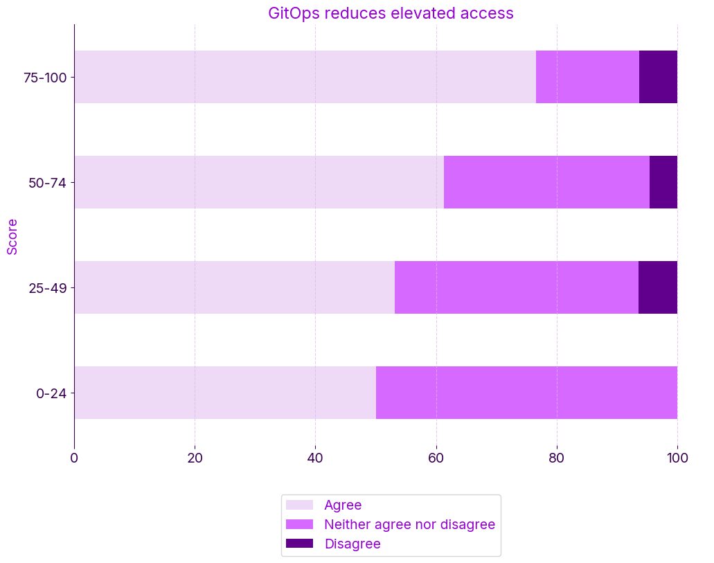

Recently, we surveyed the industry to gain insights into the adoption and challenges of real-world GitOps, with the results forming the [State of GitOps Report](https://octopus.com/publications/state-of-gitops-report). While reviewing the trends and results, the data around one key finding jumped out at me:
> GitOps reduces elevated access

Overall, 66% of respondents agreed. Among organizations with higher GitOps maturity, agreement rose to 77%, but interestingly, there was also a slight increase in disagreement among the highest performers.

So, does GitOps change or reduce the need for elevated environment access, and should it?

## How GitOps shifts access away from infrastructure

The four GitOps principles encourage you to avoid manually logging into environments and performing tasks. The goal is to manage system state declaratively through version-controlled configuration and apply those states automatically using reconciliation agents.

If fully embraced, GitOps agents continuously observe the system state, correcting any drift by reapplying the desired state defined in version control. Continuous reconciliation discourages manual changes and automatically reverses them if they occur.

In traditional operations teams, access to systems with SSH or tools like kubectl is common, but operating in a mature GitOps model should make these break-glass exceptions.

Most survey respondents agree that GitOps should reduce the need for privileged production access by replacing hands-on changes with declarative, auditable workflows.

## Rethinking what elevated access means with GitOps
So why might some respondents to the survey disagree that embracing GitOps reduces elevated access?

At lower maturity levels, teams may treat Git as a safe, developer-focused system. But as Git becomes the source of truth for managing production infrastructure and applications, a key question emerges:
> If a developer can change a manifest in Git for a production environment, does that emulate elevated access?

In a GitOps model, Git becomes the control plane, meaning write access to a production configuration in Git, especially with automatic reconciliation, becomes a form of production access.

High performers likely consider GitOps secure when configuring repositories well and implementing mature environment promotion workflows. However, Git isn't the only sensitive surface in GitOps architecture. You must also secure the reconciliation controller and supporting workflow or promotion tooling with the same level of rigor. Together, these systems form the modern delivery pipeline and deserve the same access scrutiny once reserved for direct infrastructure.

High performers likely aren't ignoring or rejecting GitOps' security benefits but instead acknowledge that Git itself must be treated as a sensitive operational boundary now more than ever. It's now one of several critical control points in the delivery process that require strict governance.

Interestingly, these same high performers agreed that GitOps reduces overall elevated access. So, the takeaway isn't contradiction; it's maturity. High-performing teams see GitOps as secure only when Git, the reconciliation controller, and supporting environment progression tooling are all treated as critical access points, with the appropriate controls in place.

## Handling exceptions to the GitOps model
In the early stages of adopting GitOps, it is common for DevOps Engineers, Platform Engineers, and even developers to rely on familiar tools like `kubectl` to inspect or tweak clusters and applications directly. Especially in learning environments and environments early in the deployment process, like dev, this is precisely what they'll do. This approach lets them rely on familiar tools while gaining confidence in GitOps practices.

The ultimate goal is for nobody to have direct access to production environments, even if read-only.

In the State of GitOps report, we surfaced six core practices of GitOps:
- Declarative desired state
- Human-readable format
- Responsive code review
- Version control
- Automatic pull
- Continuous reconciliation

You won't embrace all of these GitOps practices on day 1, and that's ok. As we learned from the DevOps movement, embracing a GitOps infrastructure and application delivery approach involves continuous improvement, learning, tweaking, and time.

With that said, even at high maturity levels with GitOps where many or all of the practices are implemented, there may still be valid scenarios where elevated access is required, such as emergency response (break-glass scenarios) or debugging complex or unreproducible issues.

In these cases, it's crucial to have:
- Break-glass procedures. Documented steps for requesting, granting, and revoking temporary access. These should include automated expiration, require multi-party approval, and be used only in exceptional circumstances.
- Audit trails. You must log every access event, recording who accessed and changed what, when, and why.
- Controlled suspension of reconciliation. Sometimes, you must temporarily disable the GitOps agent to prevent it from overwriting a manual change made during incident response. You should log and time-bound this suspension, and include procedures to reconcile safely afterward.
- Post-incident recovery. After manual intervention, have a defined process for reconciling the system back to the desired state, committing required changes to Git, and re-enabling automatic reconciliation.

These situations should be rare. Ideally, releases have already passed through multiple environments that closely mirror production in both infrastructure and configuration. If you experience an issue where you find your developers or engineers need to access environments directly, after the issue is resolved, question why. Could they have achieved the same outcome by using other systems and tooling? Is there an element of education and training required? Is there a need to implement supplimentary tooling or processes to help troubleshoot and resolve issues that surface after deployment? Work on fixing it, and implementing that fix in your process so it doesn't occur again.

Releasing to production shouldn't be a production.

## The evolving access conversation
GitOps won't immediately eliminate the need for you to have a process for elevated production access, but it should help make it an exception rather than a routine operation. You must treat Git and GitOps tooling with the same care and control as production infrastructure. The fundamentals still apply; they apply in more places and different places than you're used to.

As you mature your GitOps adoption, the conversation shifts from "do we still need access?" to "are we securing the new access surface and tooling?".

Happy deployments!