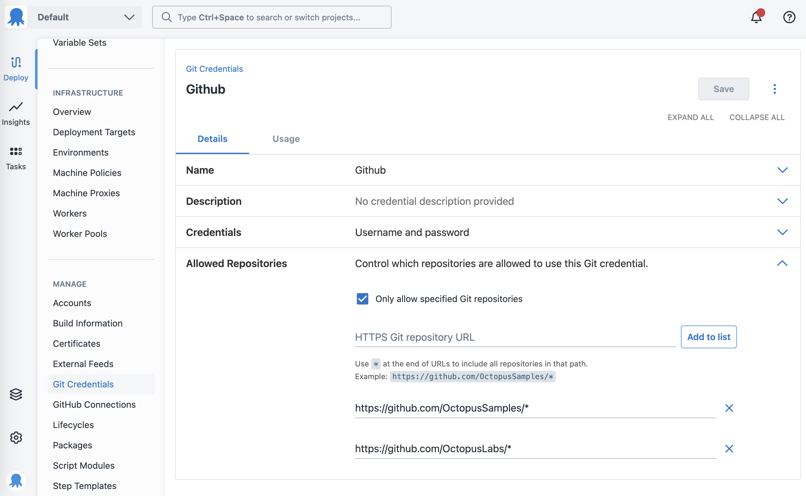
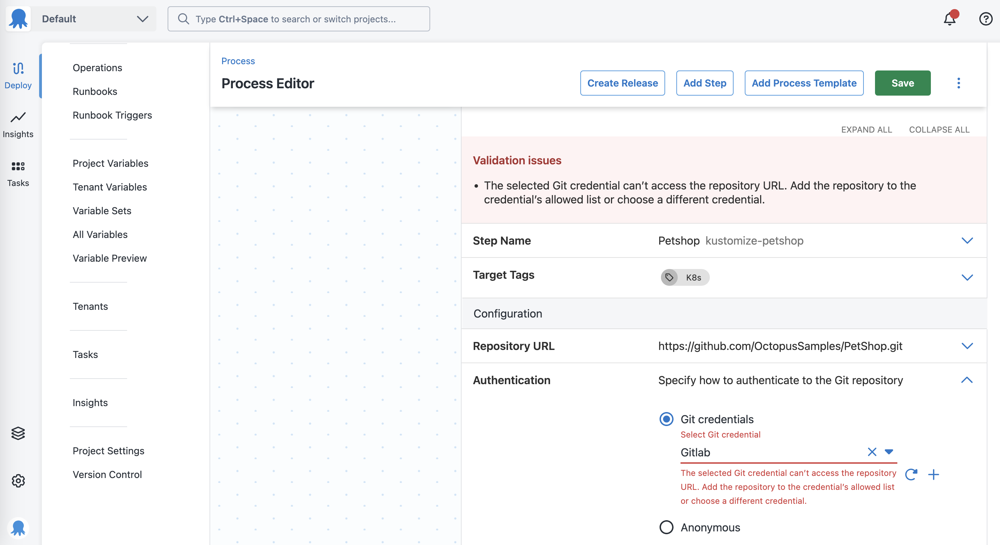

As part of our work on [orchestrating ArgoCD with Octopus](https://roadmap.octopus.com/c/85-orchestrate-argo-cd-with-octopus), we’ve taken the opportunity to add an enhancement to Git credentials called repository restrictions. This allows you to specify what repository URL’s the Git credential can be used for.

## Background

Part of the ArgoCD orchestration involves updating the manifests in the repository that an ArgoCD application is monitoring. Octopus can query the repository URL from ArgoCD, but ArgoCD doesn’t expose the login credentials. The user has to enter the credentials into Octopus separately. 

Previously, a Git credential only stored a name and description alongside the login credentials. It’s difficult to tell what repositories the credentials are valid for, other than relying on naming conventions. Also, any authentication errors from choosing the wrong credential would only surface when Octopus made a request to the Git server.

For the Argo orchestration work, we had no reliable way to pick the appropriate credential for a given repository URL.

## Solution

By letting the user specify a list of allowed repositories on a Git credential, Octopus can now automatically match a credential to the repository URL when updating ArgoCD applications.

The feature also lets you control where the credentials can be used within the Space.

You can add complete repository URL’s or specify a wildcard at the end to include everything under that path.

When you reference a Git credential that isn't compatible with the repository URL, a validation error will prevent you from saving the step. The same validation also runs at deployment time. 

## Conclusion

This feature is now rolling out across Octopus Cloud. Give it a try a let us know what you think at xyz@octopus.com

## Learn more

- [Github issue](https://github.com/OctopusDeploy/Issues/issues/9471)
